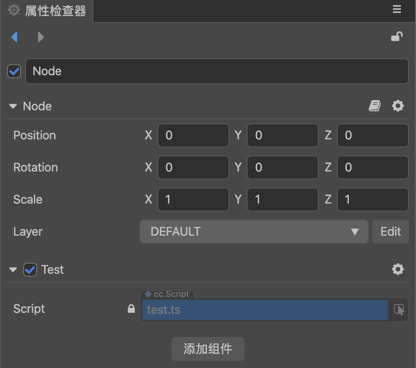

# Creating scripts

## Creating component scripts

In __Cocos Creator__, scripts are also part of resources. You can add and select **TypeScript** to create a component script by clicking the **Create** button in the **Asset** panel. Example:


A simple component script may look like this example:

```typescript
import { _decorator, Component, Node } from 'cc';
const { ccclass, property } = _decorator;

@ccclass('NewScript')
export class NewScript extends Component {
    /* class member could be defined like this */
    // dummy = '';

    /* use `property` decorator if your want the member to be serializable */
    // @property
    // serializableDummy = 0;

    start () {
        // Your initialization goes here.
    }

    // update (deltaTime: number) {
    //     // Your update function goes here.
    // }
}
```

> **Note**: it is recommended that users use **TypeScript** to write scripts. If you wish to use **JavaScript** to write scripts, they can be created directly in the operating system file manager, or created in a code editor.

## Editing scripts

Users can choose their favorite text-editing tools (such as: *Vim*, *Sublime Text*, *Web Storm*, *VSCode*...) for script editing according to their own needs, please go to [Settings](#defaultscripteditingtoolconfiguration) to set.

By double-clicking the script resource, the script editor directly opens to allow for editing. When the script is edited and saved, **Cocos Creator** will automatically detect the changes to the script and compile it quickly.

Before writing code, please read [Basics of Scripting](basic.md) documentation to learn more about scripts.

## Add a script to a scene node

Adding the script to the scene node is actually adding a component to this node. Let's first rename the newly created **NewScript.js** to **say-hello.js**. Then select the scene node we want to add, and the attributes of the node will be displayed in the **Attribute Inspector**. At the bottom of the **Inspector** panel, there is a **Add component** button. Click the button and select **Add User Script -> say-hello** to add the script component we just wrote.


If all goes well, you will see your script displayed in the **Inspector** panel:



> **Note**: users can also add scripts by directly dragging and dropping script resources to the **Inspector** panel.

## Default script editing tool configuration


