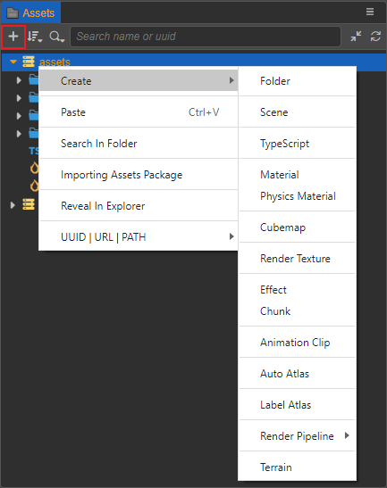
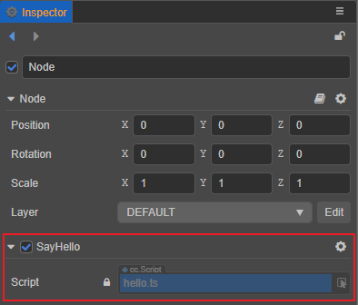
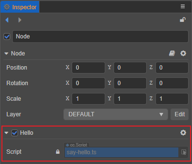

# Creating Scripts

## Creating Component Scripts

In __Cocos Creator__, scripts are also part of resources. You can create a component script by selecting the folder in the **Assets** panel where you want to place the script file, then right-clicking and selecting **TypeScript**, or just click the Create button (**+**) in the upper left corner.



Next, name it as `say-hello`, and notice a script file named `say-hello` has been generated in the **Assets** panel.


A simple component script may look like this example:

```typescript
import { _decorator, Component, Node } from 'cc';
const { ccclass, property } = _decorator;

@ccclass('NewScript')
export class NewScript extends Component {
    /* class member could be defined like this */
    // dummy = '';

    /* use `property` decorator if your want the member to be serializable */
    // @property
    // serializableDummy = 0;

    start () {
        // Your initialization goes here.
    }

    // update (deltaTime: number) {
    //     // Your update function goes here.
    // }
}
```

> **Note**: it is recommended that users use **TypeScript** to write scripts. If you wish to use **JavaScript** to write scripts, they can be created directly in the operating system file manager, or created in a code editor.

## Editing Scripts

Choose a favorite text-editing tool (such as: **Vim**, **Sublime Text**, **Web Storm**, **VSCode**...) for script editing, please setup in the **Preferences -> External Program -> Default Script Editor** option of the editor menu bar.

By double-clicking the script resource, the script editor directly opens to allow for editing. When the script is edited and saved, then returned to the editor, Cocos Creator will automatically detect the changes to the script and compile it quickly.

Before writing code, please read the following documentations to learn more about scripts:

- [Coding Environment Setup](coding-setup.md)
- [Operating Environment](basic.md)

## Add a Script to a Scene Node

Adding a script to a scene node is actually adding a script component to that node. Select the scene node to which you wish to add a script in the **Hierarchy** panel, at which point the properties of that node will be displayed in the **Inspector** panel. Adding a script component includes the following two ways:

1. Drag and drop the script from **Assets** panel directly into the **Inspector** panel.

    

2. Click the **Add Component** button at the bottom of the **Inspector** panel and select **Custom script -> SayHello** to add the script component just created. It is also possible to add it by searching for **SayHello** in the **Add Component** search box, provided that the **Add components using popups** feature in **Preferences -> Laboratory** is enabled.

    

Note that the component name of a script component is the class name defined in the script, not the script file name. When a script is created, the script file generates the class name according to the following rules:

- Use Upper Camel Case.
- There are no numbers on the head.
- Without special characters.
- Use the symbols and spaces in the script file name as intervals, and capitalize the first letter after each interval. For example, the script file name is `say-hello`, and the class name is `SayHello`.

If there are secondary changes to the script file name/script class name afterwards, the two are not automatically synchronized, and can be synchronized manually if needed.

Using `say-hello.ts` as an example, if it is renamed to `hello` in the **Assets** panel, notice that the script component name in the **Inspector** panel is still the original name, **SayHello**, only the script name has changed to `hello`:



Double click to open `say-hello.ts`, and change the class name to **Hello**:

```TypeScript
import { _decorator, Component, Node } from 'cc';
const { ccclass, property } = _decorator;

@ccclass('Hello')
export class Hello extends Component {}
```

After saving the script and returning to the editor, notice that the script component name in the **Inspector** panel has changed to **Hello**, but the script file name is still the original name, `say-hello`:


