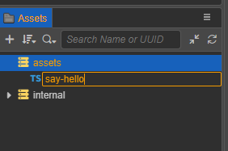
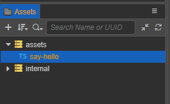
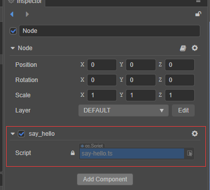
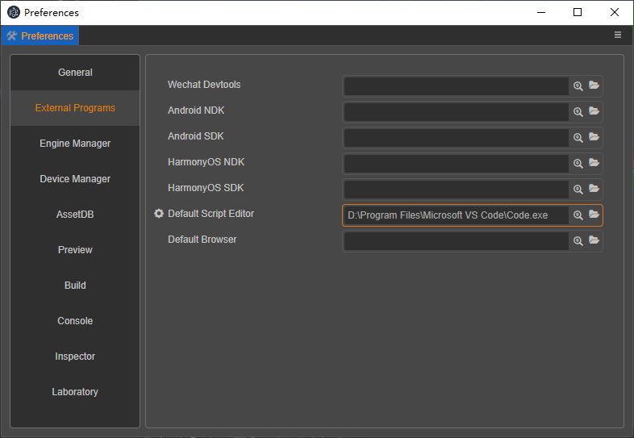
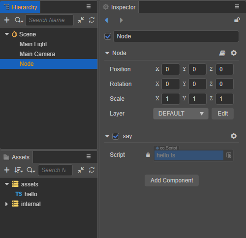
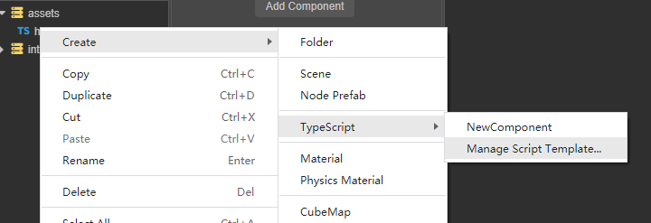
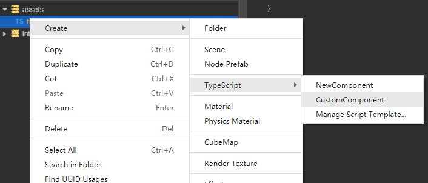

# Creating Scripts

## Creating Component Scripts

In Cocos Creator, scripts are part of assets. A script created in the **Assets** panel is a NewComponent by default, which is called a component script. It can be created in two ways:

- Select the folder in the **Assets** panel where the component script is to be placed, then right-click and select **TypeScript** > **NewComponent**.
- Click the **+** button in the upper left corner of the **Assets** panel directly, and then select **TypeScript** > **NewComponent**.


When creating a script, the script name cannot be empty and defaults to `NewComponent`. If the created component script is named as `say-hello`, and then a script file named `say-hello` is generated in the **Assets** panel:





A simple component script may look like this example:

```ts
import { _decorator, Component, Node } from 'cc';
const { ccclass, property } = _decorator;

@ccclass('say_hello')
export class say_hello extends Component {
    start() {

    }

    update(deltaTime: number) {
        
    }
}
```

**Notes**

> The class name `ClassName` (such as 'say_hello' in the above example) of all scripts in the project is not allowed to be repeated. Even if the script files are in different directories, the same class name is not allowed in their respective codes.

> The name of the script file is different from the class name of the script. After the initial file name is entered, the file name will be processed as the class name. For details of the processing logic, please refer to **Class Name Generation** below. After the script file is generated, the subsequent operation of the file **renames the script**, the new file name will not be generated and replaced by the class name in the code, and will no longer be affected.

> We recommend that users use TypeScript to write scripts. Currently, only TypeScript files are supported in **Assets**. But if users want to use JavaScript to write scripts, they can create JavaScript files directly in the operating system's folder, or create JavaScript files in other code editing software.

## Class Name Generation
After obtaining the initial file name data, the class name `ClassName` of the two rules will be generated and provided to the **Custom Script Template** in the form of variables.

- Underscore format, variable name is `<%UnderscoreCaseClassName%>`. This format is to keep the class name as consistent as possible with the file name. The advantage of being consistent is that it facilitates global search and replacement of code.
- CamelCase format, the variable name is `<%CamelCaseClassName%>`. This format is to maintain consistency with mainstream scripting standards, with capitalized camel case.


## Add a Script to a Scene Node

Adding a script to a scene node is actually adding a script component to that node. Select the scene node to which you wish to add a script in the **Hierarchy** panel, at which point the properties of that node will be displayed in the **Inspector** panel. Adding a script component includes the following two ways:

- Drag and drop the script from **Assets** panel directly into the **Inspector** panel.

-  Click the **Add Component** button at the bottom of the **Inspector** panel and select **Custom script -> say_hello** to add the script component just created. It is also possible to add it by searching for **say_hello** in the **Add Component** search box.

    
    

## Editing Scripts

Choose a favorite text-editing tool (such as: **Vim**, **Sublime Text**, **Web Storm**, **VSCode**...) for script editing, please setup in the **Preferences** > **External Program -> Default Script Editor** option of the editor menu bar.



By double-clicking the script asset, the script editor directly opens to allow for editing. When the script is edited and saved, then returned to the editor, Cocos Creator will automatically detect the changes to the script and compile it quickly.

Before writing code, please read the following documentations to learn more about scripts:

- [Coding Environment Setup](coding-setup.md)
- [Operating Environment](basic.md)


After the script file is successfully created, rename the file or modify the class name in the code, the file name and class name will no longer affect each other.

- Take `say-hello` as an example, we renamed it to `hello` in **Asset**.
Re-select it and check the **Inspector**, the code still displays `class say_hello`, which will not change.
Re-select the node **Node** where the component was just added on the **Hierarchy**, check the **Inspector**, the component name still displays `say_hello`, and it will not change.

We continue to double-click the current `hello` asset, change the class name to **say**, save it and return to the editor:

```ts
import { _decorator, Component, Node } from 'cc';
const { ccclass, property } = _decorator;

@ccclass('say')
export class say extends Component {
    start() {

    }

    update(deltaTime: number) {
        
    }
}
```

The script file name `hello` will not change. The component name in the node **Node** becomes **say**.




## <a id="custom-script-template">Custom Script Template</a>

Starting from Cocos Creator v3.3, there is support for managing different script templates in a project.

- Create a new project, the new project will not automatically create the directory `.creator/asset-template/typescript` where the custom script templates are located.
- The above directory can be created manually. You can also use the menu in the right-click menu of **Asset** to generate a directory after clicking.


The default `NewComponent` script template is still in the engine built-in resources directory `resources\3d\engine\editor\assets\default_file_content\ts`.
The code of the file is below:

```ts
import { _decorator, Component, Node } from 'cc';
const { ccclass, property } = _decorator;

@ccclass('<%UnderscoreCaseClassName%>')
export class <%UnderscoreCaseClassName%> extends Component {
    start() {

    }

    update(deltaTime: number) {
        
    }
}

/**
 * COMMENTS_GENERATE_IGNORE
 * Use "COMMENTS_GENERATE_IGNORE" tag if you do not want later created scripts to contain these comments.
 * 
 * Predefined Variables
 * You can use predefined variables below to setup your scripting preference. For example, whether to use camel case style.
 * 
 * <%UnderscoreCaseClassName%>, class name in underscore format, like 'new_component'
 * <%CamelCaseClassName%>, class name in camel format, like 'NewComponent'
 * <%Author%>, Who create this file
 * <%DateTime%>, when create this file
 * <%FileBasename%>, creating file name with extension
 * <%FileBasenameNoExtension%>, creating file name without extension
 * <%URL%>, url of this file in COCOS ASSET URL format
 * <%ManualUrl%>, url of office help document, like 'https://docs.cocos.com/creator/manual/en/'
 *
 * 
 * Example:
 * 
  @ccclass('<%UnderscoreCaseClassName%>')
  export class <%UnderscoreCaseClassName%> extends Component {
  
    // class member could be defined like this.
    dummy = '';

    // Use 'property' decorator if your want the member to be serializable.
    @property
    serializableDummy = 0;

    start () {
        // Your initialization goes here.
    }

    update (deltaTime: number) {
        // Your update function goes here.
    }

  }
 *
 * Learn more about scripting: <%ManualUrl%>scripting/
 * Learn more about CCClass: <%ManualUrl%>scripting/decorator.html
 * Learn more about life-cycle callbacks: <%ManualUrl%>scripting/life-cycle-callbacks.html
 */

```

**Nodes**

> A large number of comments in the script template will not be generated into the script file, because we use the keyword annotation `COMMENTS_GENERATE_IGNORE` in the comment. As long as this keyword is in a comment, the generated script file will ignore the comment Lose.

> `Predefined Variables` We have prepared some pre-made variables, which can be used as auxiliary information when generating script files, such as author `<%Author%>`.

> By right-clicking the menu, a shortcut link to the document URL will be automatically generated in the project custom script template directory. Double-click to call up the browser to open the specified webpage. `Custom Script Template Help Documentation`


### Make One Script Template

We modify the code from copying the above built-in `NewComponent` template, the class name is in camel case format, prefixed with `Robot`, the file is saved as a file `CustomComponent` without extension name, and saved in the path of the project custom script template, that is `.creator/asset-template/typescript/CustomComponent`.


The code of `CustomComponent` template is below:


```ts
import { _decorator, Component, Node } from 'cc';
const { ccclass, property } = _decorator;

/**
 * 
 * <%UnderscoreCaseClassName%>
 * <%CamelCaseClassName%>
 * <%Author%>
 * <%DateTime%>
 * <%FileBasename%>
 * <%FileBasenameNoExtension%>
 * <%URL%>
 * <%ManualUrl%>
 *
 */

@ccclass('Robot<%CamelCaseClassName%>')
export class Robot<%CamelCaseClassName%> extends Component {
    start() {

    }

    update(deltaTime: number) {
        
    }
}

```

Then finally, let's create a new `wake up` script asset to see the effect as shown below:




