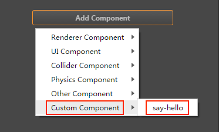
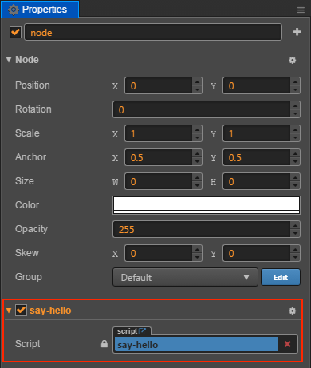

# Creating and using component script

## Creating component script

In Cocos Creator, script is also a part of the assets. You can add and select JavaScript or TypeScript to create a component script by clicking the **create** button in the **Assets** editor. By this time, you will get a new script in your asset editor:


A simple component script is as follows:

```javascript
cc.Class({
    extends: cc.Component,

    properties: {
    },

    // Use this for initialization
    onLoad: function () {
    },

    // Called every frame, uncomment this function to activate update callback
    update: function (dt) {
    },
});
```

## Editing script

We recommend that a popular editor is used, such as: Vim, Sublime Text, WebStorm, VS Code, etc. Each editor has advantages and disadvantages. Please set it up in [Settings](../getting-started/basics/editor-panels/preferences.md#script-editor) first.

Edit the scripts and save them. Cocos Creator will automatically detect the alteration of the script and compile it quickly.

## Adding script into the scene node

Adding the script into the scene node is actually adding a component to this node. Let's rename the new **NewScript.js** to **say-hello.js**. Then select the scene node you would like to add, by this time the property of this node will be shown in **Properties**.

There's an **Add Component** button at the very bottom of **Properties**. Click the button and choose **Custom Component -> say-hello** to add a new script component.



If everything goes well, you will see your script shown in **Properties**:



> **Note**: you can also add script by dragging script asset into **Properties**.
