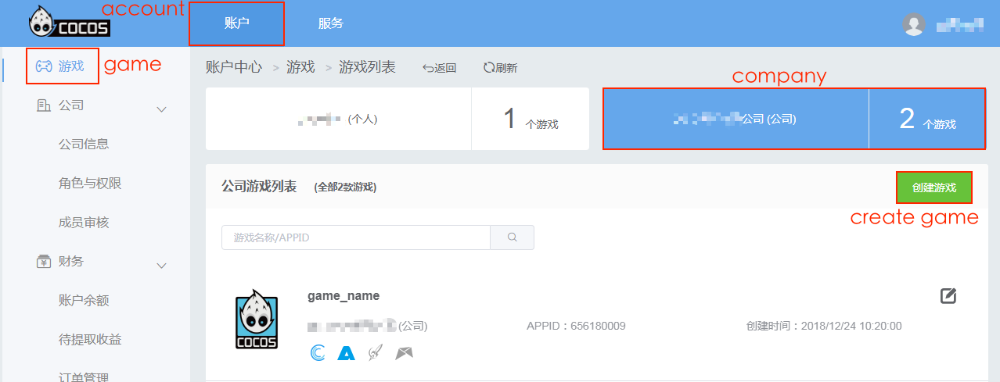
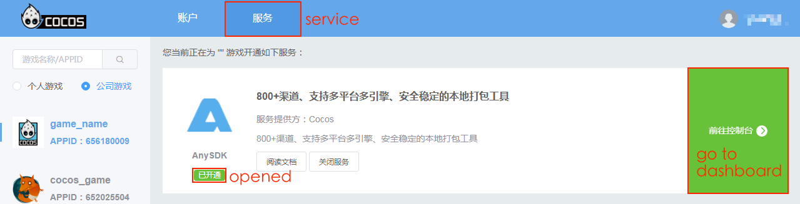
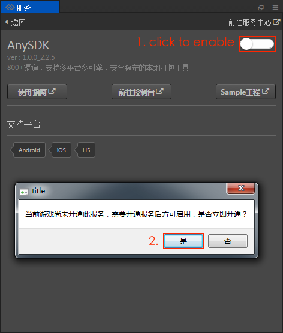
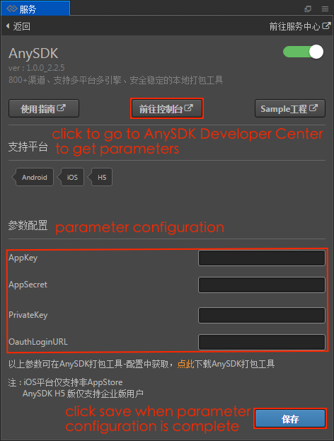
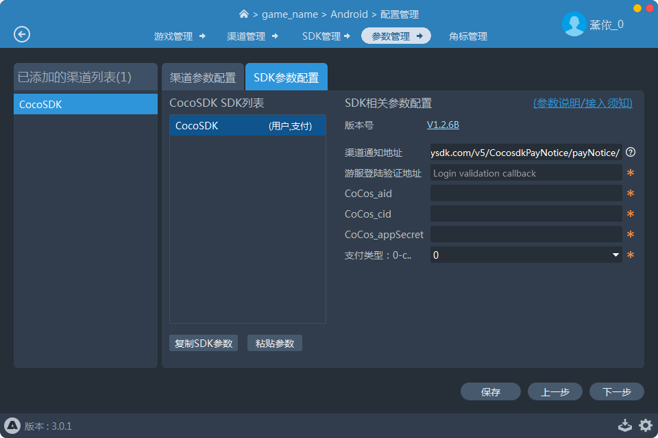

# Access to AnySDK Services

**AnySDK** is a third party solution that offers game developers SDK integration without making changes to the SDK's features or parameters. It can do all of this while remaining invisible to your end user. Our goal is to handle all the tedious SDK integration work for you so that you can use your time to focus on the game itself. No matter if it's the channel SDK, user system, payment system, ad system, statistics system, sharing system or any other type of SDK.

Currently supports the **Android / iOS / Web** platform. **Note**: The Web platform only supports channel SDK access and must use the AnySDK Enterprise Version. For more information, please refer to [AnySDK Enterprise Version](http://docs.anysdk.com/enterprise/overview/).

This document is based on **v2.0.7**, and if the user is using a version before v2.0.7, please refer to the [old version document](https://github.com/cocos/cocos-docs/blob/3e87b0f25c73e74acdc316c141971c592fc8f982/en/sdk/anysdk-overview.md).

## Create game

Because the AnySDK service only supports games under the company account, you need to go to [Cocos Account Center](https://auth.cocos.com/#/) first, click the **Company** tab in the sidebar. Then **join an existing company** or **create a new company** as needed. Please refer to [AnySDK document](http://docs.anysdk.com/rapid-experience/service-activation/#_2) for details. You can create a game in the following two ways:

- **Create a game through the Cocos Account Center**

    Create a company game by entering the [Cocos Account Center](https://auth.cocos.com/#/) through Creator's **Service** panel. Please refer to the [Service panel -> Usage](cocos-services.md#usage) for details.

    

- **Create a game with a AnySDK Client**

    Download the standalone AnySDK client from the [AnySDK Website](http://www.anysdk.com/downloads) to create a game and package. Login AnySDK client and create a new game according to the prompts, you can obtain AppKey AppSecret PrivateKey, which will be used later. Please refer to [Create Game](http://docs.anysdk.com/rapid-experience/service-activation/#2-anysdk) for details.

    

After the game is created, you need to **open AnySDK service**. Click the game in the game list in the [Cocos Account Center](https://account.cocos.com/#/game/game_list) or click the **Service** tab at the top of the page to jump to the service panel. Select the corresponding game on the left side of the service page, then find the AnySDK service, click **Open Service**. you can see the AnySDK service on the page display **opened**.

## Server access

If the developer needs to integrate User and IAP system, the game server must deal with verification and payment attestation related logic, refer to the following two documents for access.

- [Oauth Login](http://docs.anysdk.com/OauthLogin)  
- [Payment Notice](http://docs.anysdk.com/PaymentNotice)

## Client access

### Built project

**First**, open the Cocos Creator and click the **Menu bar -> Panel -> Service** to open the **Service** panel. Set up Cocos AppID, be careful to select a company game. Please refer to [Cocos service settings](cocos-services.md) for details. Then select **AnySDK** to enter the AnySDK service Settings panel.

**Second**, click the enable button in the upper-right corner to enable the AnySDK service. (If the AnySDK service is not opened in the Create game step, then when you enable the AnySDK service, it will pop up `whether to open the AnySDK service` prompt box, according to the prompt to operate.）

**Third**, when enabled is complete, the service panel displays **Installing**, and after the installation is complete, you can see that the **Parameter configuration** item has been added to the panel, fill in the parameters.

Parameters can be obtained in the following three ways:

- Click **Dashboard** in the AnySDK service panel to enter the [AnySDK Developer Center](http://dev.anysdk.com/) to get the parameters, as pictured above.
- After opening the AnySDK service in the Cocos Account Center, click **Dashboard** directly to enter the [ANYSDK Developer Admin Background] to get the parameters.
- Get parameters in the **Configuration Management -> Game Management** of the AnySDK client.

Where the `OauthLoginURL` parameter is the address that fills in the game server for login verification (Users can fill in any if they are not accessed).

**Fourth**, when the parameter settings are complete, click **Save**. Then open the **Build** panel, according to the user needs to select the platform for building compilation. And the AnySDK service has been automatically integrated into the built publishing package.

## Invoke Interface

According to the requirements of the game, refer to the following document to invoke the interface of each system.  

- [User System](http://docs.anysdk.com/UsersystemJS)  
- [IAP System](http://docs.anysdk.com/IapsystemJS)  
- [Analytics System][1]
- [Share System][2]
- [Ads System][3]
- [Push System][4]
- [Crash System][5]
- [AdTracking System](http://docs.anysdk.com/AdTrackingSystemJS)

[1]: http://docs.anysdk.com/AnalyticsSystem(JS)
[2]: http://docs.anysdk.com/ShareSystem(JS)
[3]: http://docs.anysdk.com/AdsSystem(JS)
[4]: http://docs.anysdk.com/PushSystem(JS)
[5]: http://docs.anysdk.com/CrashSystem(JS)

## Package

Use the AnySDK client to open the game, add channel to the game and access the required SDK, Config SDK parameters what you need to obtain from SDK background, select the vendor-apk, and then you can package. Please refer the [AnySDK Client Document](http://docs.anysdk.com/tool-using/package-tool/) for details.

- The Android platform compiles the generated APK package as the vendor-apk for the AnySDK client package.
- The iOS platform builds the generated Xcode project directly as the vendor-apk for AnySDK client packaging.
- Web: No need to package, only need to config channel parameters.

## Related Reference links

- [Cocos Account Center](https://auth.cocos.com/#/)
- [AnySDK Official Documents](http://docs.anysdk.com/)
- [AnySDK Developer Center](http://dev.anysdk.com/)
- [AnySDK Client Document](http://docs.anysdk.com/tool-using/package-tool/)
- [Oauth Login](http://docs.anysdk.com/OauthLogin)  
- [Payment Notice](http://docs.anysdk.com/PaymentNotice)
