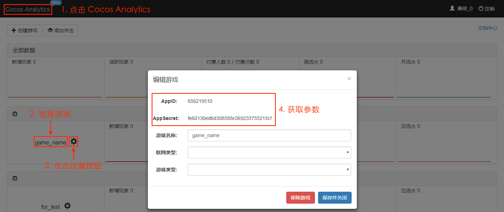

# Cocos Analytics

**Cocos Analytics** is used to record the player's game behavior and provide data analysis support in the background. **Cocos Analytics** currently supports  **Android**, **iOS** and **Web platforms**.

## Getting started

1. Visit the [Cocos Account Center](https://auth.cocos.com/#/). 
  - Click the **Game** tab in the sidebar, select the individual/company game as required. 
  - Click **Create Game** . Next, fill in the required parameters as required, then click **Submit**. The game is created.

  

2. Open the **Cocos Analytics** service. 
  - Click on the game or click on the **Services** tab above to jump to the **Services** panel. 
  - Find **Cocos Analytics** and click **Provide Service**,and you can see that the **Cocos Analytics** service on the page shows **Provided**.

3. Open **Cocos Creator**
  - click **Menu bar -> Panel -> Services** to open the **Services** panel. 
  - Set the **Cocos AppID**. For details, refer to [Cocos Service Panel Settings](cocos-services.md). 
  - Next, select **Cocos Analytics** to go to the **Cocos Analytics** settings panel.

4. Click the **Enable** button in the top right corner to enable the **Cocos Analytics** service. 
    __Note:__ Make sure you performed __2.__, above.

5. After the startup is completed, you can see the newly added **Parameter Configuration** item in the service panel and fill in the parameters. The parameters are obtained as follows:

  - **AppID** and **AppSecret**: Click **Go to console** in the **Cocos Analytics** service panel to go to [Cocos Analytics Stats](https://analytics.cocos.com/). Then click on **Cocos Analytics** in the top left to jump to the first page, select the corresponding game, and click the **Settings** button to get the **AppID** and **AppSecret** parameters. As shown below:

    

  - **channel** and **version**: These two parameters can be set by the user as long as they can be distinguished when the statistical results are obtained.

6. Click **Save** after configuration is complete. Next, open the **Build** panel to build and compile. The build release package has been automatically integrated with the **Cocos Analytics** service.

After the game is loaded, the **Analytics SDK** will be initialized in the `main.js` file after the project is built. The parameters set above will be passed in. You can also manually modify these parameters in `main.js` if you need to. After initialization, you can directly call the **Analytics SDK** and send various statistics to the server.

## Platform integration

According to the game's requirements, refer to the following documents for SDK integration.

- [Android Platform Integration](https://analytics.cocos.com/docs/manual_android.html)
- [iOS Platform Integration](https://analytics.cocos.com/docs/manual_ios.html)
- [Web Platform Integration](https://analytics.cocos.com/docs/manual_h5.html)

For detailed product and API descriptions, please refer to [Cocos Analytics Product Documentation](https://analytics.cocos.com/docs)

## Related reference links

- [Cocos Account Center](https://auth.cocos.com/#/)
- [Cocos Analytics](https://analytics.cocos.com/)
- [Cocos Analytics Product Documentation](https://analytics.cocos.com/docs)
- [Android Platform Integration](https://analytics.cocos.com/docs/manual_android.html)
- [iOS Platform Integration](https://analytics.cocos.com/docs/manual_ios.html)
- [Web Platform Integration](https://analytics.cocos.com/docs/manual_h5.html)
