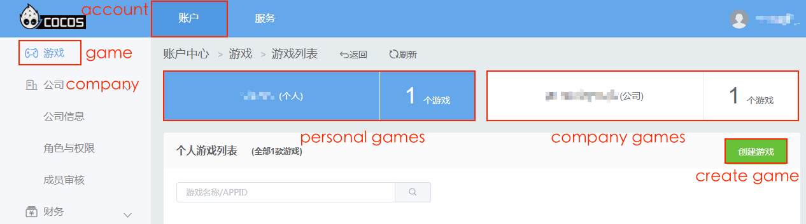
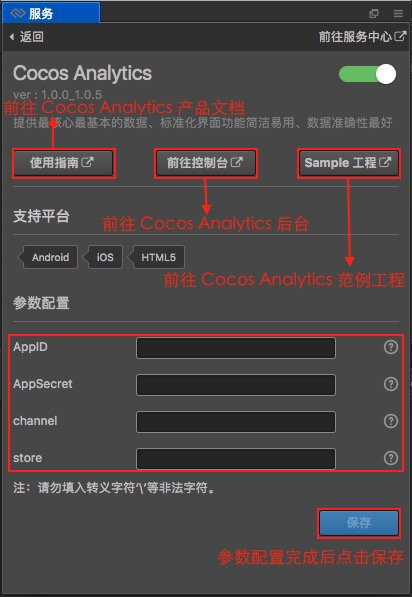

# Cocos 数据统计（Cocos Analytics）

Cocos 数据统计用于记录玩家的游戏行为，并且在后台提供了数据分析支持。目前支持 Android／iOS／Web 平台。

本文档基于 **v2.0.7** 编写，若用户使用的版本在 v2.0.7 之前，请参考 [旧版本文档](https://github.com/cocos/cocos-docs/blob/3e87b0f25c73e74acdc316c141971c592fc8f982/zh/sdk/cocos-analytics.md)。

## 操作流程

1、在 [Cocos 账户中心](https://auth.cocos.com/#/) 点击侧边栏的 **游戏** 标签，根据需要选择个人/公司游戏，然后点击 **创建游戏**。在创建游戏面板根据要求填写必须的参数，然后点击 **提交**，游戏就创建完成了。

2、打开 Creator，点击 **菜单栏的 -> 面板 -> 服务** 项，打开 **服务** 面板。设置 Cocos AppID，详情可参考 [Cocos 服务面板设置](cocos-services.md)。然后选择 **Cocos Analytics** 项，进入 Cocos Analytics 服务面板。

3、点击右上角的启用按钮以启用统计服务：

在弹出的是否开通服务的提示框中点击 **是**，会跳转到 Cocos 账户中心。点击 **确认开通**，可以看到页面中 Cocos Analytics 服务的图标下方显示 **已开通**。

**注意**：从 **v2.0.10** 开始，启用服务时不需要再跳转到 Cocos 账户中心。直接在 Cocos Analytics 服务面板中点击右上角的启用按钮，然后在弹出的是否开通服务的提示框中点击 **确认开通**，即可开通服务。

4、启用完成之后，在服务面板可以看到新增了 **参数配置** 项，包括 **AppID** 和 **store** 两个参数。以及 **重新加载预览插件** 按钮。

- **AppID** 会自动填入当前绑定的游戏 AppID。
- **store** 为游戏分发渠道 ID，长度为 **200**。该项可以任意设置，只要确保在获取统计结果时能够区分即可。
- **重新加载预览插件**：Cocos Analytics 预览插件，用户可以在浏览器预览中使用该 SDK。暂时不支持模拟器。

5、参数配置完成之后点击 **保存**。然后打开 **构建发布** 面板根据用户需求选择 **Android／iOS／Web** 平台进行构建编译。构建出来的发布包已经自动集成了 Cocos Analytics 服务。

游戏加载后，统计 SDK 会在项目构建后的 main.js 文件中初始化，并且传入上面设置的参数。如果有批量发布的需要，也可以手动在 main.js 中修改这些参数。初始化后便可以直接调用统计的 SDK，发送各种统计数据给服务器。

## 各平台接入集成

根据游戏需求，参考以下文档来进行接入集成。

- [Android 平台接入集成](https://n-analytics.cocos.com/docs/android/index.html)
- [iOS 平台接入集成](https://n-analytics.cocos.com/docs/ios/index.html)
- [Web 平台接入集成](https://n-analytics.cocos.com/docs/h5/index.html)

详细的产品和 API 说明，请参考 [Cocos Analytics 产品文档](https://n-analytics.cocos.com/docs/)

## 相关参考链接

- [Cocos 账户中心](https://auth.cocos.com/#/)
- [Cocos Analytics 后台](https://n-analytics.cocos.com/#/)
- [Cocos Analytics 产品文档](https://n-analytics.cocos.com/docs/)
- [Android 平台接入集成](https://n-analytics.cocos.com/docs/android/index.html)
- [iOS 平台接入集成](https://n-analytics.cocos.com/docs/ios/index.html)
- [Web 平台接入集成](https://n-analytics.cocos.com/docs/h5/index.html)
- [Cocos Analytics 范例工程初始项目](https://github.com/cocos/cocos-example-dark-slash)
- [Cocos Analytics 范例工程完成项目](https://github.com/cocos/cocos-example-dark-slash/tree/analytics)
