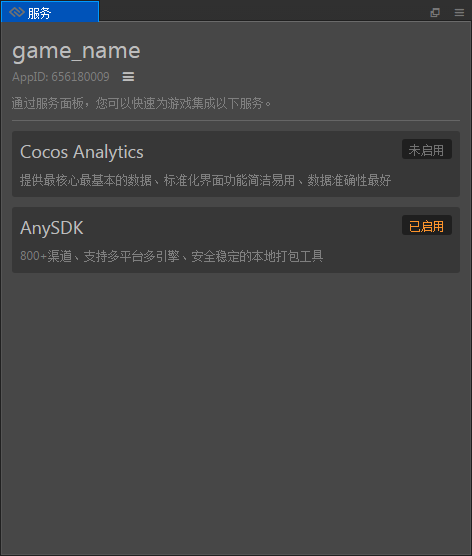
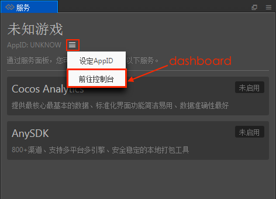
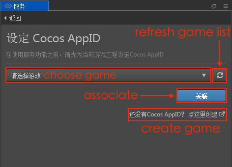
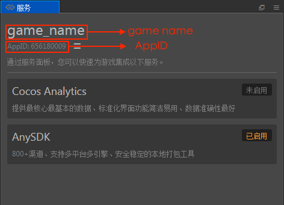
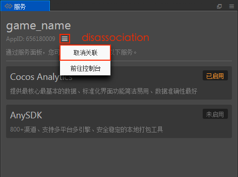

# Cocos Services

Starting with **Cocos Creator v2.0.7**, users can quickly integrate services using the **Service** panel. To get to the **Service** panel by clicking **Menu bar -> Panel -> Service**. The **Service** panel currently supports integrating **AnySDK**. Please refer to the [AnySDK documentation](anysdk.md) for details.

## Usage

**First**, open **Cocos Creator**, choose **Menu bar -> Panel -> Service** to open the **Service** panel. Click the  button above the **Service** panel. Select **Dashboard** and go to the [Cocos Account Center](https://auth.cocos.com/#/) to register your user account.

Create personal/company games as needed after your account registration is complete:

**Second**, after the game is created, return to the **Cocos Creator** **Service** panel and click the  button. After selecting **Bind AppID**, jump to the **Bind Cocos AppID** panel. Then, select the game and click the **Associate** button.

You can create a game by clicking the **Create Game** button to jump to the **Cocos Account Center**.

**Third**, when the **AppID** setup is complete, it automatically jumps to the **Service** panel, where you can see that the game name and **AppID** are already displayed at the top left of the panel.

If you need to switch games, you can click the  button again to select **Unassociate**. Then, go to the **Bind AppID** panel again and re-select the game.

