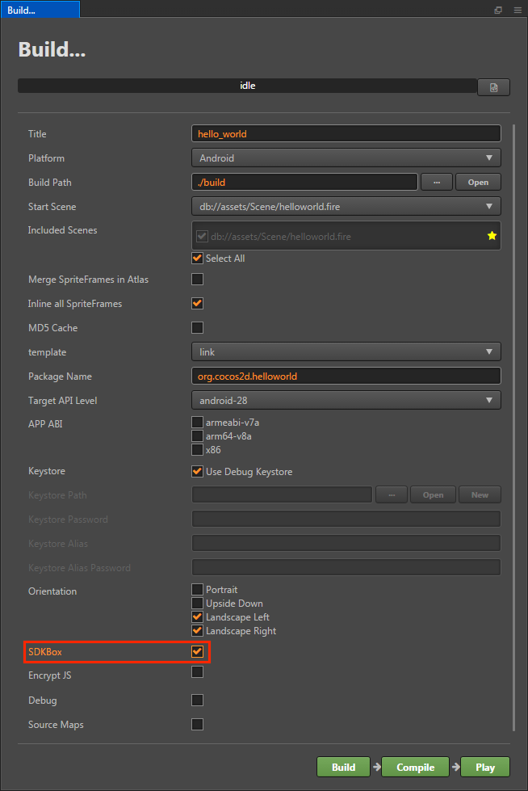

# Integrating SDKs
**Cocos Creator** easily integrates with other **SDKs**. 

### AnySDK and Cocos Analytics
**AnySDK** and **Cocos Analytics** can be integrated through the **Menu bar -> Panel -> Service** panel.

  
  
Please refer to the [Cocos Services](sdk/cocos-services.md), [AnySDK](sdk/anysdk.md) and [Cocos Analytics](adk/cocos-analytics.md) documentation for details.

### Facebook Live Video and Audience Network
**Facebook Live Video** and **Audience Network** can be integrated by selecting the **Menu bar -> Project-> Project Settings -> Service -> Facebook Service**. Please refer to [Facebook Live Video & Audience Network](fb-an-and-live.md) documentation for details.

  

### SDKBox
**SDKBox** can be integrated by selecting the **SDKBox** option in the **Build** panel. Please refer to [SDKBox](sdkbox.md) documentation for details.

  