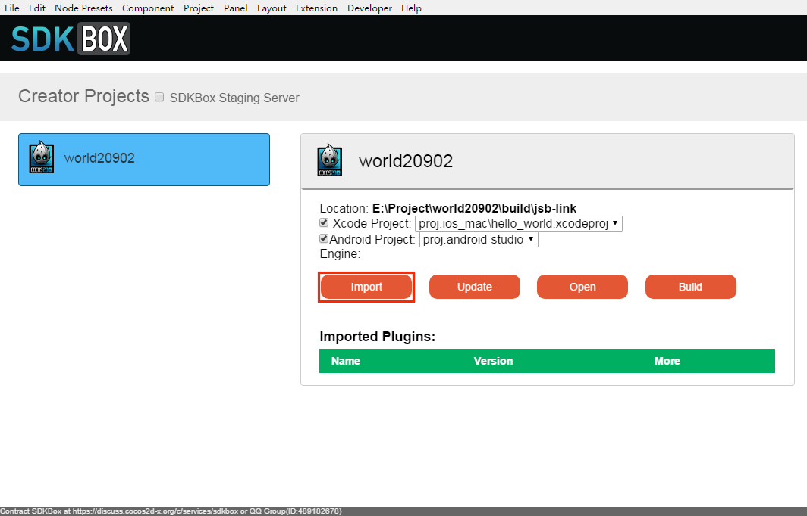
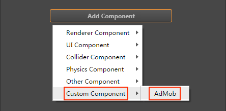
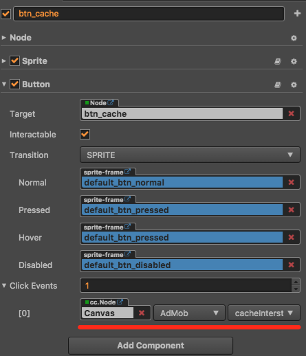

# SDKBox


__SDKBox__ is a free tool for mobile game developers that aids in easily integrating popular social services and other SDKs with just a few lines of code. All services are rigorously tested and officially certified. Supports nearly 30 types of SDKS such as Apple and Google's IAP purchases. Please visit [SDKBox's Homepage](http://www.sdkbox.com/) for more information.

## Integration SDKBox

1. Using Creator open the project that needs to integrate SDKBox. Open the **Build** panel from the **Menu bar -> Project**. Select **iOS/Android** in the **Platform** of the **Build** panel, tick SDKBox, and then click **Build**.

2. When the build is complete, a **Install SDKBox Plugin？** selection box automatically pops up, select **Yes** to open the SDKBox window, and then click **Import** to import the desired plugin. There is a [video](https://gfycat.com/entirelinearbeetle) that can be refer.



## Usage

Once you finish integrate the SDKBox, you should be able to use it with javascript code. Here we'll use AdMob SDK as an example.

### Add buttons

First add two button to scene, design ui like follow:


Click the **+** button at the top left of the **Node Tree**, and then click **Create UI Nodes -> Node with Button**. Then you can add the Button node to the **Scene**.

### Create JavaScript Component

In the **Properties**, click the **+** button in the top left, and then select **JavaScript** to create a script. Rename the script to `AdMob.js` and add the following function, remember to initialize AdMob in the `onLoad` function.

```js
cc.Class({
    extends: cc.Component,

    onLoad: function () {
        //Add this line to onLoad
        this.admobInit();
    },

    ...

    admobInit: function() {
        //finish it after import admob, let it empty for now
    },

    cacheInterstitial: function() {
        //finish it after import admob, let it empty for now
    },

    showInterstitial: function() {
        //finish it after import admob, let it empty for now
    },

    ...

});
```

Then select the Canvas node in the **Node Tree**. Click the **Add Component** button at the bottom of the **Properties** to select the **Custom Component -> AdMob**:



And then you can add **AdMob** component to the Canvas node:


### Add button click events

Select the previously created Button node in the **Node Tree** and you can see that there is a Button component in the **Properties**.
Then set the **Click Events** property and drag the Canvas node that mounts the AdMob.js to the cc.Node of the Click Events property, as shown below. Please refer to [Click Events](../components/button.md#button-event) for details.




### Configuration AdMob

According to AdMob account to configure the release package directory under the `./build/jsb-link/res/sdkbox_config.json` file, fill in AppID, ad ID and so on. You can open the project folder by clicking the **Open Project** button at the top right of the editor.

### Compile

- **iOS**: Use Xcode to open the `.xcodeproj` file under the `./build/jsb-link/frameworks/runtime-src/proj.ios_mac` directory to compile and run.

- **Android**: Run the `cocos run -p android` command in the release package `./build/jsb-link` directory.

When you are finished running, click the Cache Interstitial button, and then click the Show Interstitial button to display your ad.

### Reference code

The complete `AdMob.js` code that can be referenced is as follows:

```js
cc.Class({
    extends: cc.Component,

    onLoad: function () {
        //Add this line to onLoad
        this.admobInit();
    },

    admobInit: function() {
        if(cc.sys.isMobile) {
            var self = this
            sdkbox.PluginAdMob.setListener({
                adViewDidReceiveAd: function(name) {
                    self.showInfo('adViewDidReceiveAd name=' + name);
                },
                adViewDidFailToReceiveAdWithError: function(name, msg) {
                    self.showInfo('adViewDidFailToReceiveAdWithError name=' + name + ' msg=' + msg);
                },
                adViewWillPresentScreen: function(name) {
                    self.showInfo('adViewWillPresentScreen name=' + name);
                },
                adViewDidDismissScreen: function(name) {
                    self.showInfo('adViewDidDismissScreen name=' + name);
                },
                adViewWillDismissScreen: function(name) {
                    self.showInfo('adViewWillDismissScreen=' + name);
                },
                adViewWillLeaveApplication: function(name) {
                    self.showInfo('adViewWillLeaveApplication=' + name);
                }
            });
            sdkbox.PluginAdMob.init();
        }
    },

    cacheInterstitial: function() {
        if(cc.sys.isMobile) {
            sdkbox.PluginAdMob.cache('gameover');
        }
    },

    showInterstitial: function() {
        if(cc.sys.isMobile) {
            sdkbox.PluginAdMob.show('gameover');
        }
    },

});
```

## Related reference links

- [SDKBox's Homepage](http://www.sdkbox.com/)
- [Service Provisioning](http://www.sdkbox.com/integrations)
- For a workflow and detailed guide to using __SDKBox__ in __Cocos Creator__, see the [SDKBox Official Documentation](http://docs.sdkbox.com/zh/qa/cocos_creator/).
