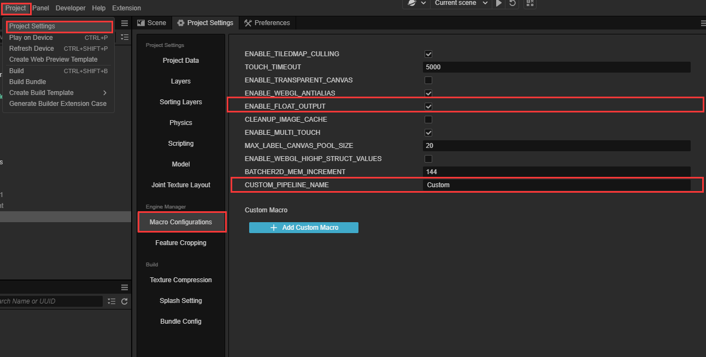
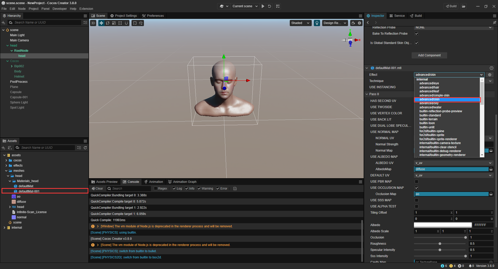
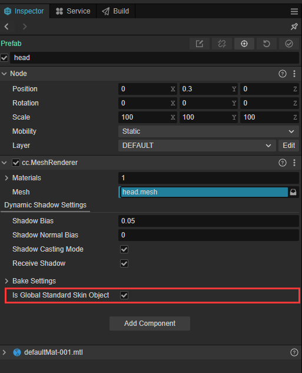
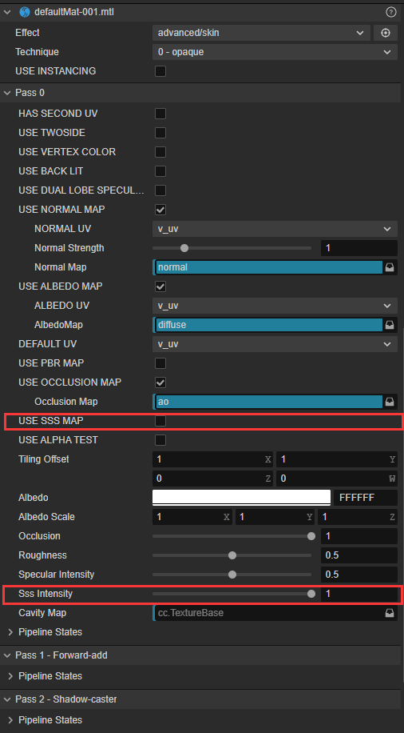

# Skin material

In the game skin if the use of ordinary BRDF material is often not enough red and transparent performance, because the real skin structure is more complex, we need to refer to Separable Subsurface Scattering separable subsurface scattering, restore the skin SSS effect, and make the performance level more rich.

## Use of skin material

1. To use skin material, you need to turn on custom pipeline. For detailed steps, please refer to[Custom rendering of pipelines](../../render-pipeline/custom-pipeline.md#feature-enable).

2. Using skin materials requires some additional macro definition configuration. Check **Project Settings** in **Projects**, then click on the **Macro Configurations** side option in **Engine Manager**.

    - Check the **ENABLE_FLOAT_OUTPUT** option. If unchecked, the engine will also automatically detect if a skin material is available each time it starts and change this option to guarantee the correct effect, but a warning message will be generated.

    

3. To use the skin material you need to add **skin** material to the model:

    - Create a new material. To create a new material, please refer to [Material Assets](../../asset/material.md#material-creation)
    - Select **advanced/skin** for **effect** in the material.

    

4. Specify a model as a global **skin** model: **Optional, usually specifying the model corresponding to the head or body**.
    The engine needs to know the scale of the model corresponding to the skin material in order to calculate the skin scattered light correctly. If no model is checked, the model with the skin material will be automatically selected for calculation.

    - Select the **Node** of the skin model, find the **cc.MeshRenderer** component in the **Property Inspector**, and check the **Is Global Standard Skin Object** option in the component configuration menu.

    > **Note**: **Is Global Standard Skin Object** can only be checked in one render component in the scene. Repeatedly checking in other rendering components will invalidate the previous check.

    

## Adjustment of **skin** parameters

1. **skin** Configuration in the global panel.

    - Adjust the skin effect in the **skin** panel. skin configuration panel please refer to [skin configuration panel](../../concepts/scene/skin.md).

2. **skin** configuration in materials.

    - Subcutaneous Scattering Intensity: This value controls the skin's moistness and subcutaneous scattering intensity, which produces a reddish scattering effect in the transition areas between light and dark. When adjusting the skin material intensity for a single model, you can find **Sss Intensity** in the **Property Viewer** of the skin material to set it, or you can add a **USE SSS MAP** map to the skin material to precisely control the intensity of the skin effect for each organ of the face.

    
