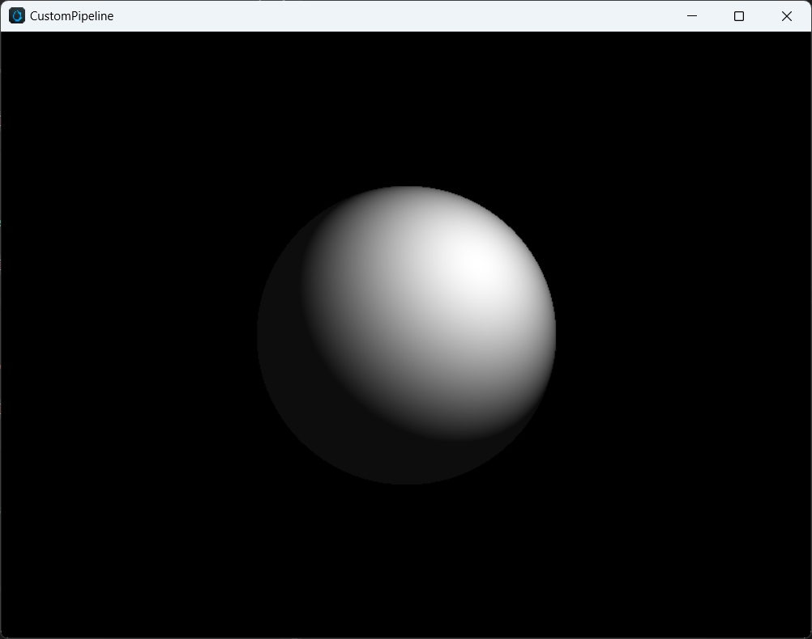

# Compute Shader

Compute Shader (CS) is a programming model for executing general-purpose computing tasks on a GPU. Cocos Compute Shader inherits the syntax and built-in variables of glsl, and is added in the same way as rasterization Shaders, presented in effect form, and can only be used in custom render pipelines. Compute shader uses multiple threads to achieve parallel processing, making it highly efficient when dealing with large amounts of data.

## Syntax

The definition method is the same as that of rasterization Shader shown below. Configuring PipelineStates under Computer Shader is meaningless.

```
CCEffect %{
  techniques:
  - name: opaque
    passes:
    - compute: compute-main           // shader entry
      pass: user-compute              // pass layout name
      properties: &props
        mainTexture: { value: grey }  // material properties
}%
CCProgram compute-main %{
  precision highp float;
  precision mediump image2D;
  layout(local_size_x = 8, local_size_y = 4, local_size_z = 1) in;
  
  #pragma rate mainTexture batch
  uniform sampler2D mainTexture;

  #pragma rate outputImage pass
  layout (rgba8) writeonly uniform image2D outputImage;

  void main () {
    imageStore(outputImage, ivec2(gl_GlobalInvocationID.xy), vec4(1, 0, 0, 1));
  }
}%
```

For more, please refer to [Shader Syntax](./effect-syntax.md).

## Input / Output

Compute Shader input and output consist of built-in input variables and Shader Resource variables.

The built-in input includes:

```c
in uvec3 gl_NumWorkGroups;
in uvec3 gl_WorkGroupID;
in uvec3 gl_LocalInvocationID;
in uvec3 gl_GlobalInvocationID;
in uint  gl_LocalInvocationIndex;
layout(local_size_x = X, local_size_y = Y, local_size_z = Z) in;
```

Shader Resource includes:
- UniformBuffer
- StorageBuffer
- ImageSampler
- StorageImage
- SubpassInput

CS has no built-in output, and output can be achieved through StorageBuffer/Image.

## Shader resource declaration

Compute shader currently supports resource binding at two frequencies: **PerPass** and **PerBatch**, as shown below:

```glsl
#pragma rate mainTexture batch
uniform sampler2D mainTexture;

#pragma rate outputImage pass
layout (rgba8) writeonly uniform image2D outputImage;
```

PerPass resources can be defined as resources that require pipeline tracking to handle synchronization, while PerBatch resources are typically constant data or static textures that can be bound through Material.

The PerBatch `mainTexture` can be configured in the Material panel.

The PerPass `outputImage` needs to be declared in the pipeline and referenced by ComputePass, and the data read/write synchronization and ImageLayout management need to be managed by RenderGraph. Please see below for details.

## Pipeline integration

Adding a Compute Shader in the Custom Render Pipeline involves three steps:

1. 1.Add a Compute Pass, where `passName` is the Layout Name of the current Pass and must correspond to the pass field in the Effect.

  ```ts
  const csBuilder = pipeline.addComputePass('passName');
  ```

2. Declare and reference resources, set access types and associate shader resources.

  ```ts
  const csOutput = 'cs_output';
  if (!pipeline.containsResource(csOutput)) {
      pipeline.addStorageTexture(csOutput,
          gfx.Format.RGBA8,
          width, height,
          rendering.ResourceResidency.MANAGED);
  } else {
      pipeline.updateStorageTexture(csOutput,
          width, height,
          gfx.Format.RGBA8);
  }

  csBuilder.addStorageImage(csOutput,  // resource name
      rendering.AccessType.WRITE,      // access type
      'outputImage');                  // shader resource name
  ```

3. Add a dispatch call and set Compute material.

  ```ts
  csBuild.addQueue().addDispatch(x, y, z, rtMat);
  ```

## Cross-platform support

### Feature

|         | WebGL | WebGL2 | Vulkan | Metal | GLES3  | GLES2 |
| :------ | :---- | :----- | :----- | :---- | :----- | :---- |
| support | N     | N      | Y      | Y     | Y(3.1) | N     |

It can be queried through `device.hasFeature(gfx.Feature.COMPUTE_SHADER)`.

### Limitation

- `maxComputeSharedMemorySize`: maximum total shared storage size, in bytes.
- `maxComputeWorkGroupInvocations`: maximum total number of compute shader invocations in a single local workgroup.
- `maxComputeWorkGroupSize`: maximum size of a local compute workgroup.
- `maxComputeWorkGroupCount`: maximum number of local workgroups that can be dispatched by a single dispatching command.

It can be queried through `device.capabilities`.

### Platform-specific differences

Cocos Creator will convert the Cocos Compute Shader into platform-specific versions of GLSL shaders. Therefore, to ensure compatibility across different platforms, it is necessary to meet the limitation requirements of all platforms as much as possible, including:
1. In Vulkan and GLES, it is required to explicitly specify the format identifier for Storage Image, according to the GLSL specification.
2. GLES requires explicit specification of the Memory identifier for Storage resources, and currently only supports "readonly" and "writeonly". In addition, default precision must be explicitly specified.

### Best Practices

1. When performing screen-space image post-processing, it is recommended to prioritize the use of Fragment Shader.
2. It is recommended to avoid using large work groups, especially when using shared memory. The size of each work group should not exceed 64.

## Sample Code

The following code demonstrates a simple ray tracing shader using a single sphere with 1 ray per pixel, implemented through ComputePass. It uses UniformBuffer, ImageSampler, and StorageImage.

Shader Pass Declaration：

```yaml
techniques:
- name: opaque
  passes:
  - compute: compute-main
    pass: user-ray-tracing
    properties: &props
      mainTexture: { value: grey }
```

`compute-main` implement:

```c
precision highp float;
precision mediump image2D;

layout(local_size_x = 8, local_size_y = 4, local_size_z = 1) in;

#pragma rate tex batch
uniform sampler2D tex;

#pragma rate constants pass
uniform constants {
  mat4 projectInverse;
};

#pragma rate outputImage pass
layout (rgba8) writeonly uniform image2D outputImage;

void main () {
  vec3 spherePos = vec3(0, 0, -5);
  vec3 lightPos = vec3(1, 1, -3);
  vec3 camPos = vec3(0, 0, 0);
  float sphereRadius = 1.0;
  
  vec4 color = vec4(0, 0, 0, 0);
  
  ivec2 screen = imageSize(outputImage);
  ivec2 coords = ivec2(gl_GlobalInvocationID.x, gl_GlobalInvocationID.y);
  vec2 uv = vec2(float(coords.x) / float(screen.x), float(coords.y) / float(screen.y));
  
  vec4 ndc = vec4(uv * 2.0 - vec2(1.0), 1.0, 1.0);
  vec4 pos = projectInverse * ndc;
  vec3 camD = vec3(pos.xyz / pos.w);
  vec3 rayL = normalize(camD - camPos);
  
  vec3 dirS = spherePos - camPos;
  vec3 rayS = normalize(dirS);
  float lenS = length(dirS);
  
  float dotLS = dot(rayL, rayS);
  float angle = acos(dotLS);
  float projDist = lenS * sin(angle);
  
  if (projDist < sphereRadius) {
    // intersection
    vec3 rayI = rayL * (lenS * dotLS - sqrt(sphereRadius * sphereRadius - projDist * projDist));
  
    vec3 N = normalize(rayI - dirS);
    vec3 L = normalize(lightPos - rayI);
    color = vec4(vec3(max(dot(N, L), 0.05)), 1.0);
  }
  
  imageStore(outputImage, coords, color);
}
```

On the API side, it is as follows:

```ts
export function buildRayTracingComputePass(
    camera: renderer.scene.Camera,
    pipeline: rendering.Pipeline) {
    // Get the screen width and height.
    const area = getRenderArea(camera,
        camera.window.width,
        camera.window.height);
    const width = area.width;
    const height = area.height;
 
    // Declare the Storage Image resource.
 const csOutput = 'rt_output';
    if (!pipeline.containsResource(csOutput)) {
        pipeline.addStorageTexture(csOutput,
            gfx.Format.RGBA8,
            width, height,
            rendering.ResourceResidency.MANAGED);
    } else {
        pipeline.updateStorageTexture(csOutput,
            width, height,
            gfx.Format.RGBA8);
    }
    
    // Declare Compute Pass, the layout needs to be consistent 
 const cs = pipeline.addComputePass('user-ray-tracing');
    // Update the camera projection parameters.
    cs.setMat4('projectInverse', camera.matProjInv);
    // Declare the reference of the Storage Image in the current Compute Pass.
    cs.addStorageImage(csOutput, rendering.AccessType.WRITE, 'outputImage');
    // Add Dispatch parameters and bind Material
    cs.addQueue()
        .addDispatch(width / 8, height / 4, 1, rtMat);
    // Return the name of the current Image resource, which will be used for subsequent Post Processing.
    return csOutput;
}
```

Users need to update and bind PerPass resources in Compute Pass, while PerBatch resources will be bound by the material system. The final effect after presenting is as follows:


