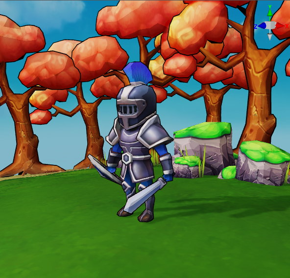

# Toon Shading

Unlike physically based rendering  (PBR,) non-photorealistic rendering (NPR) produces images from a stylized approach without consideration for physical accuracy. Among its many implementations, toon shading is most commonly used.

Generally, toon shader offers render capabilities including:

- Border edges
- Non-linear color steps
- Customized lighting
  
 

 ## Parameters

| Parameter      | Description                                                              |
| :------------- | :---------------------------------------------------------------- |
| tilingOffset   | Scaling and offsetting the mesh’s UVs. Dimension x and y corresponds to scaling, z and w to offsetting. |
| mainColor      |
| colorScale     |
| alphaThreshold |
| shadeColor1    |
| shadeColor2    |
| specular       |
| baseStep       |
| baseFeather    |
| shadeStep      |
| shadeFeather   |
| emissive       |
| emissiveScale  |
| normalStrenth  |
| normalMap      |
| mainTexture    |
| shadeMap1      |
| shadeMap2      |
| specularMap    |
| emissiveMap    |

 ## Macros

 | Definition                    | Description                      |
 | :---------------------------- | :------------------------ |
 | USE_BATCHING                  | Whether the renderable component is to be included in mesh batching |
 | USE_INSTANCING                | Whether the renderable component is to be included in geometric instancing |
 | USE_OUTLINE_PASS              | Whether to enable the border edge pass |
 | USE_NORMAL_MAP                | Whether to use normal map |
 | USE_BASE_COLOR_MAP            | Whether to use base color map |
 | USE_1ST_SHADE_MAP             | Whether to use a texture map for color step 1 |
 | USE_2ND_SHADE_MAP             | Whether to use a texture map for color step 2 |
 | USE_EMISSIVE_MAP              | Whether to use emissive map |
 | USE_ALPHA_TEST                | Whether to enable alpha test (stencil masking) |
 | USE_SPECULAR_MAP              | Whether to use specular map |
 | BASE_COLOR_MAP_AS_SHADE_MAP_1 |                           |
 | BASE_COLOR_MAP_AS_SHADE_MAP_2 |                           |
 | SHADE_MAP_1_AS_SHADE_MAP_2    |                           |

 ## Production Guidelines

 ## Description

 The default toon shader in Cocos Creator consists of 2 passes:
 
 - Pass 0: border edges (optional)
 - Pass 1: color steps, customized lighting and other shading attributes

### Pass 0

This pass is used solely for drawing the border edges of the material, hence requires the front of the mesh to be culled (`CullMode=FRONT`.) In this pass, the vertices are extended in the direction of the vertex normal, returning a mesh slightly larger than the mesh being shaded.

This pass can be enabled or disabled with the `USE_OUTLINE_PASS` parameter.

### Pass 1

The base color of the material is broken into 3 color steps, which respectively are controlled by 3 color parameters:

- `BaseColor`
- `ShaderColor1`
- `ShaderColor2`

When `USE_1ST_SHADE_MAP` or `USE_2ND_SHADE_MAP` is enabled, the second and third color step are shaded with color texture maps instead of constant color values. Artists may create their own ramp color map for customized color steps.
