# Physically Based Rendering

Cocos Creator provides a physically based rendering (PBR) shader since v3.0: `builtin-standard.effect`. PBR simulates the effect of realistic physical lighting based on the principle of realistic light propagation and the law of energy conservation.

The advantages of PBR are:

- Realism: physics-based rendering makes the final effect more realistic
- Consistency: standardized art production process and unified production standards
- Reusability: model materials are separated from the lighting environment and can be reused in all PBR projects

## Creating materials and textures with PBR

Materials created manually in the **Assets** panel use the `builtin-standard.effect` shader by default, which we call the PBR material, which uses the Metal/Roughness workflow of the PBR process.

When rendering with PBR materials, you need to set at least **Albedo**, **Roughness** and **Metallic** of the material in order to get the correct rendering. These can be set in the Material Resource Inspector panel.

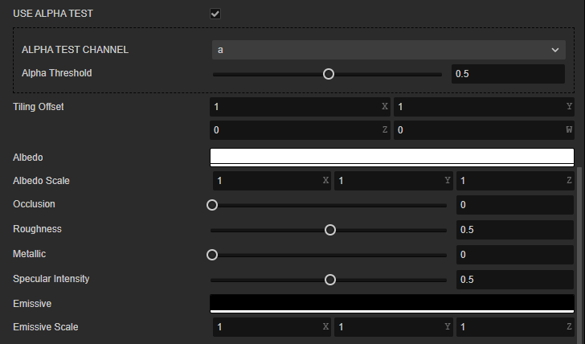

In addition to assigning values directly in the material properties panel, you can also assign **textures** to the material's Albedo, Roughness, and Metallic for more accurate material representation. In addition, you can assign Normal maps for more surface structure details, Ambient Occlusion maps for detail relationships, and Emissive maps for emissive effects.

Let's take the following picture as an example to see the effect obtained by setting the above material parameters.

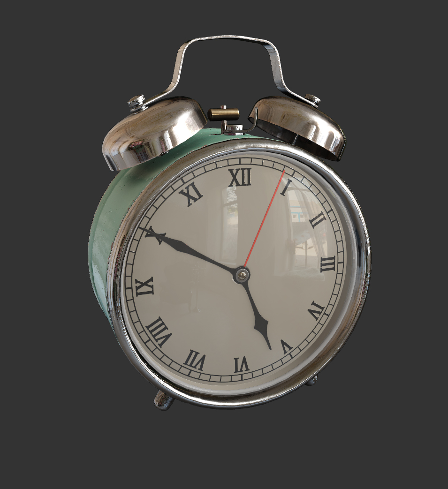

### Albedo

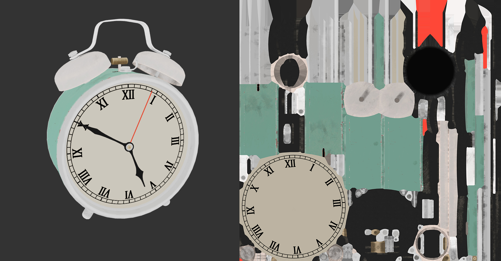

Albedo is used to express the color information expressed by a material in the absence of light. Aesthetically, intrinsic color can be interpreted as the color information expressed by a material when viewed with the naked eye.

In the PBR process, the Albedo represents the set of **Diffuse** colors of the **Non-Metallic** part of the material and **Specular** colors of the **Metallic** part of the material.

> **Note**: In the Metal / Roughness workflow, the Diffuse color of all metals is black, and the color representation seen by the naked eye is produced by the reflected light from the metal. In the non-Metal / Roughness workflow, the color of the metal is determined by the Specular color. Color maps made with non-Metal / Roughness workflows will not render the metal's color information correctly in the Creator's default PBR material.

Users can set the Albedo directly in the **Inspector** property of the material properties panel, or you can check `USE ALBEDO MAP` to assign an RGBA map of the sRGB color space to the material.

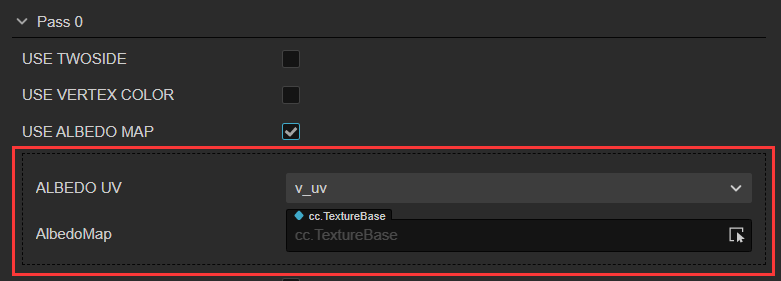

According to the production guidelines of the standard PBR process, in order to obtain a physically realistic rendering, it is important to note during the creation of the intrinsic color mapping that
- The intrinsic color sRGB values should not exceed a maximum of **240** and a minimum of **30~50** depending on the material.
- When expressing the intrinsic color of metals, the physical law of **70%~100%** specular reflectance of metals should be followed, and the sRGB values should be in the range of **180~255**.

### Roughness

Roughness is used to express the degree of reflectivity of a material due to the fine structural details of its surface and takes values in the range [0, 1].

- When Roughness is set to 0, the material surface is absolutely smooth with 100% specular reflectivity.
- When the roughness is set to 1, the material surface is absolutely rough and the specular reflectivity is 0%.

You can set the roughness directly in the **Roughness** property of the Material Properties panel. Or assign an RGBA map in the sRGB color space to the PBR material and express the roughness through the **Green Channel** of the map, as follows.

1. select the PBR material resource in **Assets** panel, then check the **USE PBR MAP** property in the **Inspector** panel and drag the RGBA map to the **PbrMap** property box that appears.
2. then check the **USE METALLIC ROUGHNESS MAP** and drag the RGBA map to the **MetallicRoughnessMap** property box that appears again.

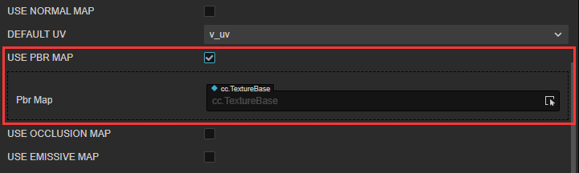

### Metallic

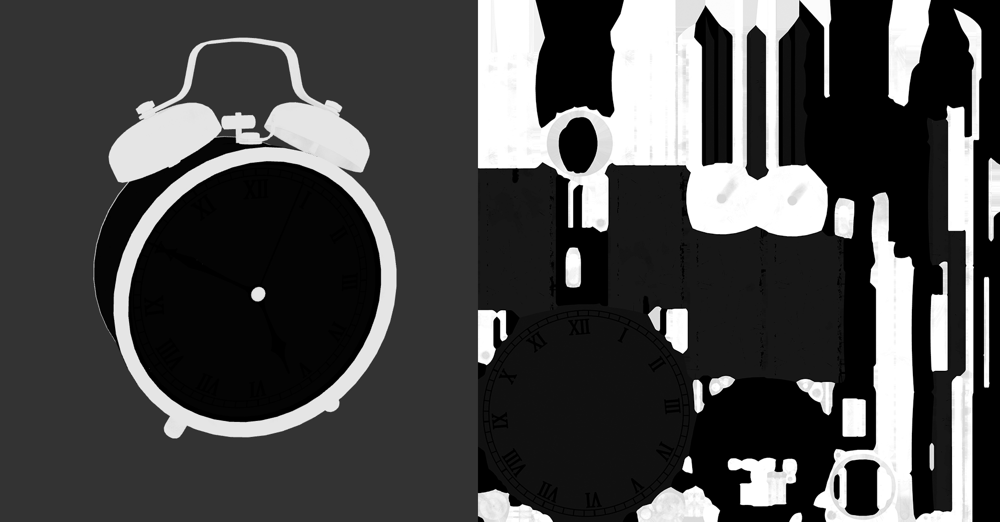

Metallic is used to express the metallic properties of a material and has a value range of [0, 1]. In use, it is usually set to 0 or 1.

- When the metallic is **0**, the material is non-metallic.
- When the metallic is **1**, the material is metal.
- When the metallic is a floating point number between **0 and 1**, it is usually used to indicate metals with non-metallic dirt on the surface.

> **Note**: When the metallic is set to 1, the material is recognized as metal. This is because as the metallic increases, the material undergoes the following changes, which in turn causes it to exhibit metallic characteristics.
>
> - the inherent color is less bright and less saturated than when the metallic is 0.
> - the color of the highlights of the material mixes with the material's intrinsic color.
> - the reflected light more closely resembles the intrinsic color.

You can set the metallic directly in the **Metallic** property of the material properties panel. Or assign an RGBA map in the sRGB color space to the material and express the metallic through the **Blue Channel** of the map as follows.

1. select the PBR material resource in the **Assets** panel, then check the **USE PBR MAP** property in the **Inspector** panel and drag the RGBA map into the **PbrMap** property box that appears.
2. then check the **USE METALLIC ROUGHNESS MAP** and drag the RGBA map to the **MetallicRoughnessMap** property box that appears again.

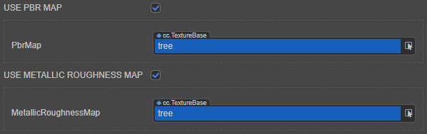

### Ambient Occlusion

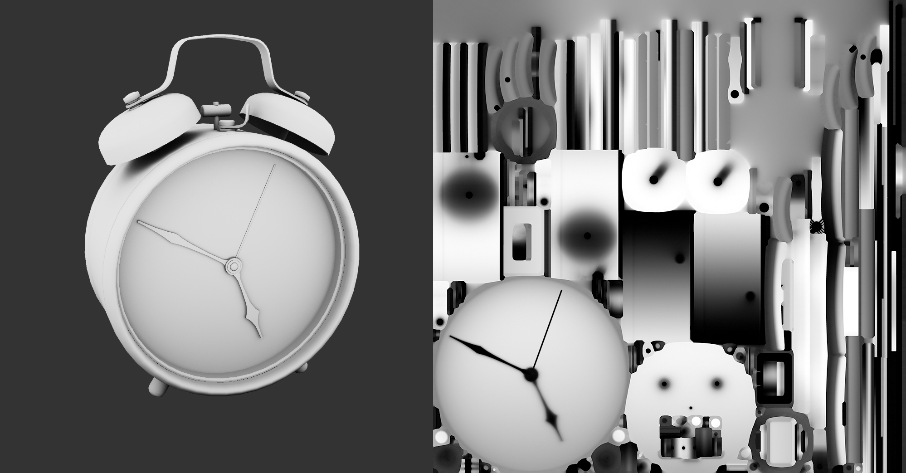

Ambient Occlusion is used to express the relationship between light and dark in a material due to the structural details of the surface. Aesthetically, ambient occlusion can be understood as the shadows created by the model's own structure.

You can assign an RGBA map in the sRGB color space to the PBR material to express the ambient light masking relationship through the **Red Channel** of the map, as follows.

1. select the PBR material resource in **Assets** panel, then check the **USE PBR MAP** property in **Inspector** panel and drag and drop the RGBA map into the **PbrMap** property box that appears.
2. then check the **USE METALLIC ROUGHNESS MAP** and drag and drop the RGBA map into the **MetallicRoughnessMap** property box that appears.
3. check the **USE OCCLUSION MAP** and drag the RGBA map to the **OcclusionMap** property box that appears.

### Normal

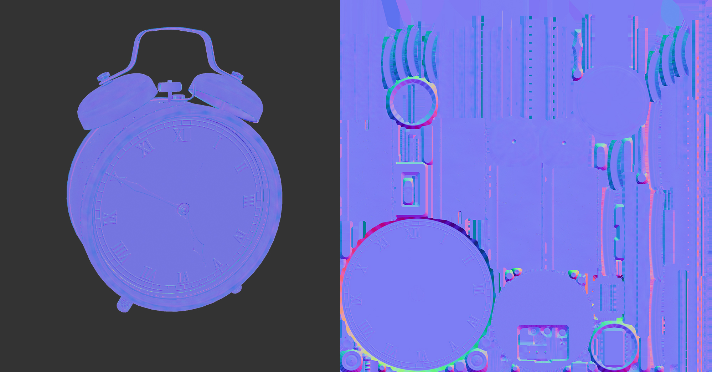

A normal map is a map that uses RGB values in the sRGB color space to represent the vertex coordinate positions in the model's tangent space. Its function is to superimpose the vertex coordinate data in the map onto the model's own vertex coordinate data to participate in the calculation of PBR light and shadow, so that the low model with low vertex count can also express the light and shadow change effect of the high model with high vertex count. Aesthetically, a normal map can be interpreted as a map that expresses the details of the surface structure of an object.

Normal maps are usually created in two ways.
1. create a high-mode with a high vertex count and a low-mode with a low vertex count, and bake the vertex coordinate data of the high-mode onto a map that uses the UV of the low-mode
2. Convert the type of an image resource to a normal map

   

> **NOTE**: When baking normals from a high mode, make sure the baker uses a right-handed coordinate system (Y-axis up) and the MIKK tangent space algorithm.

### Emissive

Emissive color expresses the color information of the material itself as a light source emitting light to the outside.

You can set the emissive directly in the **Emissive** property of the Material Properties panel. Or assign an RGBA map in the sRGB color space to the PBR material, as follows.

1. check the PBR material resource in **Assets** panel, then check the **USE EMISSIVE MAP** property in **Inspector** panel and drag the RGBA map into the **EMISSIVEMAP** property box that appears.

2. then adjust the luminous intensity of the red, green and blue channels of the self-luminous color by using the **EmissiveScale** property.

    > **Note**: The **EmissiveScale** property is usually set to **1** or higher for use with emissive. When **EmissiveScale** is set to 1, the emissive effect of the material is equivalent to that of the `builtin-unlit.effect` material.

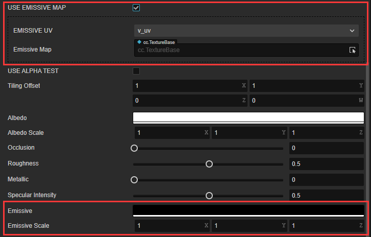

### Stencil

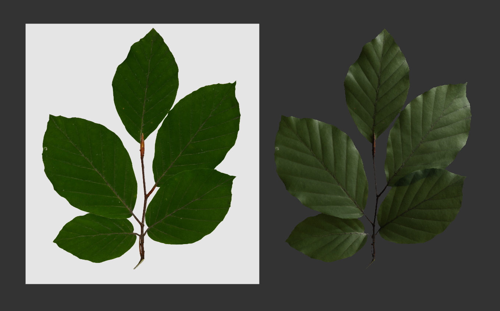

When rendering a material that uses a stencil mask (Stencil), you can turn on the Alpha Test function of the PBR material to remove the pieces outside the mask. The steps are as follows：

- Store the stencil mask (Stencil) as an **Alpha channel** or **Red channel** in the Intrinsic color map.
- Create a new material in the **Assets** panel and mount the intrinsic color map to the new material, referring to the **INTRINSIC COLOR** section above.
- Check **USE ALPHA TEST** and select the Alpha channel (corresponding to the **a** item in the properties) or the Red channel (corresponding to the **r** item in the properties) where the stencil mask (Stencil) is located in the **ALPHA TEST CHANNEL** property displayed below.
- Select the channel (Alpha channel or Red channel) where the template mask (Stencil) is located in the `ALPHA TEST CHANNEL` parameter.
- adjusting the threshold for discarding the meta-brightness of the slice via the **AlphaThreshold** property.
- If needed, refer to the above to implement effects such as normal and ambient light masking.

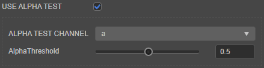

### Transparency materials

The **Technique** property in the Material Properties panel is used for rendering transparent or translucent materials. When set to **1-transparent**, the Alpha Blending feature is turned on, switching to rendering transparent material mode.

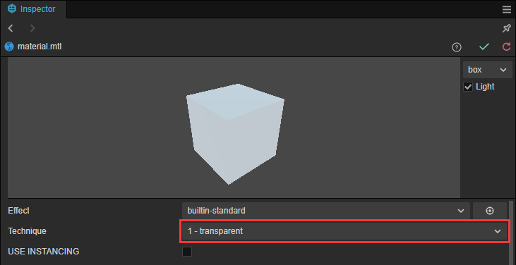

When switching to transparent material mode, all the functions of the material are no different from opaque mode. Users can follow the above workflow to create materials.

Since the engine's rendering pipeline's control of depth changes when Alpha Blending is on, **you need to check the `DepthWrite` parameter under PipelineStates -> DepthStencilState in the Material Properties panel when switching to transparent material mode.**

### PBR Main parameters assembly process

## PBR Parameters

Open `builtin-standard.effect` in the `internal -> effects` directory in the **Inspector** panel in the external code editor and you can see the following parameters：

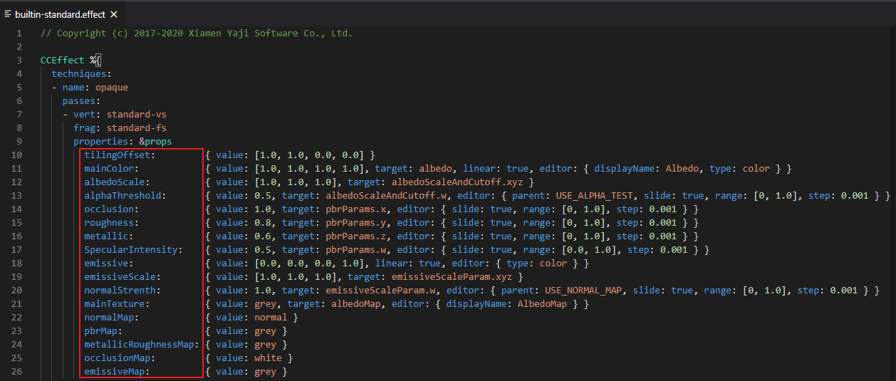

| Parameter | Description |
| :------- | :--- |
| tilingOffset | Scaling and offset of the model UV, xy corresponds to scaling, zw corresponds to offset |
| mainColor | Used to specify the model's albedo or albedo map, the name of which appears as **albedo** in the **Inspector**. |
| albedoMap/mainTexture | Albedo map/texture, if specified, this will be multiplied by the albedo color  |
| albedoScale | Albedo intensity of the model, used to control the weight of the albedo color influence on the final color |
| alphaThreshold | Alpha test threshold, pixels with alpha values below this value will be discarded |
| normalMap | Normal mapping for adding surface detail |
| normalStrength | Normal mapping intensity to control the strength of bumpy texture |
| pbrMap **R**（AO） **G**（Roughness） **B**（Metallic） | PBR material parameter mapping, the sampling result will be multiplied with the constant term R channel: Ambient light masking G channel: Roughness B channel: metallic |
| metallicRoughnessMap **G**（Roughness） **B**（Metallic） | Independent roughness and metallic mapping, the sampling result will be multiplied with the constant term G channel: roughness B channel: metallic |
| occlusionMap | Independent ambient light masking mapping Sampling results are multiplied by a constant term |
| occlusion | Ambient light occlusion factor |
| roughness | Roughness coefficient |
| metallic | metallic coefficient |
| emissive | Emissive colors, independent of light calculation, directly emitted by the model itself |
| emissiveMap | Emissive mapping This will multiply with the emissive color if specified, so you need to turn up the emissive color (default is black) to get the effect  |
| emissiveScale | Emissive intensity Used to control the weighting of the emissive color on the final color. |

## PBR Pre-compiled Macro Definition

| Macro | Description |
| :---- | :--- |
| USE_INSTANCING | Whether to enable GPU Geomerty Instancing |
| HAS_SECOND_UV | Whether there is a secondary UV  |
| ALBEDO_UV | Specify the UVs used for the albedo color map, the first set is used by default |
| EMISSIVE_UV | Specify the UVs used for the sampled emissive mapping, the first set is used by default|
| ALPHA_TEST_CHANNEL | Specify the test channel for alpha test, default is A channel |
| USE_VERTEX_COLOR | If or not the vertex color is enabled. If enabled, the vertex color will be multiplied by the albedo color |
| USE_ALPHA_TEST | Whether to enable alpha text |
| USE_ALBEDO_MAP | Whether to use albedo color reflection mapping |
| USE_NORMAL_MAP | Whether to use normal map |
| USE_PBR_MAP | Whether or not to use PBR parameter triple mapping (**by glTF standard, RGB channels must correspond to ambient light masking, roughness and metallic respectively**) |
| USE_METALLIC_ROUGHNESS_MAP | Whether to use metallic roughness mapping (**by glTF standard, GB channel must correspond to roughness and metallic respectively**)|
| USE_OCCLUSION_MAP | Whether to use ambient light masking (**by glTF standard, only R channel will be used**)|
| USE_EMISSIVE_MAP | Whether to use self-luminous mapping |

For more information about the PBR principle, please refer to [PBR Theory](https://learnopengl.com/PBR/Theory)。
