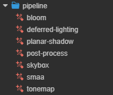
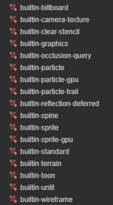

# Built-in Effect

The engine provides a set of common built-in shaders, located in the `internal -> effects` directory of the **Assets** panel of the editor. Double-click a shader file to open it in an external IDE for viewing and editing (provided that **Default Script Editor** needs to be configured in **Preferences -> External Programs**).

Creator roughly categorizes built-in shaders into the following categories:

- `internal`：Internal functionality shaders, such as In-editor gizmo, geometry renderer. Users generally do not need to pay attention to these.
- `pipeline`：Pipeline effects shaders, including deferred lighting, post-effects, anti-aliasing, and more.
- `util`：Holds some loose built-in shaders, such as dcc material importing and sequence frame animations. Users generally do not need to pay attention to these.
- `for2d`：2D rendering shaders, such as spine and sprite.
- `particles`：Particle effect shaders.
- `advanced`：Advanced material with [surface shader](surface-shader.md), such as water, skin, hair, jade.
- Others are built-in shaders, please refer to the description below for details.

## Built-in pipeline effect

| Effect name               | description                         |
| :----------------------- | :--------------------------- |
| bloom.effect             | Full-screen bloom effect |
| deferred-lighting.effect | Lighting process in the deferred-rendering pipeline |
| planar-shadow.effect     | Planar shadow |
| post-process.effect      | Post-processing |
| skybox.effect            | Skybox shader |
| smaa.effect              | SMAA Antialiasing |
| tonemap.effect           | Engine reserved |

## Built-in effect

| Material Effect name                | description                                           |
| :--- | :--- |
| builtin-standard.effect            | [PBR](effect-builtin-pbr.md) |
| builtin-terrain.effect             | Default terrain effect |
| builtin-toon.effect                | [Toon shading](effect-builtin-toon.md) |
| builtin-unlit.effect               | [Unlit](effect-builtin-unlit.md) |

| Other Effect name                | description                                           |
| :--- | :--- |
| builtin-billboard.effect | Billboard Billboard is a rendering technique that makes objects always face the camera, suitable for rendering trees, healthing point bars, etc.|
| builtin-camera-texture.effect      | camera texture |
| builtin-clear-stencil.effect       | clear stencil cache |
| builtin-graphics.effect            | [Graphics](../ui-system/components/editor/graphics.md) effect |
| builtin-occlusion-query.effect     | Occlusion query |
| builtin-particle-trail.effect      | Trail for particle system |
| builtin-particle.effect            | CPU-based rendergin for particle system |
| builtin-particle-gpu.effect        | GPU-based rendering for particle system   Please refer to [Particle Renderer](../particle-system/renderer.md) to understand the useage of these two effects |
| builtin-reflection-deferred.effect | For reflection handling in deferred-rendering |
| builtin-spine.effect               | Effect for spine skeleton animation|
| builtin-sprite.effect              | Built-in standard sprite effect |
| builtin-sprite-gpu.effect          | Engine reserved |
| builtin-wireframe.effect           | Wireframe effect |
