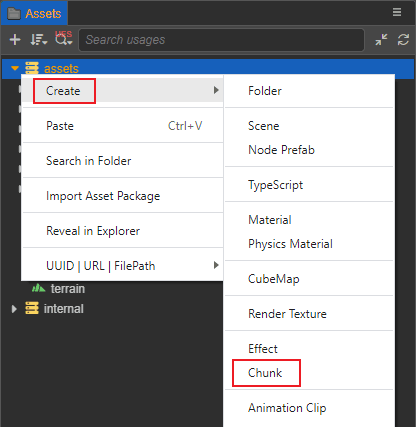
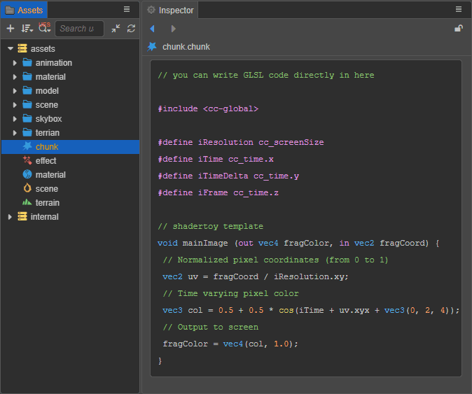

# Effect Chunk

Chunk is a cross-file code reference mechanism that enables shader code fragments to be reused between different files.

The syntax of the chunk is based on **GLSL 300 ES** and will be precompiled when the asset is loaded to generate the target machine shader code.

## Create chunk

Right-click in the **Assets** panel and select **Create -> Chunk**:



A chunk asset named **chunk** by default can be created, as shown below:



## Include mechanism

Based on the standard GLSL syntax, Cocos Effect introduces a C-style syntax extension - the Include mechanism.

Through the include mechanism, other chunks can be included in any Shader code (CCProgram block or separate header file), as follows:

```c
// Introduced in-engine chunk
#include <builtin/uniforms/cc-global>

// Introduce custom chunk
#include "../headers/my-shading-algorithm.chunk"
```

Relevant rules and precautions:

- Chunk extension defaults to `.chunk`, which can be ignored when include. There is no difference between using double brackets or angle brackets when introducing other code fragments, for example:

  ```c
  #include "filename.chunk"
  #include "filename" // ignorable extension
  #include <filename.chunk>
  #include <filename>  // ignorable extension
  ```

- Chunks are expanded when Cocos Effect is compiled, and only once. So don't worry when writing, each module can contain its own dependent shader fragments, even if there are repetitions;
- All function declarations that do not participate in the actual calculation process at runtime will be eliminated at compile time, so you can safely include various tool functions without worrying that the generated object code will be redundant;
- Chunk references can specify a relative path based on the current file directory (hereinafter collectively referred to as "relative path"), or a relative path based on the **internal -> chunks** directory in the **Explorer** panel of the editor (Hereinafter collectively referred to as the "Project Absolute Path"). If there are files with the same name in the two directories, the latter (project absolute path) takes precedence;
- Creator provides some built-in shader fragment resources, mainly including some commonly used utility functions and standard lighting models, etc. The built-in asset database (DB for short) located in the [Assets](../editor/assets/index.md) panel in the `chunks` directory of `internal`, so it can be directly referenced without a directory.
- Chunk that reference other DBs (Databases) in the editor can only specify the absolute path of the project. When multiple DBs have the same file in this path, the DB priority is: User Project DB > Plugin DB > Internal DB;
- All CCProgram code blocks declared in the same Cocos Effect file can reference each other.
