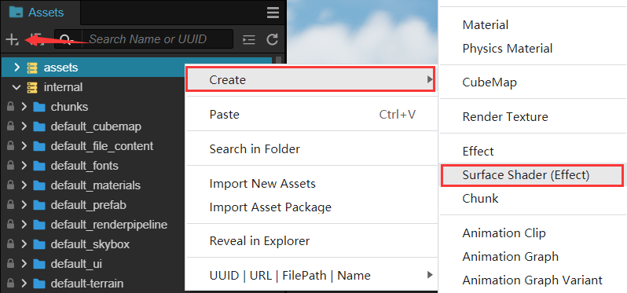
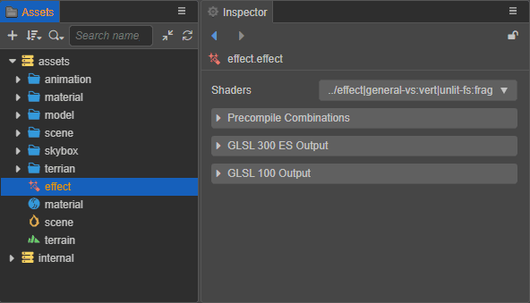
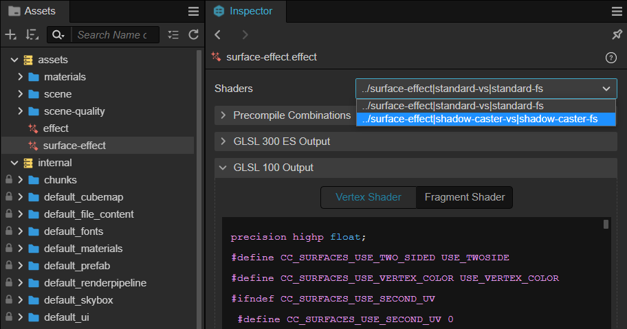
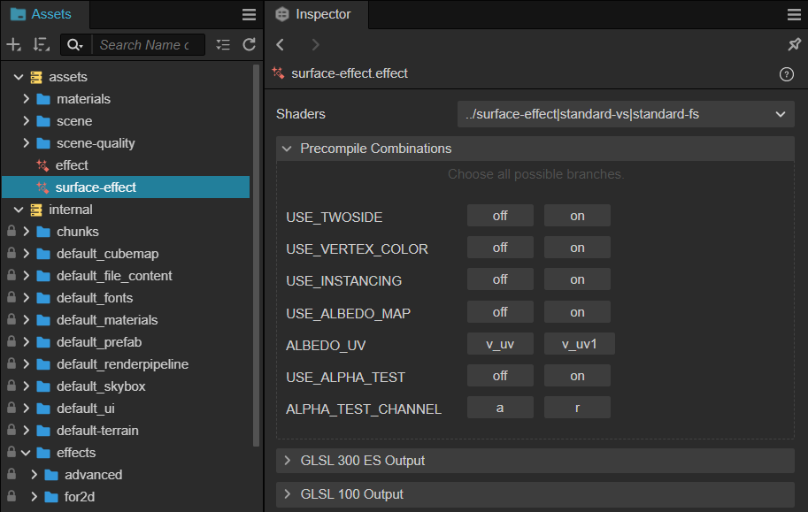
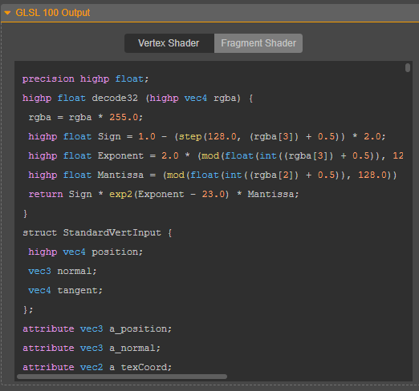

# Effect Asset

## Effect creation

To create a new effect asset, click the **+** button on the upper left corner of the **Assets** panel and select **Effect**. Or just right-click on the **Assets** panel and choose **Create -> Effect**.



Engine will create an effect asset in the **Assets** named **effect** by default:



In Effect **Inspector** you can see that the shader is mainly composed of the following parts:

| property | description|
| :-- | :-- |
| Shaders | The current shader and the name of its rendering pass |
| Precompile Combinations | Whether to enable preprocessing macro definition combination, please refer to the following description for details |
| GLSL 300 ES/100 Output | GLSL output, please refer to the description below for details |

## Shaders

If the current shader has multiple rendering passes, you can select a different rendering pass through the drop-down box to the right of Shaders. After selecting a render pass, the currently compiled shader code can be viewed through the GLSL Output window.



## Precompile Combinations

Under normal circumstances, the material will be compiled when the corresponding macro definition is used. When more macro definitions are used, the compilation maybe slow. Therefore, the precompiled macro definition combination can be configured in this option, which is used to compile the required macro definition combination in advance. For example, the configuration in the following figure:



This indicates that the following 4 combined shaders will be precompiled at initialization:

USE_INSTANCING = 0, USE_BATCHING = 0

USE_INSTANCING = 0, USE_BATCHING = 0

USE_INSTANCING = 1, USE_BATCHING = 0

USE_INSTANCING = 1, USE_BATCHING = 1

## GLSL Output

Currently the engine provides GLSL 300 ES and GLSL 100 output.

The compiled vertex and fragment shaders can be toggled between display by selecting different tabs:



## Use shaders procedurally

When using a shader in script, you need to find the corresponding shader name in the **Shaders** property of the effect in the **Inspector** panel, and then load and use it by its unique string name.


Take the custom shader in the above figure as an example, the code example is as follows:

```ts
resources.load("custom-effect", EffectAsset, ()=>{
    const effectAsset = EffectAsset.get("../resources/custom-effect");
    const material = new Material();
    material.initialize({ effectName: "../resources/custom-effect" });
})        
```

**NOTE**: Since v3.6, if you want to using a engine builtin shader in script, you will also need to find the corresponding shader name in the **Shaders** property of the effect in the **Inspector** panel. Take the standard shader as an example, the code example is as follows:

```ts
// Get built-in standard effect: ‘builtin-standard.effect’
const effect = EffectAsset.get('builtin-standard');

const mat = new Material();

// Initialize material with built-in physically based lighting shader (PBR) 'builtin-standard.effect'
mat.initialize({ effectName: "builtin-standard" });
```

If it is a custom shader, you need to find the corresponding shader name in the **Shaders** property of the effect in the **Inspector** panel, and then load and use it by its unique string name.


Take the custom shader in the above figure as an example, the code example is as follows:

```ts
resources.load("custom-effect", EffectAsset, ()=>{
    const effectAsset = EffectAsset.get("../resources/custom-effect");
    const material = new Material();
    material.initialize({ effectName: "../resources/custom-effect" });
})        
```