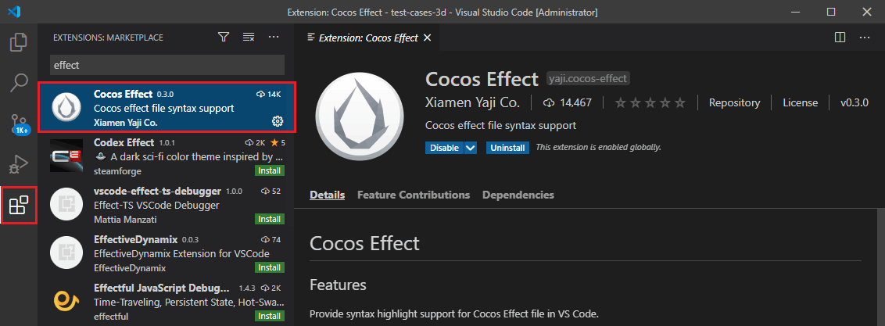
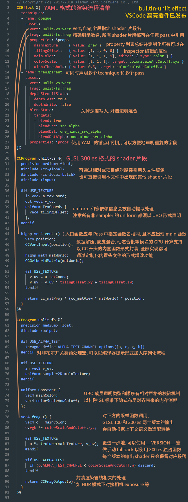

# Effect Syntax Guide

The shader (Cocos Effect) in Cocos Creator is a single-source embedded domain-specific language based on [YAML](yaml-101.md) and [GLSL](glsl.md). The YAML part declares the flow control list and the GLSL part declares the actual shader fragments, which complement each other and together form a complete description of the rendering process.

> **Note**: It is recommended to use Visual Studio Code to write Cocos Effect and to install the Cocos Effect extension in the app store, which provides syntax highlighting when writing.
>
> 

## Effect Syntax Overview

**Cocos Effect** usually consists of two parts.

- `CCEffect`: used to declare attributes such as rendering technique, rendering passes, render state, material parameters, etc.
- `CCProgram`: used to declare Vertex Shader and Fragment Shader code snippets.

Here we take the built-in shader `builtin-unlit.effect` as an example to illustrate the syntax framework of Cocos Effect.

Open the `builtin-unlit.effect` file in the `internal -> effects -> util` directory in the Creator **Assets** panel in VS Code, and you will see the following content:



### CCEffect

The part of Cocos Effect wrapped in `CCEffect` is a description of the rendering process declared by the **YAML syntax**. YAML is a data serialization-oriented and human-friendly language, but it introduces some unique syntax to represent different types of data, so for developers unfamiliar with YAML, we have summarized some common syntax and language features in [YAML 101](yaml-101.md) summarizes some common syntax and language features for developers who are not familiar with YAML.

The overall structure of `CCEffect` is as follows.

```glsl
CCEffect %{
  techniques:
  - name: tag
    passes:
    - vert: vs:entry
      frag: fs:entry
      <optional: material properties>
      <optional: pipeline states>
      <optional: one or more definitions>
    ...
  ...
}%
```

The core of `CCEffect` is the rendering technique. A `CCEffect` supports the definition of multiple rendering techniques, but only one of them will be used in the actual rendering process.

The unlit shader `builtin-unlit.effect` in the figure above, for example, contains `opaque`, a rendering technique specifically for rendering opaque objects, and `transparent`, a rendering technique specifically for rendering transparent objects. In the actual rendering process, a rendered object can only choose to use `opaque` or `transparent`.

Each rendering technique (technique) contains a name (`name`) and at least one rendering process (`pass`). The name is used to mark the purpose of the rendering technique, and the rendering process defines all the information needed for a complete rendering process.

A rendering technique can contain multiple rendering passes, and the rendering passes are executed one by one in the defined sequence.

- A rendering pass must contain a Vertex Shader and a Fragment Shader, the rest are optional. Please refer to [Optional Pass Parameters](pass-parameter-list.md) for details.

- The vertex/fragment shader needs to specify the shader to be used (that is, the shader declared with **CCProgram** described below), and the entry function of the shader.

**Example**：

```yaml
CCEffect %{
  techniques:
  - name: opaque # Define an opaque rendering technique
    passes:
    - vert: vs: entry # Select a CCProgram declared vertex shader 'vs', with entry function 'entry'
      frag: fs: entry # Selects a CCProgram-declared fragment shader 'fs', with entry function 'entry'
      properties:
        mainTexture: { value: grey } # A 'uniform mainTexture' needs to be defined simultaneously in the shader, and this property can be entered in the editor's Inspector panel
        colorScale: { value: [1, 1, 1], target: colorScaleAndCutoff.xyz } # Based on the 'target' property configuration mechanism, the shader needs to define a 'uniform colorScaleAndCutoff' synchronously and pick its x, y, z components to fill the data set by 'colorScale'
      depthStencilState: # Configure depth tests, stencil tests and write states
        depthTest: true
        depthWrite: true
    ...
  ...
}%
```

#### Optional Pass Parameters

Each rendering process has only two required parameters, `vert` and `frag`, which are used to declare the vertex shader and the fragment shader used by the current rendering process, respectively, in the format `fragment name: entry function name`. The fragment name can be either the `CCProgram` fragment name declared in this file, or a standard chunk file provided by the engine.

> **Note**: The `main` function should not be used in the code of a custom shader. Cocos Effect will automatically add a `main` function and call the entry function of the rendering process (e.g. `vert` or `frag`) when compiled, and the `main` function will take the return value of the entry function as the output of the current shader (e.g. `gl_Position` or `gl_FragColor`).

For other optional parameters and default values, please refer to [Optional Pass Parameters](pass-parameter-list.md) for details.

### CCProgram

The part of Cocos Effect wrapped by `CCProgram` is a shader fragment declared by **GLSL syntax**. It is recommended to know the [Introduction to GLSL Syntax](./glsl.md).

It is structured as follows.

```glsl
CCProgram shader-name %{
  <required: precision settings>
  <optional: include>  
  <optional: ubo>
  <optional: custom attribute>
  <optional: >
  vec4 entry(){
    // Need to return a vec4 type data
  }
}%
```

## Pre-processing Macros

Pre-processing macros allow control of code branching and combining at Cocos Effect compile time for efficient and convenient Shader code management.

For more details, please refer to:

- [Preprocessor macro definition](macros.md)
- [Introduction to GLSL Syntax](glsl.md)

## CCVertInput[^1]

- To interface the skeletal animation with the data decompression process, we provide the `CCVertInput` utility function, which is available in `general` and `standard` versions, as follows:

  ```glsl
  // Generic vertex shader input at 'input.chunk'
  #define CCVertInput(position) \
    CCDecode(position);         \
    #if CC_USE_MORPH            \
      applyMorph(position);     \
    #endif                      \
    #if CC_USE_SKINNING         \
      CCSkin(position);         \
    #endif                      \
    #pragma // empty 'pragma' trick to eliminate trailing semicolons at compile time
  
  // 位于 ‘input-standard.chunk’ 的标准顶点着色器输入
  #define CCVertInput(In) \
    CCDecode(In);         \
    #if CC_USE_MORPH      \
      applyMorph(In);     \
    #endif                \
    #if CC_USE_SKINNING   \
      CCSkin(In);         \
    #endif                \
    #pragma // empty 'pragma' trick to eliminate trailing semicolons at compile time

  ```

- If you only need to get **vertex position**, you can use the **general** version, then the code example at the beginning of the vertex shader function is as follows:

  ```glsl
  #include <legacy/input>
  vec4 vert () {
    vec3 position;
    CCVertInput(position);
    // ... Customization of position
  }
  ```

  If you also need information such as normals, you can use the `standard` version, written like the following:

  ```glsl
  #include <legacy/input-standard>
  vec4 vert () {
    StandardVertInput In;
    CCVertInput(In);
    // ... At this point 'In.position' is initialized and can be used in the vertex shader
  }
  ```

In the above sample code, the `StandardVertInput` object `In` returns the vertex position (`position`), normal (`normal`) and tangent space (`tangent`) information of the model space, and finishes the skinning calculation for the skeletal animation model.

The `StandardVertInput` structure is defined as follows.

```glsl
struct StandardVertInput {
  highp vec4 position;
  vec3 normal;
  vec4 tangent;
};
```

> **Note**: After referencing the chunk file, do not declare these attributes (`a_position`, `a_normal`, `a_tangent`, etc.) repeatedly in the Shader. For other vertex data (such as uv, etc.), you still need to declare attributes before using them.

To dock the engine for dynamic Mesh merge batching and GPU Geomerty Instancing, you need to include the `cc-local-batch` header file and get the world matrix via the `CCGetWorldMatrix` utility function, example as follows.

```glsl
mat4 matWorld;
CCGetWorldMatrix(matWorld);

mat4 matWorld, matWorldIT;
CCGetWorldMatrixFull(matWorld, matWorldIT);
```

For more information about Cocos Effect's built-in uniform, please refer to [Built-in Shader Uniforms](uniform.md).

## CCFragOutput

Cocos Effect provides the `CCFragOutput` utility function to simplify the output of fragment shaders, which can be used to return the values needed by the fragment shader directly, with the following code example.

```glsl
#include <legacy/output>
vec4 frag () {
  vec4 o = vec4(0.0);
  // ... Writing fragment shader code 
  return CCFragOutput(o);
}
```

`CCFragOutput` will decide whether to do `ToneMap` transcoding based on the pipeline state, so that the intermediate color calculation does not have to distinguish whether the current rendering pipeline is an HDR process or not.

Code examples are as follows:

```glsl
vec4 CCFragOutput (vec4 color) {
  #if CC_USE_HDR
    color.rgb = ACESToneMap(color.rgb);
  #endif
  color.rgb = LinearToSRGB(color.rgb);
  return color;
}
```

**Special attention**.

If `CCFragOutput` is used as the slice output, the intermediate color operations must be transferred to `Linear` space, because `CCFragOutput` considers the incoming parameters to be in `Linear` space and always does `LinearToSRGB` transcoding.

The `CCFragOutput` function does not generally need to be implemented by itself, it only serves to interface with the rendering pipeline, and for this kind of output containing lighting calculations, since the results are already in the HDR range, the `output-standard` rather than the `output` header should be included.

To include standard PBR lighting calculations, use the `StandardSurface` structure together with the function `CCStandardShadingBase` to form the PBR shading process.

The contents of the `StandardSurface` structure are as follows:

```glsl

struct StandardSurface {
  // albedo
  vec4 albedo;
  // these two need to be in the same coordinate system
  vec3 position;
  vec3 normal;
  // emissive
  vec3 emissive;
  // light map
  vec3 lightmap;
  float lightmap_test;
  // PBR params
  float roughness;
  float metallic;
  float occlusion;
};
```

Code examples are as follows:

```glsl
#include <legacy/shading-standard-base>
#include <legacy/output-standard>
void surf (out StandardSurface s) {
  // fill in your data here
}
vec4 frag () {
  StandardSurface s; surf(s);
  vec4 color = CCStandardShadingBase(s);
  return CCFragOutput(color);
}
```

See also `bultin-standard.effect`, which uses the `surf` function in combination with the `CC_STANDARD_SURFACE_ENTRY()` macro.

`CC_STANDARD_SURFACE_ENTRY()` is a wrapper that constructs a `main` function available to the slice element using the `surf` function based on the rendering state, with the following code example:

```glsl
CCProgram shader-fs %{
  #include <legacy/standard-surface-entry>

  void surf (out StandardSurface s) {
    // fill in your data here
  }

  CC_STANDARD_SURFACE_ENTRY()
}%
```

## Customize GPU Instancing Properties

The **GPU Instancing** feature allows the GPU to batch draw rendered objects with the same mesh and the same material. If we want to modify the display of an object individually without breaking this feature, we need to customize the instancing property.

The declaration, definition, and use of variables related to instancing properties depend on the `USE_INSTANCING` preprocessing macro definition, otherwise a compilation error will occur when the `USE_INSTANCING` switch is toggled. Code examples are as follows:

```glsl
#if USE_INSTANCING // when instancing is enabled
  #pragma format(RGBA8) // normalized unsigned byte
  in vec4 a_instanced_color;
#endif
```

> **Note**:
> - The `format` here is used to specify the specific data format of this attribute, the argument can be any enumeration name [^2] from the engine `GFXFormat`; if undeclared it defaults to the 32-bit >float type.
> - All instantiated attributes are input from the attribute that utilizes the vertex shader (vs), and need to be declared in vs before being passed to fs if they are to be used in the slice shader (fs).
> - Make sure the code executes properly in all branches, regardless of whether `USE_INSTANCING` is enabled or not.

The value of the instantiated attribute is initialized to 0 at runtime and can be set in the script via the `MeshRenderer.setInstancedAttribute` interface, with the following sample code.

```ts
const comp = node.getComponent(MeshRenderer);
comp.setInstancedAttribute('a_instanced_color', [100, 150, 200, 255]); // should match the specified format
```

> **Note**: If a material is changed on the **MeshRenderer** component, all instancing property values will be reset and need to be reset.

## WebGL 1.0 Fallback Compatibility Support

Since WebGL 1.0 only supports the GLSL 100 standard syntax, the GLSL 300 ES to GLSL 100 backward-compatible code (fallback shader) is provided in the Cocos Effect compilation, and developers basically don't need to care about this layer of change.

It should be noted that the current automatic backward compatibility policy only supports some basic format conversion, if you use GLSL 300 ES unique functions (such as `texelFetch`, `textureGrad`) or some specific extensions (`extensions`), it is recommended to determine the GLSL version according to the `__VERSION__` macro definition to achieve a more stable and accurate backward compatibility by yourself, the code example is as follows:

```glsl
#if __VERSION__ < 300
#ifdef GL_EXT_shader_texture_lod
  vec4 color = textureCubeLodEXT(envmap, R, roughness);
#else
  vec4 color = textureCube(envmap, R);
#endif
#else
  vec4 color = textureLod(envmap, R, roughness);
#endif
```

Cocos Effect is compiled to parse all macro control flows that are already constants and generate different versions of the GLSL Shader code.

## UBO Memory Layout

Cocos Effect states that all non-sampler types of uniform should be declared as UBO (Uniform Buffer Object/Uniform Block).

Take the built-in shader `builtin-standard.effect` as an example, its uniform block declaration is as follows:

```glsl
uniform Constants {
    vec4 tilingOffset;
    vec4 albedo;
    vec4 albedoScaleAndCutoff;
    vec4 pbrParams;
    vec4 miscParams;
    vec4 emissive;
    vec4 emissiveScaleParam;
  };
```

And all UBOs should follow the following rules:
1. no vec3 members should be present;
2. for array type members, the size of each element cannot be smaller than vec4;
3. no member declaration order that would introduce padding is allowed.

Cocos Effect checks the above rules during compilation to alert you to import errors (implicit padding related).

This may sound a bit overly strict, but there are very pragmatic considerations behind it:<br>
First, UBO is the only fundamental unit within the rendering pipeline to achieve efficient data reuse, and discrete declarations are no longer an option.<br>
Second, WebGL2's UBO only supports the std140 layout, which adheres to a more primitive set of padding rules [^3]:

- All vec3 members are complemented to vec4:

  ```glsl
  uniform ControversialType {
    vec3 v3_1; // offset 0, length 16 [IMPLICIT PADDING!]
  }; // total of 16 bytes
  ```

- Arrays and structures of any length less than the vec4 type will have their elements complemented to vec4:

  ```glsl
  uniform ProblematicArrays {
    float f4_1[4]; // offset 0, stride 16, length 64 [IMPLICIT PADDING!]
  }; // total of 64 bytes
  ```

- The actual offsets of all members within the UBO are aligned by the number of bytes they occupy [^4]:

  ```glsl
  uniform IncorrectUBOOrder {
    float f1_1; // offset 0, length 4 (aligned to 4 bytes)
    vec2 v2; // offset 8, length 8 (aligned to 8 bytes) [IMPLICIT PADDING!]
    float f1_2; // offset 16, length 4 (aligned to 4 bytes)
  }; // total of 32 bytes
  
  uniform CorrectUBOOrder {
    float f1_1; // offset 0, length 4 (aligned to 4 bytes)
    float f1_2; // offset 4, length 4 (aligned to 4 bytes)
    vec2 v2; // offset 8, length 8 (aligned to 8 bytes)
  }; // total of 16 bytes
  ```

This means a lot of wasted memory and the driver implementation for some devices does not fully comply with this standard [^5], so for now Cocos Effect has chosen to limit the use of this part of the functionality to help troubleshoot some of the very obscure runtime issues.

> **Remind again**: the type of uniform can not correspond directly to the program interface of the inspector when displaying and assigning runtime parameters, and the [property target](pass-parameter-list.md#Properties) mechanism allows editing the specific components of any uniform independently.

[^1]: Shaders that are not based on Mesh rendering such as Particle, Sprite, and Post Effect are not included.

[^2]: Note that WebGL 1.0 does not support integer attributes, so if you need to publish your project to this platform, you should use the default floating point type.

[^3]: [OpenGL 4.5, Section 7.6.2.2, page 137](http://www.opengl.org/registry/doc/glspec45.core.pdf#page=159)

[^4]: Note that in the sample code, the total length of the UBO `IncorrectUBOOrder` is 32 bytes, and indeed this data remains platform-dependent even today, seemingly due to an oversight in the GLSL standard, for more discussion on this see [here](https://bugs.chromium.org/p/chromium/issues/detail?id=988988).

[^5]: **Interface Block - OpenGL Wiki**：<https://www.khronos.org/opengl/wiki/Interface_Block_(GLSL)#Memory_layout>
