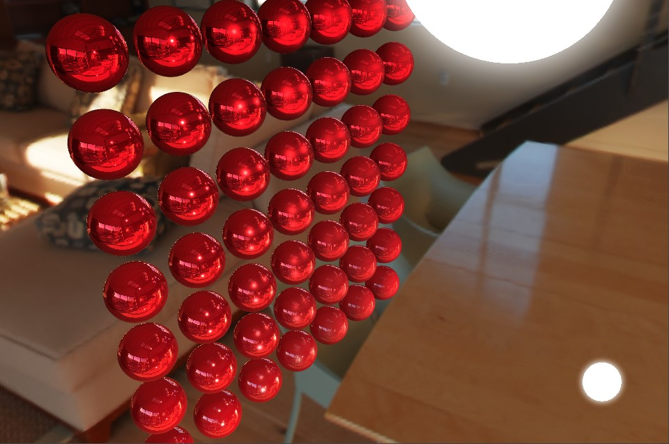

# Effect Overview

In modern graphics cards, to draw objects correctly, you need to write code fragments based on Vertex and Fragment, which are called Shaders. Shader supports a shader language called GLSL (OpenGL Shading Language) on hardware devices based on OpenGL series drivers.

In order to adapt to the industrial production flow and improve the ease of use of shader fragments, Creator encapsulates a GLSL-based shader - [Cocos Effect](./effect-syntax.md).

This chapter mainly introduces how Cocos Effect works and how to use it.

## Content

This chapter mainly includes the following contents:

- [Effect asseet](effect-inspector.md)
- [Effect syntax](effect-syntax.md)
    - [Optional Pass Parameters](pass-parameter-list.md)
    - [YAML 101](yaml-101.md)
    - [Introduction to GLSL Syntax](glsl.md)
    - [Preprocessor macro definition](macros.md)
    - [Effect chunk](effect-chunk-index.md)
    - [Built-in Shader Uniforms](uniform.md)
- [Built-in effect](effect-builtin.md)
    - [Physically based rendering](effect-builtin-pbr.md)
    - [Cartoon Rendering](effect-builtin-toon.md)
    - [Unlit lighting model](effect-builtin-unlit.md)
- [Custom effect](write-effect-overview.md)
    - [3D effect: RimLight](write-effect-3d-rim-light.md)
    - [2D effect: Gradient](write-effect-2d-sprite-gradient.md)
