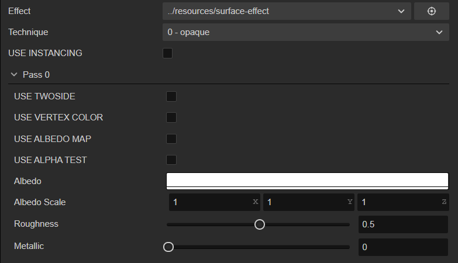
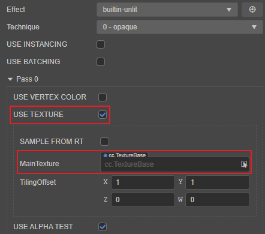

# Preprocessor Macro Definition

Preprocessing macros only take effect when Cocos Effect is compiled. Different combinations of preprocessing macros will generate different codes to better manage the content of Cocos Effect code, and the generated shader code is redundant and efficient.

Preprocessing macros only take effect when Cocos Effect is compiled, and different combinations of preprocessing macros generate different code to better manage Cocos Effect code content while generating non-redundant and efficient shader code.

Cocos Creator will collect all macro definitions that appear in Cocos Effect when loading resources, and then display them in the **Inspector** panel, which is convenient for users to make visual adjustments, as shown in the following figure:



Taking the use of the preprocessing macro `USE_TEXTURE` as an example, the code example is as follows:

```glsl
CCProgram unlit-vs %{
  #if USE_TEXTURE
    // ...
  #endif
}%
```

The declaration rules for macro definitions are as follows:

- All macro definitions default to `false`, so when defining a simple macro definition (such as a macro for a boolean switch), its default value cannot be specified, but can be modified through the **Inspector** panel or code. If there is a mutually exclusive relationship between certain macros in the design (cannot be true at the same time), it can be handled by using the macro declared by tag. For details, please refer to the **Macro Tags** section below.
- All custom macros that appear in Shader will be explicitly defined at runtime (the default value is 0), so **except for GLSL language built-in macros (extensions at the beginning of `GL_`, etc.)**, please do not use `#ifdef` or `#if defined` is used for judgment, otherwise the execution result will always be true;
- Macro definitions can be used not only in `CCProgram` to control the code logic within the macro definition, but also in `CCEffect` to associate the display state of editable properties with the macro definition.

As shown below, `mainTexture` will only be displayed on the **Inspector** panel when the `USE_TEXTURE` preprocessor macro is turned on:

```glsl
CCEffect %{
    # ...
    properties:
        mainTexture:  { value: white, editor: { parent: USE_TEXTURE } }
        # ...
}%

CCProgram unlit-fs %{
    // ...
    vec4 frag () {
        #if USE_TEXTURE
          // Handle mainTexture logic
        #endif
    }
}%
```



## Macro Tags

Although the effect compiler will try to be smart and collect all pre-processing branches, sometimes there are more complicated cases:

```glsl
// macro defined within certain numerical 'range'
#if LAYERS == 4
  // ...
#elif LAYERS == 5
  // ...
#endif
// multiple discrete 'options'
float metallic = texture(pbrMap, uv).METALLIC_SOURCE;
```

For these special usages, you'll have to explicitly declare the macro, using macro tags:

| Tag     | Description | Default Value | Usage |
| :------ | :---------- | :------------ | :---- |
| **range**   | A two-element array, specifying minimum and maximum value, both inclusive | [0, 3] | For macros with bounded range. The bound should be as tight as possible |
| **options** | An arbitrary-length array, specifying every possible options | nothing | For macros with discrete, explicit choices |

Declarations for the above case are:

```glsl
#pragma define-meta LAYERS range([4, 5])
#pragma define-meta METALLIC_SOURCE options([r, g, b, a])
```

The first line declares a macro named `LAYERS`, with possible range of [4, 5].

The second line declares a macro named `METALLIC_SOURCE`, with four possible options: 'r', 'g', 'b', 'a'.

> **Note**:
> 1. every tag accepts a single parameter, in the syntax of YAML.
> 2. Before v3.5, the syntax for Macro Tags feature is `#pragma define`, but from v3.5, the syntax will be automatically upgraded to `#pragma define-meta` during effect migration process, please pay attention to use the right syntax if you are writing new effect or using external effects without meta file.

### Function-like Macros

Due to lack of native support in WebGL platform, functional macros are provided as an effect compile-time feature, all references will be expanded in the output shader.

This is an good match for inlining some simple utility functions, or similar code repeating several times.

In fact, many built-in utility functions are functional macros:

```glsl
#pragma define CCDecode(position) \
  position = vec4(a_position, 1.0)
#pragma define CCVertInput(position) \
  CCDecode(position);         \
  #if CC_USE_SKINNING         \
    CCSkin(position);         \
  #endif                      \
  #pragma // empty pragma trick to get rid of trailing semicolons at effect compile time
```

Meanwhile, same as the macro system in C/C++, the mechanism does nothing on checking the [Hygienic Macro WikiPedia Entry](https://en.wikipedia.org/wiki/Hygienic_macro). Any issues will have to be dealt with by developers manually:

```glsl
// please do be careful with unhygienic macros like this
#pragma define INCI(i) do { int a=0; ++i; } while(0)
// when invoking
int a = 4, b = 8;
INCI(b); // correct, b would be 9 after this
INCI(a); // wrong! a would still be 4
```

> **Note**: Before v3.5, the standard define in glsl is occupied by Functional Macros, so developers aren't able to use standard define like `#ifdef` or `#ifndef`. But from v3.5, the syntax of Functional Macros is upgraded to `#pragma define`. All Functional Macros will be automatically upgraded during effect migration process, and developers can directly use standard defines inn the shader. Just need some extra attention to use the right syntax if you are writing new effect or using external effects without meta file.
