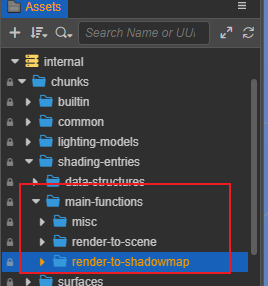
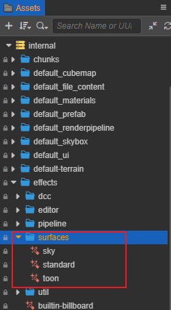
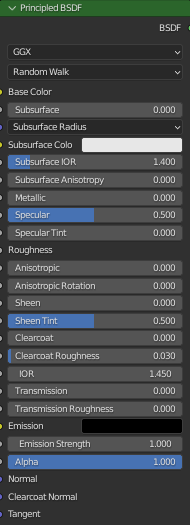

# Surface Shader

Rendering tends to become more processing-heavy as development criteria rise. We introduce the Surface Shader framework in v3.5.1 to provide a more efficient and structured process for creating shaders.

Developers can find the corresponding shaders and shader fragments in **Assets -> internal -> effect -> surfaces** and **Assets -> internal -> chunk -> surfaces**.

Surface Shader aims to facilitate fast and streamlined shader creation with simple codes in unified structures and processes. Users may easily define lighting and shading attributes, access public properties such as global lighting and debug viewing with the additional benefit of low maintenance, better readability and higher compatibility.

With Surface Shader integrated, Material system in Cocos Creator will continue to expand in future versions including visual coding for shaders. However, it will also prohibit ad-hoc modifications such as custom lighting and shading calculations. In the event of such development scenario rises, please revert to the legacy shader system.

Surface Shader is built on the [Cocos Effect](../material-system/effect-syntax.md) system, of which the syntax and properties are fully compatible.

## Related Concepts

The following sections illustrate new terminologies introduced by the Surface Shader framework.

### 1. Rendering Usage

Render Target specifies the destinations for the pixels rendered by the shader.

A shader typically incorporates multiple passes to render to various data outlets, such as to the screen for displaying, to the shadow maps to create shadows, to the reflection map to create reflections, etc.

Relevant functionalities can be found in the folder **Assets -> internal -> chunk -> shading-entries -> main-functions**.



| Common Rendering Uses                               | File Locations         | Notes           |
| :--------------------------------------------------- | :-------------------- | :-------------- |
| render-to-scene (default)                           | render-to-scene        |                 |
| render-to-shadowmap                                 | render-to-shadowmap    |                 |
| render-to-environment                               | render-to-reflectmap   | engine reserved |
| render-to-cartoon stroke                            | render-silhouette-edge |                 |
| render sky                                          | misc/sky               |                 |
| post-processing or general-purpose computation Pass | misc/quad              | engine reserved |

### 2. Lighting Model

Lighting model refers to the manner in which the material’s microscopic structures interact with lights and the visual outcomes thereof, such as specular, diffusion, reflection, etc.

| Illumination Model Name | Description |
| :-- | :-- |
| standard | PBR lighting, support GGX BRDF distribution of isotropic and anisotropic lighting, support convolutional ambient lighting |
| toon | simple cartoon lighting, step lighting effect |

### 3. Surface Material Model

Surface model refers to the material’s surface attributes such as IOR and roughness.

Surface models typically work in conjunction with lighting models. New models are to be introduced in future updates.

| Material Model Name | Description |
| :-- | :-- |
| standard | Standard PBR material with roughness and metallic description, similar to material nodes in SP, Blender, Maya, etc. |
| toon | A simple cartoon material with multiple shade color treatments. |

### 4. Shader Stage

Shader stage refers to the different stages in the render process, which includes:

| Shader Stage    | Identifier |
| :-------------- | :--------- |
| Vertex Shader   | vs         |
| Fragment Shader | fs         |
| Compute Shader | cs         |

## Framework

Similar to legacy shaders, Surface Shader code also consists of Cocos Effect’s properties, techniques and UBOs but excludes macro definitions, in/out parameters, instancing, coordinate transformations and other calculations found in the legacy shaders.

A typical Surface Shader is comprised of three parts:

- `Macro Remapping`: Map declared parameters and macros in the Effect header to private macros
- `Surface Functions`: Declare functions in the Surface Shader
- `Shader Assembly`: Assemble the vertex shader and the fragment shader in the Surface Shader.

Using the default shader `surfaces/standard.effect` as an example, A Surface Shader include code such as:



### Macro Remapping

When a certain functionality of the Surface Shader is required, users may choose to expose said functionality by defining a Marco in the Macro Mapping section of the Surface Shader. Doing so allows users to expose said functionalities in the Properties Panel with a name of the user’s choosing without interfering with the shading calculation involved.

These macros start with `CC_SURFACES_` and the following is the complete list of macros.

| Macro Name | Type | Meaning |
| :--- | :--- | :-- |
| CC_SURFACES_USE_VERTEX_COLOR                          | BOOL | Whether to use vertex color |
| CC_SURFACES_USE_SECOND_UV                             | BOOL | Whether to use 2uv |
| CC_SURFACES_USE_TWO_SIDED                             | BOOL | Whether to use double-sided normals |
| CC_SURFACES_USE_TANGENT_SPACE                         | BOOL | Whether to use tangent space (must be on when using normal map or anisotropy) |
| CC_SURFACES_TRANSFER_LOCAL_POS                        | BOOL | Whether to access model space coordinates in FS |
| CC_SURFACES_LIGHTING_ANISOTROPIC                      | BOOL | Whether to enable anisotropic materials |
| CC_SURFACES_LIGHTING_ANISOTROPIC_ENVCONVOLUTION_COUNT | UINT | The number of anisotropic ambient light convolution samples, 0 means convolution calculation is off, only valid when anisotropy is on |
| CC_SURFACES_USE_REFLECTION_DENOISE                    | BOOL | Whether to turn on ambient reflection denoising |
| CC_SURFACES_USE_LEGACY_COMPATIBLE_LIGHTING | BOOL | Whether or not to enable legacy-compatible lighting mode, which makes the rendering effect identical to legacy/standard.effect and facilitates upgrades |

> **NOTE**: These macros can be left undefined and are automatically defined internally to the default value of 0; they can also be defined directly to 0 or some other value, indicating that they are forced off or on in this Effect and user adjustment is disabled.

Searching for the `CCProgram macro-remapping` paragraph, you can see that the content consists of the following three parts.


#### 1. Macros Not Used In The Surface Function

```glsl
// ui displayed macros not used in this effect file
#pragma define-meta HAS_SECOND_UV
#pragma define-meta USE_TWOSIDE
#pragma define-meta USE_REFLECTION_DENOISE
#pragma define-meta IS_ANISOTROPY
#pragma define-meta USE_COMPATIBLE_LIGHTING
    
#define CC_SURFACES_USE_SECOND_UV HAS_SECOND_UV
#define CC_SURFACES_USE_TWO_SIDED USE_TWOSIDE
#define CC_SURFACES_USE_REFLECTION_DENOISE USE_REFLECTION_DENOISE
#define CC_SURFACES_LIGHTING_ANISOTROPIC IS_ANISOTROPY
#define CC_SURFACES_USE_LEGACY_COMPATIBLE_LIGHTING USE_COMPATIBLE_LIGHTING   
```

Surface Shader omits certain codes compared to legacy shaders such as ~~`#if HAS_SECOND_UV`~~. To declare a macro of the same purpose, users may pre-defined the macro **`#pragma define-meta MACRONAME`** for it to be displayed in the Properties Panel first, then map the newly declared macro to one of Surface Shader’s functionalities as with standard GLSL: **`#define CC_SURFACES_MACRONAME MACRONAME`**.

#### 2. Macros Used In The Surface Function

```glsl
// ui displayed macros used in this effect file
#define CC_SURFACES_USE_VERTEX_COLOR USE_VERTEX_COLOR
#if IS_ANISOTROPY || USE_NORMAL_MAP
  #define CC_SURFACES_USE_TANGENT_SPACE 1
#endif
```

Macros being used in the Surface Functions can be declare in the format: **#define CC_SURFACES_MACRONAME MACRONAME**. In this particular case, normal mapping and anisotropy requires `CC_SURFACES_USE_TANGENT_SPACE` to be enabled.

#### 3. Internal Functional Macros

```glsl
// functionality for each effect
#define CC_SURFACES_LIGHTING_ANISOTROPIC_ENVCONVOLUTION_COUNT 31
```

Internal macros can be defined with its intended value attached.

### Surface Function

**The function of each material function is similar to the output of a material parameter to a specified material node in the material editor of DCC (Digital Content Creation) software**. Similar to：



#### 1. Definition

Surface functions can be declared in `CCProgram` code blocks or their separate .chunk files.

> **Note**: For consistency’s sake, all vertex shader code should be encased in one block while all fragment shader code in another. Vertex shader and fragment shader should not use more than one code blocks each. Also, vertex shader and fragment shader should not share the same code block.

Surface Shader provides simple default functions internally, so **these functions are not mandatory**, **if you want to overload a function, you need to predefine the macro corresponding to that function to do so**. These functions are named with `Surfaces + ShaderStage name` followed by the function description. They can be found in [editor/assets/chunks/surfaces/default-functions](https://github.com/cocos/cocos-engine/tree/v3.5.1/editor/assets/chunks/surfaces/default-functions) to see the specific definition and implementation of each Surface function in different material models, e.g.

```glsl
#define CC_SURFACES_VERTEX_MODIFY_WORLD_POS
vec3 SurfacesVertexModifyWorldPos(in SurfacesStandardVertexIntermediate In)
{
  vec3 worldPos = In.worldPos;
  worldPos.x += sin(cc_time.x * worldPos.z);
  worldPos.y += cos(cc_time.x * worldPos.z);
  return worldPos;
}
```

Defining the macro `CC_SURFACES_VERTEX_MODIFY_WORLD_POS` allows its corresponding function to be overridden with the code in the current Surface Shader.

> **Note**: Overriding functions can be assigned new names and parameters. Users may override functions according to their own design or call the default version of the same function. This allows easy extension for the shader capabilities and avoid conflicts with future updates.

#### 2. VS Corresponding Functions List

Functions relevant to vertex shaders are listed as follows. All functions takes the `SurfacesStandardVertexIntermediate` structure as parameter. As vertex shader rarely see customizations, these functions require no overriding in most scenarios.

| Predefined macros | Corresponding function definitions | Corresponding material models | Function descriptions |
| :--- | :-- | :-- | :-- |
| CC_SURFACES_VERTEX_MODIFY_LOCAL_POS | vec3 SurfacesVertexModifyLocalPos | Common | Returns the modified model space coordinates
| CC_SURFACES_VERTEX_MODIFY_WORLD_POS | vec3 SurfacesVertexModifyWorldPos | Common | Returns the modified world space coordinates (world space animation)
| CC_SURFACES_VERTEX_MODIFY_CLIP_POS | vec4 SurfacesVertexModifyClipPos | Common | Returns the modified clipping (NDC) space coordinates (usually used to modify depth)
| CC_SURFACES_VERTEX_MODIFY_UV | void SurfacesVertexModifyUV | Common | Modifies UV0 and UV1 within the structure (using tiling, etc.)
| CC_SURFACES_VERTEX_MODIFY_WORLD_NORMAL | vec3 SurfacesVertexModifyWorldNormal | Common | Returns the modified world space normals (world space animation)

#### 3. FS Corresponding Functions List

Functions relevant to fragment shaders are listed as follows. Most functions involve in modifying the value of one particular property while some modify more than one. In such cases, the respective functions can take multiple parameters.

| Predefined macros | Corresponding function definitions | Corresponding material models | Function descriptions |
| :--- |:--- |:--- |:--- |
| CC_SURFACES_FRAGMENT_MODIFY_ BASECOLOR_AND_TRANSPARENCY | vec4 SurfacesFragmentModify BaseColorAndTransparency | Common | Returns the modified base color (rgb channel) and transparency value (a channel) |
| CC_SURFACES_FRAGMENT_ALPHA_CLIP_ONLY | vec4 SurfacesFragmentModify AlphaClipOnly | Common | It is not necessary to get the color to be used in the Pass that only deals with translucency. If rendering to shadows, etc., not overloading this function may result in shadows without trans-paste effect  |
| CC_SURFACES_FRAGMENT_MODIFY_ WORLD_NORMAL               | vec3 SurfacesFragmentModify WorldNormal | Common | Return modified pixel normals (usually normal map) |
| CC_SURFACES_FRAGMENT_MODIFY_ SHARED_DATA                | void SurfacesFragmentModify SharedData | Common | If some textures and calculations need to be used in more than one material node, they can be done in this function, which directly modifies the parameters within the Surface structure to reduce performance consumption, similar to the surf() function in the legacy shader |
| CC_SURFACES_FRAGMENT_MODIFY_ WORLD_TANGENT_AND_BINORMAL | void SurfacesFragmentModify WorldTangentAndBinormal  | Standard PBR | Modify the world tangent space vector within the Surface structure |
| CC_SURFACES_FRAGMENT_MODIFY_ EMISSIVE | vec3 SurfacesFragmentModify Emissive | Standard PBR | Returns the modified self-illumination color |
| CC_SURFACES_FRAGMENT_MODIFY_ PBRPARAMS | vec4 SurfacesFragmentModify PBRParams | Standard PBR | Returns the modified PBR parameters (ao, roughness, metallic. specularIntensity) |
| CC_SURFACES_FRAGMENT_MODIFY_ ANISOTROPY_PARAMS | vec4 SurfacesFragmentModify AnisotropyParams | Standard PBR | Returns modified anisotropy parameters (rotation, shape. unused, unused) |
| CC_SURFACES_FRAGMENT_MODIFY_ BASECOLOR_AND_TOONSHADE | void SurfacesFragmentModify BaseColorAndToonShade | Toon | Modify Toon Render Base Color |
| CC_SURFACES_FRAGMENT_MODIFY_ TOON_STEP_AND_FEATHER | vec4 SurfacesFragmentModify ToonStepAndFeather | Toon | Returns the modified parameters |
| CC_SURFACES_FRAGMENT_MODIFY_ TOON_SHADOW_COVER | vec4 SurfacesFragmentModify ToonShadowCover | Toon | Returns the modified parameters |
| CC_SURFACES_FRAGMENT_MODIFY_ TOON_SPECULAR | vec4 SurfacesFragmentModify ToonSpecular | Toon | Returns the modified parameters |

#### 4. VS Input Value Acquisition

Input values of the vertex shader, which is stored in the format of a `SurfacesStandardVertexIntermediate` structure, include members as follows:

| Vertex Shader Inputs | Type | Requires macro to be turned on when using | Meaning                              |
| :-------------------- | :---- | :----------------------------------------- | :------------------------------------ |
| position             | vec4 | N/A                                       | Local Position                       |
| normal               | vec3 | N/A                                       | Local Normal                         |
| tangent              | vec4 | CC_SURFACES_USE_TANGENT_SPACE             | Local Tangent and Mirror Normal Sign |
| color                | vec4 | CC_SURFACES_USE_VERTEX_COLOR              | Vertex Color                         |
| texCoord             | vec2 | N/A                                       | UV0                                  |
| texCoord1            | vec2 | CC_SURFACES_USE_SECOND_UV                 | UV1                                  |
| clipPos              | vec4 | N/A                                       | Clip(NDC) Position                   |
| worldPos             | vec3 | N/A                                       | World Position                       |
| worldNormal          | vec4 | N/A                                       | World Normal and Two Side Sign       |
| worldTangent         | vec3 | CC_SURFACES_USE_TANGENT_SPACE             | World Tangent                        |
| worldBinormal        | vec3 | CC_SURFACES_USE_TANGENT_SPACE             | World Binormal                       |

#### 5. FS Input Value Acquisition

Input values of the fragment are listed as follows. Most can be accessed without macro condition evaluations.

| Fragment Shader Input | Type  | Requires macro to be enabled when using | Meaning            |
| :--------------------- | :----- | :--------------------------------------- | :------------------ |
| FSInput_worldPos      | vec3  | N/A                                     | World Position     |
| FSInput_worldNormal   | vec3  | N/A                                     | World Normal       |
| FSInput_faceSideSign  | float | N/A                                     | Two Side Sign      |
| FSInput_texcoord      | vec2  | N/A                                     | UV0                |
| FSInput_texcoord1     | vec2  | N/A                                     | UV1                |
| FSInput_vertexColor   | vec4  | N/A                                     | Vertex Color       |
| FSInput_worldTangent  | vec3  | N/A                                     | World Tangent      |
| FSInput_mirrorNormal  | float | N/A                                     | Mirror Normal Sign |
| FSInput_localPos      | vec4  | CC_SURFACES_TRANSFER_LOCAL_POS          | Local Position     |

### Shader Assembly

Users may assemble multiple modules with the `include` keyword for each pass of the Surface Shader. For instance, the fragment shader of the default Surface Shader is assembled by 6 parts:

#### 1. Macros

Macros are required to be mapped and defined in the Marco Mapping section of the surface shader, which is integrated in the form of CCProgram code blocks or .chunk files.

By including `common-macros`, users can integrate most macros to the Surface Shader.

```glsl
Pass standard-fs:
#include <macro-remapping>
#include <surfaces/effect-macros/common-macros>
```

In scenarios where only part of the Surface Shader’s capabilities are used, users can also include specific macros involved in the shading process.

```glsl
Pass shadow-caster-fs:
#include <surfaces/effect-macros/render-to-shadowmap>
```

#### 2. Shader Generic Header File

Header files should be included with their Shader Stage specified, such as:

```glsl
Vertex Shader：
#include <surfaces/includes/common-vs>
Fragement Shader：
#include <surfaces/includes/common-fs>
```

#### 3. Surface Utility Functions

Surface functions that are created in their separate .chunk file need to be included accordingly. Surface functions require access to the shared memory allocation to function properly. For this reason, shared UBO also need to be included prior to the .chunk files in question.

```glsl
#include <shared-ubos>
#include <surface-fragment>
```

#### 4. Lighting Model

Lighting models are **optional and can only be used in the fragment shader to render to screen.**

When including lighting models, their corresponding names are also required to be specified.

```glsl
Standard PBR Lighting：
#include <lighting-models/includes/standard>
Toon Lighting：
#include <lighting-models/includes/toon>
```

#### 5. Surface Materials and Shading Models

Surface material models are optional and can only be used to render to screen.

When including lighting models, their corresponding names and render stages involved are also required to be specified.

```glsl
Vertex Shader：
#include <surfaces/includes/standard-vs>
Fragement Shader：
#include <surfaces/includes/standard-fs>
```

#### 6. Main Shader Function

When including main render loop functions, their corresponding render target and render stages involved are also required to be specified.

```glsl
Pass standard-fs:
#include <shading-entries/main-functions/render-to-scene/fs>
Pass shadow-caster-fs:
#include <shading-entries/main-functions/render-to-shadowmap/fs>
```

## Debug View

<font color=#ff0000>**The built-in rendering debugging feature is only available for materials using the Surface Shader framework**</font>. By selecting the corresponding debug mode in the upper-right corner of the scene preview window in the editor, you can view the model, materials, lighting and other computational data on the same screen, and quickly locate the problem when the rendering effect is abnormal.


To facilitate pixel-by-pixel comparison, we use full-screen debugging instead of picture-in-picture display, which allows us to quickly switch between different data in the same screen to locate rendering errors, and to use the color picker to explore the pixel-specific values.

In addition, Surface Shader has a built-in **Irrational Number Visualization** feature, so once some pixels appear to have abnormal <font color=#ff0033> **Red(255, 0, 51)**</font> and <font color=#00ff33> **Green(0, 255, 51)** </font> alternately blink, then the rendering calculation of these pixels appears irrational, please use the single debug mode to check the model tangent or other related data.

The rendering debugging functions are subdivided into the following three categories.

### 1. Common Options

Debugging options that are in effect in either single or combined mode, including:

| Name | Function | Debugging Tips |
| :--- | :--- | :--- |
| Lighting with Base Color | Check to show normal material illumination, check off to show the effect of white mold pure illumination.         | You can see the effect of AO, GI and other indirect light related effects more obviously.                     |
| CSM Layer Coloration     | Cascading shadows are stained layer by layer from near to far, distributed as reddish, greenish, bluish, and yellowish, with no staining in areas beyond the shadows. | Allows you to view and confirm the fineness of the scene shadows. <br> If three or four layers accounted for too little shading is too fine, should increase the shading visible distance. <br>If the ratio of one or two layers is too small, it means that the shadows are too coarse and the visible distance of shadows should be reduced. |

### 2. Single mode

The debugging focus <font color=#ff8000>is on a particular piece of data that needs to be tested</font>, and the entire scenario visualizes this data output.

The debuggable data includes four major categories.

#### I. Primitive Model Info

| Name | Function | Description and debugging tips | Dependencies |
| :--- | :--- | :--- | :--- |
| Vertex Colors           | Vertex Colors| | Must check **USE VERTEX COLOR** in material |
| World Normal | World Normal| |                                                              |
| World Tangent| World Tangent | If there are irrational numbers or unusual lighting effects in the calculation you can focus on checking here, if it is black then the model tangent is not turned on but normal mapping or anisotropy is turned on.  | Exclusion cannot be selected in the model's tangent settings<br> Must have **USE NORMAL MAP** or **IS ANISOTROPY** checked in the material |
| World Position | Visualize vertex coordinates (no scaling) | RGB channels display the XYZ axis coordinate data.<br>You can judge the difference of world space axis by color, and the model size by light and dark.|                                                              |
| Mirrored Normal | Show normal map flip reuse markers    | To improve normal map utilization, some symmetric models (e.g., faces) will only bake half of the normals and reuse the data in the normal map using mirror markers for the other half.<br>If the value of this marker does not change at all on the model, it may cause the normals of the other half of the model to show unusual effects such as bump flip. | Must check **USE NORMAL MAP** in the material |
| Front Face Coloration | Display front or back faces            | With the default single-sided model, the normals are not automatically distinguished and the light and dark seen on the front and back sides of the model are the same. <br>When a single-sided model uses a double-sided material, it automatically distinguishes between the front and back normals, and the light and dark seen on the front and back sides of the model are different.<br>The mark is white for the front side of the model and black for the reverse side. It can be used to check the light and darkness of the single-sided model. | |
| UV0 | Display the First UV | | |
| UV1 | Display the second UV | | Must be checked in the material **HAS SECOND UV**  |
| Lighting MAP UV | Display the lighting mAP UV | If the light mapping effect is not correct, you can turn on this option and compare the general area of the light mapping to check the error. | Must bake scenes |
| Projection Depth Z | Display (0-1 non-linear variation) depth | Too far away of the far clip plane will result in a large depth value in the near field. | |
| Linear Depth W | Display (0-1 linear variation) depth | Too far away of the far clip plane will result in a large depth value in the near field | |

#### II. Primary Material Info

| Name | Function | Description and debugging tips | Dependencies |
| :--- | :--- | :--- | :--- |
| World Space Pixel Normals | | You can compare with the corresponding vertex data to see if the effect of normal mapping is correct | |
| World Space Pixel Tangent/Binormals | | Can compare with corresponding vertex data to see if normal mapping affects it correctly | Cannot be selected for exclusion in the model's tangent settings<br /> Must have **USE NORMAL MAP** or **IS ANISOTROPY** checked in the material |
| Base Color | | | |
| Diffuse Color | Base colors affecting diffuse illumination calculated from natural colors and other material data | | |
| Specular Color | The base color affecting specular reflective lighting calculated from intrinsic color and other material data | | |
| Opacity | Smaller means more transparent | | Must have **Alpha Blend** enabled in the material |
| Metallic | | | |
| Roughness | | | |
| Specular Intensity | Display the multiplication of non-metallic reference mirror reflectance F0 | If the specular is black, please check if this field is set to 0. |                                                              |

#### III. Lighting Info

| Name | Function | Description and debugging tips | Dependencies |
| :--- | :--- | :--- | :--- |
| Direct Diffuse   | | | |
| Direct Specular | | | |
| Direct Lighting | Direct Diffuse + Direct Specular | | |
| Ambient Diffuse   | | | |
| Ambient Specular | | | |
| Ambient Lighting | Ambient Diffuse + Ambient Specular | | |
| Emissive | Display the emissive in the material | | |
| Light Map | Display baked lightmap RGB colors | | Must bake scenes |
| Shadows | Show shadows of direcional light, spot light, point light | | Shadows must be enabled in the scene's **Inspector** panel and light sources, and objects enabled to receive shadows |
| Ambient Occlusion | Show the color of AO map in the material and real-time AO | | |

#### IV. Misc Info

| Name | Function | Description and debugging tips | Dependencies |
| :--- | :--- | :--- | :--- |
| Fog | Display the fog effect factor, the larger it is, the denser the fog is |                | Fog effect must be enabled in the scene's **Inspector** panel |

### 3. Render Composite Options

The debugging focus <font color=#ff8000>is on the overall rendering performance</font>, and each module can be blocked or turned on, with modules unrelated to each other, to see how different modules affect each other's rendering effects.

single mode has higher priority than the composite mode, <font color=#ff0000>If you want to use the composite mode, you must check No single mode.</font>

Including:

| Name | Function | Description and debugging tips | Category |
| -------------- | ----------------------- | ------------------------------------------------------------ | -------- |
| Direct Diffuse | Enable/Disable Direct Light Diffuse | Affect Directional, Spot, and Point Light | Lighting |
| Direct Specular | Enable/Disable Direct Light Specular Reflection | Affect Directional, Spot, and Point Light | Lighting |
| Ambient Diffuse | Enable/Disable Ambient Light Diffuse | Influence Skylight | Lighting |
| Ambient Specular | Enable/Disable Ambient Light Specular Reflection | Influence Skylight | Lighting |
| Emissive | Enable/Disable Emissive | If some objects are too bright or exposed, try to turn off this option is not set in the material unnecessary self-illumination | Lighting |
| Light Map | Enable/Disable Baking Light | Affect Baking | Light |
| Shadows | Enable/Disable Direct Light Shadows | Affect Live Directional Light / Spot Light / Spot Light Shadows and Baked Directional Light Shadows | Lighting |
| Ambient Occlusion | Enable/Disable Ambient Occlusion | Influence Skylight | Light |
| Normal Map | Enable/Disable Normal Map | If the lighting is unusually scattered, try turning this option off to see if the normal map is scrambling at the wrong intensity. <br> If the lighting effect is wrong or appears irrational, try turning this option off to see if the model is not tangential | Materials |
| Fog | Enable/Disable fog effect | If the scene color is abnormally gray, try turning off this option to see if the fog parameter is not set properly | Environment |
| Tone Mapping | Enable/Disable Tone Mapping | If the scene color is too different from the original material, try to turn off this option to see if it is normal, indicating that UseHDR should not be checked in the scene panel | Color Space |
| Gamma Correction | Enable/Disable Gamma Correction | If the scene is unusually colorful and dark, try turning off this option to see if it is normal, indicating that the mapping resources may have been gamma corrected multiple times | Color Space |

## Advanced Usage

1. Manual inserting vertex shader outputs and fragment shader inputs: with the new varying property introduced in the Surface Shader framework, vertex shader outputs and fragment shader inputs can be accessed in particular Surface Functions.
2. Surface Shader and legacy shader codes can be used in the same render loop as long as the varying vertex data are kept consistent between the two.

## Public function libraries

The library headers can be found under **assets -> internal -> chunks -> common** folder in different categories.

The functions in the library do not depend on any internal data (engine related uniform, mapping, etc.) and can be used directly as tool functions.

Surface already automatically contains common public function headers internally, which can be classified according to type as:

| Folder Name | Function Usage |
| :-------- | :---------------------------------------- |
| color | color-related functions (color space, tonemapping, etc.) |
| data | Data-related functions (compression and decompression, etc.) |
| debug | Debug View-related functions |
| effect | Scene effect-related functions (water, fog, etc.) |
| lighting | lighting-related features (brdf, bsdf, attenuation, baking, etc.) |
| math | math library (coordinate transformation, numerical determination and operation, etc.)
| mesh | model-related functions (material conversion, model animation, etc.)
| shadow | shadow-related functions (pcf, hcs, etc.)
| texture | mapping-related functions (sampling, mip calculation, etc.) |

[^1]: Custom GPU geometry instancing properties are not supported.
