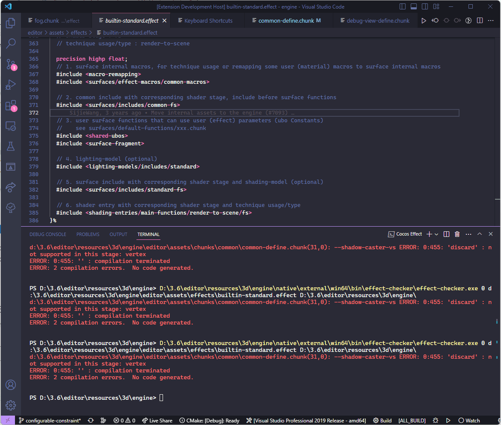

# VSCode Shader Extension（Experimental）

To enable syntax highlighting for Cocos Shader files (`*.effect`), search for the "Cocos Effect" extension in the Visual Studio Code extensions store and install it.

After installing completed, If you open a `.effect` from a project which is using Cocos Creator 3.7.3 or later in VS Code, the following features will be available to be used.

## 1. Autocompletion and Syntax Highlighting

Autocompletion and syntax highlighting for built-in shader functions, macros, and global uniforms.

As you type, a list of suggestions will appear for keywords. Use the up and down arrow keys to select from the list. Additionally, information about the selected suggestion, including comments and the location within the file, will be displayed.

Hovering the mouse over a completed keyword will show a tooltip with relevant information.

> **Note**: As it is an experimental feature, it currently only supports the autocompletion of commonly used built-in shader code and does not support autocompletion for user-defined code.

## 2. Syntax Checking and Error Jumping

When you have a `*.effect` file open in the VS Code, you can use the "View" menu and select "Command Palette" ( or press Ctrl + Shift + P ) to access the command panel. Choose **Cocos Effect:compile effect** to invoke the tool to automatically compile the current file and provide corresponding error messages. You can Ctrl + Click on the file path in the error message window to jump to the corresponding line of code.

To the right of this option, there is a small gear icon that allows you to add a keyboard shortcut binding by hitting it. After adding the binding, you can use the shortcut key to invoke the syntax checker. See the GIF below for the complete workflow.

> **Note**: As it is an experimental feature, it currently only supports on Windows.

## 3. Other Settings

The extension will automatically search for the corresponding built-in shader files and provide completion suggestions based on the location of the opened `*.effect` or `*.chunk` file. However, this functionality is limited to shader files using Cocos Creator 3.7.3 or later.

If you open a file from an external folder ( a folder not belongs to a Cocos Creator project) or and older version  of  Cocos Creator, the aforementioned features will not work. In such cases, you can download a newer version of Cocos Creator and specify the folder path for the new. This will enable support for all `*.effect` files.

Here are the steps to follow.

1. Go to the "File" -> "Preferences" -> "Settings"
2. In the search box, type "cocos".
3. In the "Cocos-effect: Engine Path" field, enter the folder path of thew newer version of Cocos Creator ( it will be automatically recognized )
