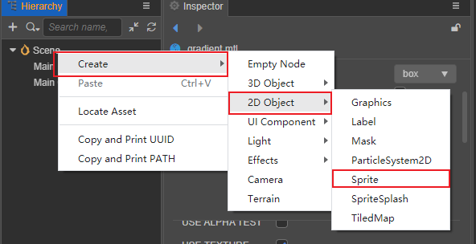
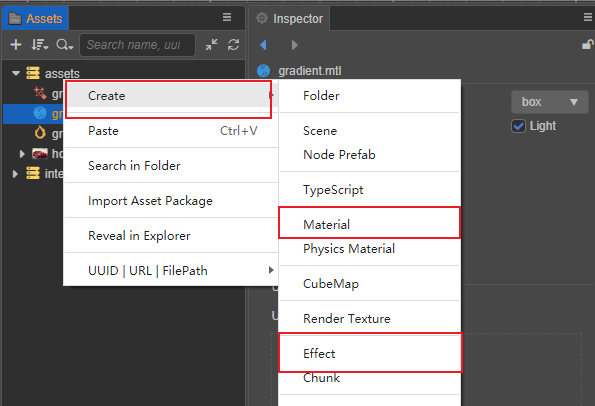
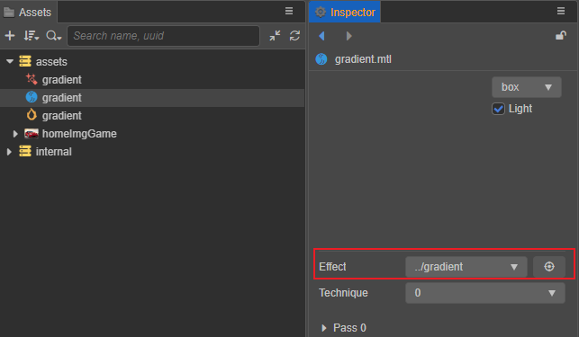
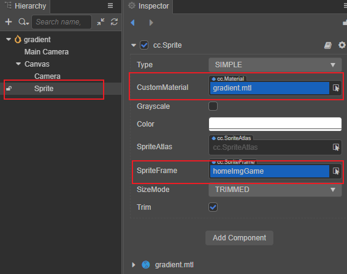
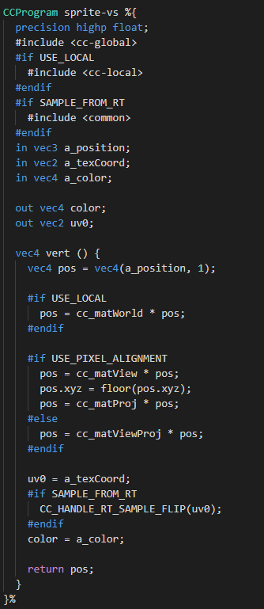
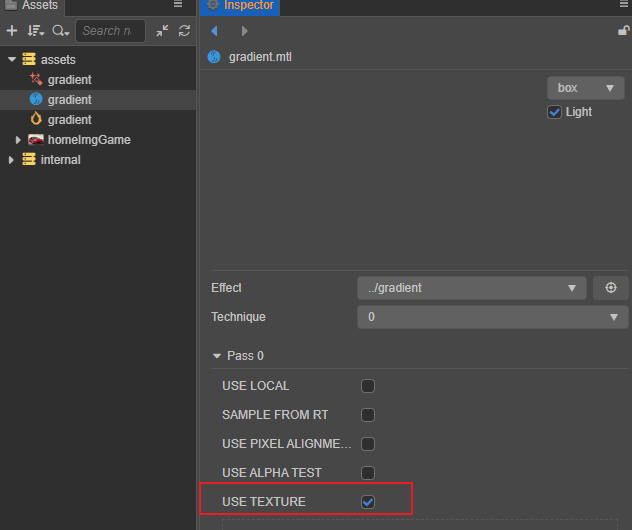
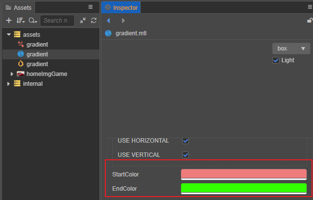
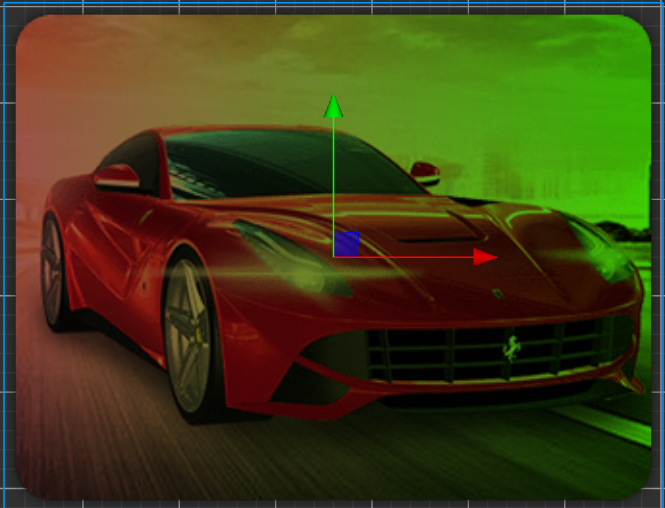
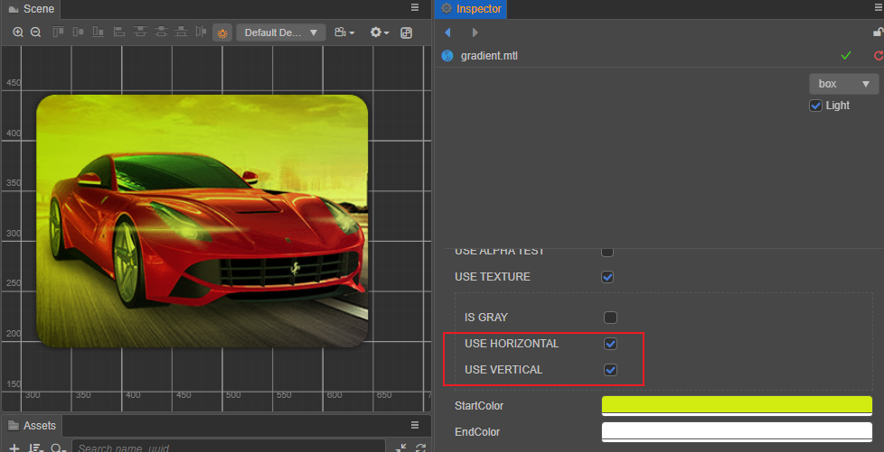

# 2D Sprite Effect：Gradient

By default, UI and 2D components use the engine's built-in shaders, which are placed in the **internal -> effects** directory of the **Assets** panel.

For any UI and 2D component that holds a CustomMaterial property, custom materials can be implemented within the **Inspector** panel by selecting from the drop-down box for that property or by dragging and dropping from within the **Assets** panel.

Engine specifies that there can be only one custom material for UI/2D components.


> **Note**.
> 1. The batching may be interrupted after using custom materials.
> 2. For UI and 2D component batching, please refer to: [2D Renderable Components Batching Guidelines](../ui-system/components/engine/ui-batch.md)

This article will demonstrate how to use custom shaders for UI and 2D components by implementing a gradient shader for sprites.

## Project creation

Create a new 2D project via CocosDashBoard.

And Create a new scene and add a Sprite to the scene.



Perform the following actions within **Assets** panel.

- Create a effect file named gradient.effect;
- Copy the contents of the `builtin-sprite` shader in **Assets -> intenal -> effects** to gradient.effect;
- Create a material named gradient.mtl and select gradient.effect in the Effect column of the **Inspector**;
- Import any valid texture.

Materials and shaders can be created by right-clicking anywhere in **Assets** panel, or by clicking the `+` button on **Assets** panel.



The created project is shown in the figure below:



Select the created sprite and assign the gradient.mtl material and the imported texture to the corresponding properties of the sprite.



## CCEffect

By observation, a gradient can be understood as a change in color on an axis as the coordinates change. Therefore, we add two color properties to the properties of the shader in the CCEffect paragraph to represent the start color and end color of the gradient.

```yaml
startColor: { value: [1.0, 1.0, 1.0, 1.0], # The default value for the RGBA channel of gradientA
              editor: {type: color} } # The style displayed in the Inspector, shown here as a color
endColor: { value: [1.0, 1.0, 1.0, 1.0], 
              editor: {type: color} }}
```

The CCEffect code is as follows:

```yaml
CCEffect %{
  techniques:
  - passes:
    - vert: sprite-vs:vert
      frag: sprite-fs:frag
      depthStencilState:
        depthTest: false
        depthWrite: false
      blendState:
        targets:
        - blend: true
          blendSrc: src_alpha
          blendDst: one_minus_src_alpha
          blendDstAlpha: one_minus_src_alpha
      rasterizerState:
        cullMode: none
      properties:
        alphaThreshold: { value: 0.5 }
        startColor: { value: [1.0, 1.0, 1.0, 1.0], editor: {type: color} }
        endColor: { value: [1.0, 1.0, 1.0, 1.0], editor: {type: color} }
}%
```

Note that two color values `startColor` and `endColor` are defined here, and the corresponding Uniform needs to be added if these two colors are to be properly passed to the shader fragment.

Engine states that discrete use of Uniform is not allowed, so add the following code to the `CCProgram sprite-fs` segment.

```glsl
uniform Constant{
    vec4 startColor;
    vec4 endColor;
}; 
```

In this case, the engine will automatically associate the properties defined in `properties` with the Uniform in `Constant`.

## Vertex shader

Additional processing of vertex shaders is usually not needed, so the system's built-in `sprite-vs` is retained.



## Fragment shader

Within the default sprite shader, the XY axis of the sprite vertices corresponds to the UV of the texture coordinates, so consider using a change in texture coordinates to reach a gradient by adding the following code to the scope defined by the USE_TEXTURE macro:

```glsl
#if USE_TEXTURE            
    o *= CCSampleWithAlphaSeparated(cc_spriteTexture, uv0); 
    #if IS_GRAY
    float gray  = 0.2126 * o.r + 0.7152 * o.g + 0.0722 * o.b;
    o.r = o.g = o.b = gray;
    #endif

    // Adjust the gradient color according to the UV change
    o.rgb *= mix(startColor, endColor, vec4(uv0.x)).rgb;
#endif
```

Check the `USE_TEXTURE` option on the original material.



By adjusting the **startColor** and **endColor** on the material, different gradients can be observed: **startColor** and **endColor**.



The color the sprite is as follows:



## Use preprocessing macros to define

Within the above fragment shader, only the gradient of the texture coordinate axis U is considered. For flexibility and to support more functionality, the gradient of the different axes is implemented through preprocessing macro definitions, so the following code is deleted.

```glsl
o.rgb *= mix(startColor, endColor, vec4(uv0.x)).rgb;
```

And add the following code:

```glsl
#if USE_HORIZONTAL
    o.rgb *= mix(startColor, endColor, vec4(uv0.x)).rgb;
#endif

#if USE_VERTICAL 
    o.rgb *= mix(startColor, endColor, vec4(uv0.y)).rgb;
#endif        
```

The preprocessing macros `USE_HORIZONTAL` and `USE_VERTICAL` are declared here, representing horizontal and vertical gradients respectively, and can be conveniently used on demand.



The complete effect code is as follows:

```glsl
// Copyright (c) 2017-2020 Xiamen Yaji Software Co., Ltd.
CCEffect %{
  techniques:
  - passes:
    - vert: sprite-vs:vert
      frag: sprite-fs:frag
      depthStencilState:
        depthTest: false
        depthWrite: false
      blendState:
        targets:
        - blend: true
          blendSrc: src_alpha
          blendDst: one_minus_src_alpha
          blendDstAlpha: one_minus_src_alpha
      rasterizerState:
        cullMode: none
      properties:
        alphaThreshold: { value: 0.5 }
        startColor: { value: [1.0, 1.0, 1.0, 1.0], editor: {type: color} }
        endColor: { value: [1.0, 1.0, 1.0, 1.0], editor: {type: color} }
}%

CCProgram sprite-vs %{
  precision highp float;
  #include <cc-global>
  #if USE_LOCAL
    #include <cc-local>
  #endif
  #if SAMPLE_FROM_RT
    #include <common>
  #endif
  in vec3 a_position;
  in vec2 a_texCoord;
  in vec4 a_color;

  out vec4 color;
  out vec2 uv0;

  vec4 vert () {
    vec4 pos = vec4(a_position, 1);

    #if USE_LOCAL
      pos = cc_matWorld * pos;
    #endif

    #if USE_PIXEL_ALIGNMENT
      pos = cc_matView * pos;
      pos.xyz = floor(pos.xyz);
      pos = cc_matProj * pos;
    #else
      pos = cc_matViewProj * pos;
    #endif

    uv0 = a_texCoord;
    #if SAMPLE_FROM_RT
      CC_HANDLE_RT_SAMPLE_FLIP(uv0);
    #endif
    color = a_color;

    return pos;
  }
}%

CCProgram sprite-fs %{
  precision highp float;
  #include <embedded-alpha>
  #include <alpha-test>

  in vec4 color;

  uniform Constant{
    vec4 startColor;
    vec4 endColor;
  };   

  #if USE_TEXTURE
    in vec2 uv0;
    #pragma builtin(local)
    layout(set = 2, binding = 11) uniform sampler2D cc_spriteTexture;
  #endif

  vec4 frag () {
    vec4 o = vec4(1, 1, 1, 1);

    #if USE_TEXTURE            
      o *= CCSampleWithAlphaSeparated(cc_spriteTexture, uv0); 
      #if IS_GRAY
        float gray  = 0.2126 * o.r + 0.7152 * o.g + 0.0722 * o.b;
        o.r = o.g = o.b = gray;
      #endif

      #if USE_HORIZONTAL
         o.rgb *= mix(startColor, endColor, vec4(uv0.x)).rgb;
      #endif
      
      #if USE_VERTICAL 
         o.rgb *= mix(startColor, endColor, vec4(uv0.y)).rgb;
      #endif      

    #endif

    o *= color;

    ALPHA_TEST(o);
    return o;
  }
}%

```
