# How to Submit Code to Cocos Engine Repository

Cocos Creator is an open-source engine, and its examples and documentation are also open-source. When you find areas where the engine, documentation, or examples can be improved during your game development process, simply suggesting it to the official team may not guarantee immediate follow-up due to limited resources. Therefore, we welcome all users to actively submit pull requests (PRs) to help make Cocos better. Found a bug in the engine? Submit a PR! Examples don't look appealing? Submit a PR! API comments unclear? Submit a PR! Typos in the documentation? Submit a PR! Want to contribute your valuable modifications to the game community? Submit a PR! The following repositories are currently the commonly used open-source repositories by the official team, and you can submit PRs to these repositories.

- **cocos/cocos-engine**：[GitHub](https://github.com/cocos/cocos-engine/)

Now let's take a look at how to submit code to Cocos on GitHub, starting from scratch.

## Register a GitHub Account

Open the [GitHub website](https://github.com/) and register an account. If you already have an account, simply log in.

## Environment Setup

### Install Git

First, make sure that Git is installed on your computer. Enter `git` in the command line, and if Git is installed, it will display the following content:

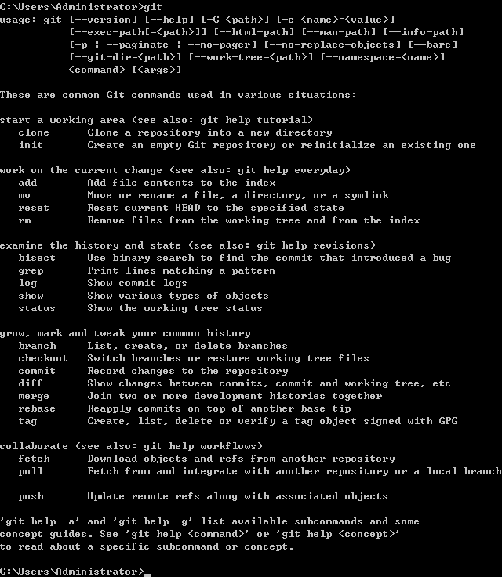

If it's not installed, you can [**Download Git**](https://git-scm.com/download/) and install it. Keep all the installation options as default and click "Next" until the installation is complete.

### Install Git Client —— GitKraken

Generally, you can use git command line or any Git client tools to operate git repositories. Such as GitKraken Source Tree, GitHub Desktop and so on.

Because GitKraken is a commonly used Git client tool. Let's take it as an example.

The following example demonstrates the installation process using the Windows version.

First, download [GitKraken](https://www.gitkraken.com/) and extract the files, then proceed with the installation.

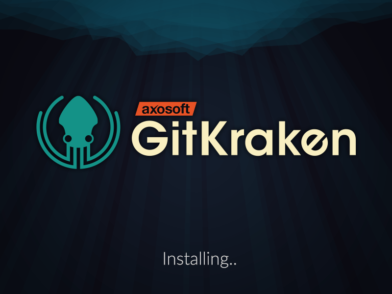

After the installation is complete, the interface will look like the following:

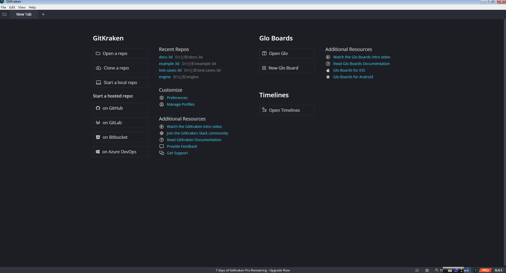

## Fork the Project

Let's take the documentation repository **creator-docs** ([GitHub](https://github.com/cocos/cocos-docs)) as an example. Go to the documentation repository page and click the "Fork" button in the upper right corner, as shown below:

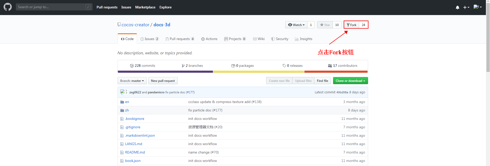

After forking, you will be automatically redirected to your GitHub repository page, where you can see that a copy of the docs-3d project has been created, as shown below:

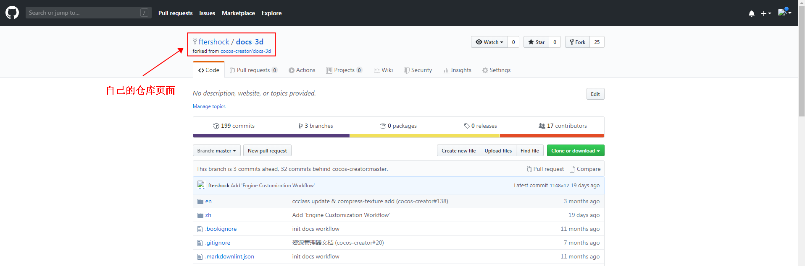

## Clone the Remote Repository to Local

1. First, go to your remote repository and copy the remote repository URL, as shown in the image below:

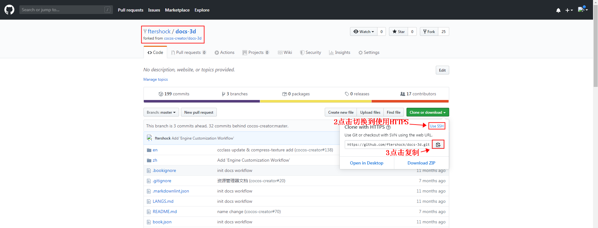

2、Switch to GitKraken and click the **Clone a Repo** button at the top to go to the Clone page. Paste the **remote repository URL** you copied earlier and fill in the relevant configurations. If you want the local folder name to be the same as the project name, add `/docs-3d` after the local storage path. Once the configuration is complete, click **Clone**.

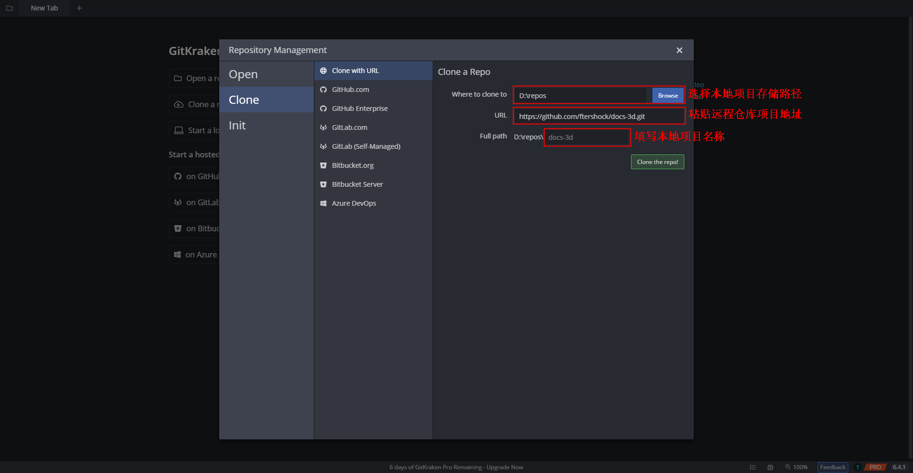

After cloning, the "docs-3d" folder will be automatically created locally, and the project will open in GitKraken.

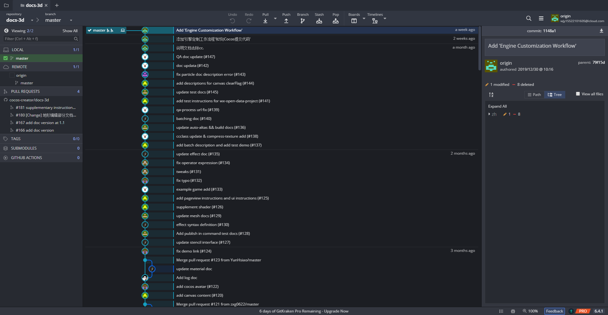

## Upload Local Modifications to Remote Repository

1: Check out the desired branch. In the **REMOTE** directory on the left side, you will find an `origin` repository, which is your own remote repository. For example, if you want to modify the next branch, double-click the next branch after clicking `origin`, as shown below:

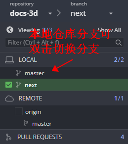

the project name, add "/docs-3d" after the local storage path. Once the configuration is complete, click Clone.

clone repository

After cloning, the "docs-3d" folder will be automatically created locally, and the project will open in GitKraken.

clone finish

Upload Local Modifications to Remote Repository
Check out the desired branch. In the REMOTE directory on the left side, you will find an origin repository, which is your own remote repository. For example, if you want to modify the next branch, double-click the next branch after clicking origin, as shown below:
checkout

**Note:** Depending on the version, you may need to switch to different branches, such as:

- **vX.Y** branch: Corresponds to the branch used for version X.Y.
- **develop** branch: Development branch.

2: Make the necessary modifications in the local "docs-3d" project. After making the changes, view the repository details, as shown below:

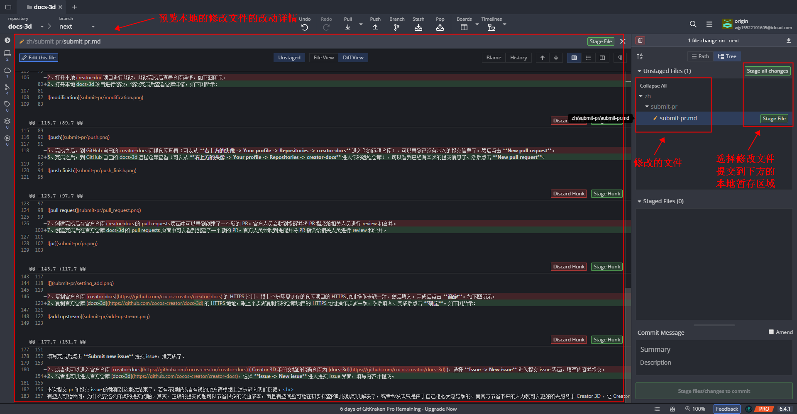

3: Commit the staged files to the local repository. Submit the modified files you want to upload to the local staging area and provide a commit message in the lower section. Once done, click **Commit** to submit the staged files to the local repository. Then, click **Push** to push the changes to your remote repository. The steps are shown in the following image:
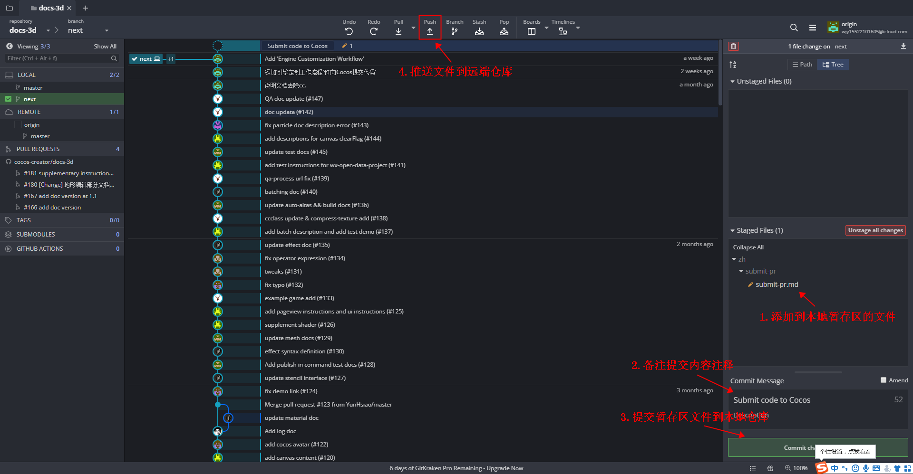

4: Push the changes from your local repository to your remote repository (origin).

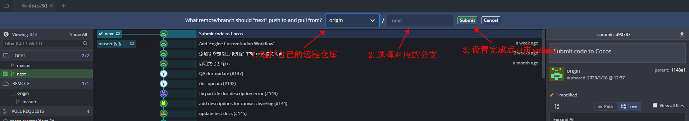

5: After completion, go to your GitHub repository for "docs-3d" (you can access it from **Profile -> Repositories -> docs-3d** under the avatar in the upper right corner). You will see the commit message for this submission. Click **New pull request**.

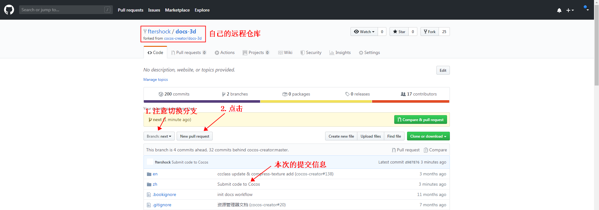

6: Clicking **New pull request** will redirect you to the **Open a pull request** page in the official repository. The title will be automatically filled with the submitted information, but you can modify it if needed. In the area below, provide additional information about the submission. Specifically, for modifications related to the engine itself, please provide a complete description of the issue, changes made, affected versions, relevant platforms, etc. If there are related issues or forum addresses, you can include them as well. At the bottom, you can see the detailed changes for this PR. Once everything is filled out, click **Create pull request**.

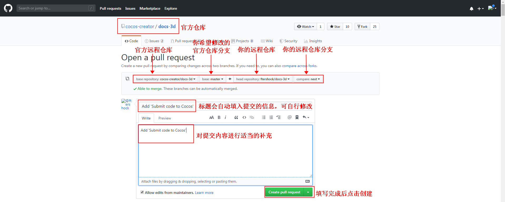

7: After creation, you can see the newly created PR in the pull requests page of the official repository "docs-3d". The official team will receive a notification and assign the PR to the relevant individuals for review and merging. This completes the creation of the PR. If the official team approves the review, your changes will be merged into the official repository. If the Open icon above changes to the Merged icon, it indicates that the changes have been merged into the official repository. If necessary, the official team may also initiate further discussions on the PR. Please pay attention to GitHub notifications or follow the PR page to avoid missing any discussions. If you need to modify the content of the PR submission, repeat steps 2, 3, and 4 in the **Upload Local Modifications to Remote Repository** section.

## Sync Remote Repository

If it has been a long time since you last cloned the repository, it is recommended to fetch the latest changes from the official repository before submitting a pull request to avoid conflicts with other people's modifications.

1. Click on the REMOTE + in the left sidebar of GitKraken, as shown below:
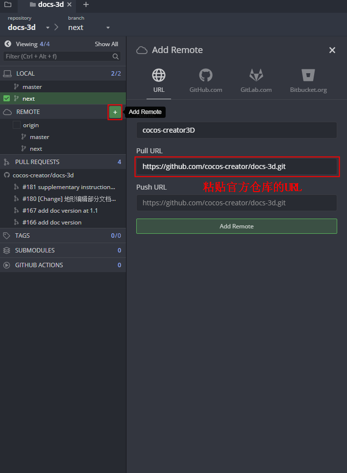

2. In the left sidebar of GitKraken, under the local repository "docs-3d," you will see two remote repositories: "origin" and "cocos-creator3D." "origin" represents your own remote repository, while "cocos-creator3D" represents the official repository. Under REMOTES -> cocos-creator3D, you can see various branches of the official repository, as shown in the image below:
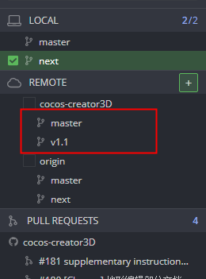

3. Fetch the latest updates from the official repository. Switch to the branch you want to fetch and click **Pull** in the upper left corner. See the image below for reference:
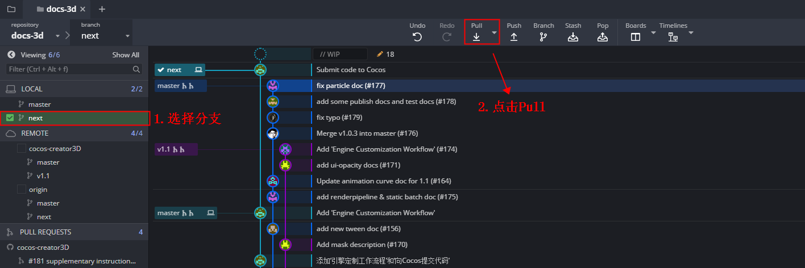

**Note:** Before updating to the latest version, if you are not familiar with Git operations, it is recommended to ensure that no changes have been made to the local Git repository. If there are any changes, it is advisable to revert them manually and then reapply them after the update.

## How to Provide Feedback on Documentation Issues

For issues related to the documentation itself, it is recommended to provide feedback through GitHub issues. Let's briefly demonstrate the process. Before submitting an issue, please make sure of the following:

- Ensure that the documentation version matches the Cocos Creator version.
- Verify that the steps are correct.
- Confirm that it is indeed a documentation issue, such as a code error or an exception encountered while following the documentation steps.

Once you have confirmed the above points, there are two ways to submit feedback:

1: Click the **Submit Feedback** button located at the bottom right of the official Creator documentation. This will take you to the issue submission page.

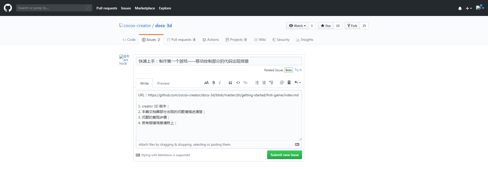

Fill in the required information and click **Submit new issue** to submit the issue.

2: You can visit the official repository for **creator-docs** ([GitHub](https://github.com/cocos/cocos-docs)). Select **Issue -> New issue** to access the issue submission page. Fill in the details and submit the issue.

That concludes the tutorial on submitting pull requests and issues. If there is anything you do not understand or if you find any mistakes, please provide feedback following the steps mentioned above.
