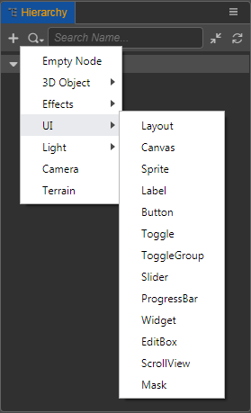

# UI Components

Some common UI controls can be created by adding nodes. Click the **+** Create Node button in the top left corner of the **Hierarchy** panel, then select **UI** to create the desired UI node, and the corresponding UI component will be automatically mounted to the node.

Other UI components can be added by manually selecting the node in the **Hierarchy** panel and clicking the **Add Component -> UI** in the **Inspector** panel:

For the specific description of each component, please refer to the corresponding component description documentation.
