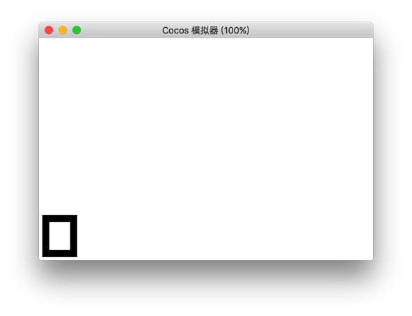

# Line Width

The `lineWidth` defines the width of drawing line for [`stroke`](./stroke.md) function.

| Parameter | Description
| -------------- | ----------- |
| *number* | The width of the current line, in pixels. |

## Example

```javascript
var ctx = node.getComponent(Graphics);
ctx.lineWidth = 20;
ctx.rect(20,20,80,100);
ctx.stroke();
```

<a href="lineWidth.png"></a>

<hr>

Return to the [Graphics Component Reference](../graphics.md) documentation.
