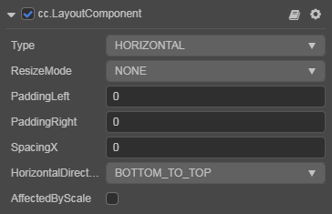
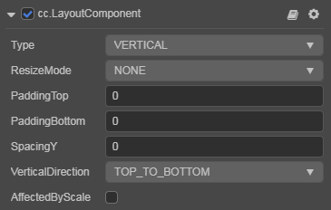
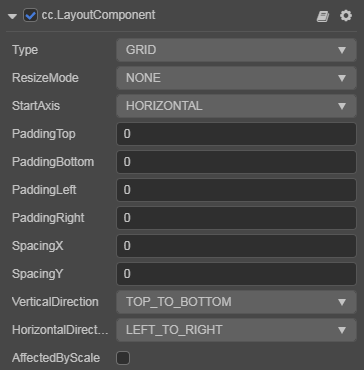

# Layout Component Reference

__Layout__ is a component for UI container nodes. This component provide to the container various layout functionalities to automatically arrange all the children, so that the developer can make list, page, grid container, etc conveniently.

- Horizontal Layout

  

- Vertical Layout

  

- Grid Layout

  

Click the __Add Component__ button at the bottom of the __Inspector__ panel and select __UI/Layout__ to add the __Layout__ component to the node.

To use `Layout`, please refer to the [Layout API](https://docs.cocos.com/creator3d/api/en/classes/ui.layout.html)  documentation and the [layout](https://github.com/cocos-creator/test-cases-3d/tree/master/assets/cases/ui/05.layout) scene of the test-cases-3d project.

## Layout Properties

| Properties             | Function Explanation      |
| --------------         | -----------   |
| *Type*                 | Layout type, including __NONE__, __HORIZONTAL__, __VERTICAL__ and __GRID__. See [Auto Layout](../engine/auto-layout.md) for details. |
| *ResizeMode*           | Resize mode, including __NONE__, __CHILDREN__ and __CONTAINER__. |
| *PaddingLeft*          | The left padding between the children and the container frame. |
| *PaddingRight*         | The right padding between the children and the container frame. |
| *PaddingTop*           | The top padding between the children and the container frame. |
| *PaddingBottom*        | The bottom padding between the children and the container frame. |
| *SpacingX*             | The spacing between children in the horizontal layout. __NONE__ mode __doesn't__ have this property. |
| *SpacingY*             | The spacing between children in the vertical layout. __NONE__ mode __doesn't__ have this property. |
| *HorizontalDirection*  | When it is designated as horizontal layout, this property determines which side(left or right) does the first child node start in the layout. When the __Layout__ type is set to __Grid__, this property along with `Start Axis` property determine the starting horizontal alignment of __Grid__ layout elements. |
| *VerticalDirection*    | When it is designated as vertical layout, this property determines which side(top or bottom) does the first child node start in the layout. When the __Layout__ type is set to __Grid__, this property with `Start Axis` property determines the starting vertical alignment of __Grid__ layout elements. |
| *CellSize*             | This property is only available in __Grid__ layout, __CHILDREN__ resize mode, determines the size of each child node. |
| *StartAxis*            | This property is only available in __Grid__ layout, determines the arrangement direction of children. |
| *AffectedByScale*      | Whether the scale of the child node affects the layout.  |

## Detailed Explanation

The default layout type is __NONE__. It indicates that the container won't change size and position of the children. When the user places children manually, the container will take the minimum rectangular region that can contain all the children as its own size.

You can switch the layout container type by altering `Type` property in the __Inspector__ panel, all the layout types support `Resize Mode`.

- When __Resize Mode__ is __NONE__, the size of the container and children is independent from each other.

- When __Resize Mode__ is __CHILDREN__, the size of the children will change with the size of the container to make sure all children fit inside the container's bounding box.

- When __Resize Mode__ is __CONTAINER__, the size of the container will change with the size of the children to make sure the container is large enough to contain all children inside its bounding box.

When using __Grid__ layout, the __Start Axis__ is very important.

- When choosing __HORIZONTAL__, it will fill an entire row before a new row is started.

- When choosing __VERTICAL__, it will fill an entire column before a new column is started.

> __Node__: If the __Layout__'s configuration is set in runtime, the results need to be updated until the next frame, unless you manually call `updateLayout` API.
