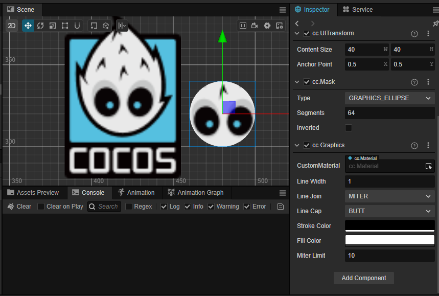
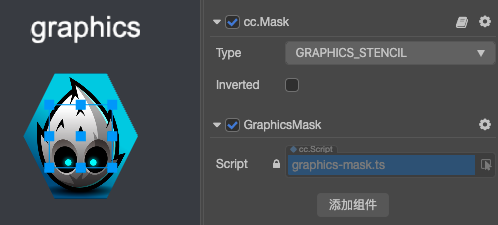
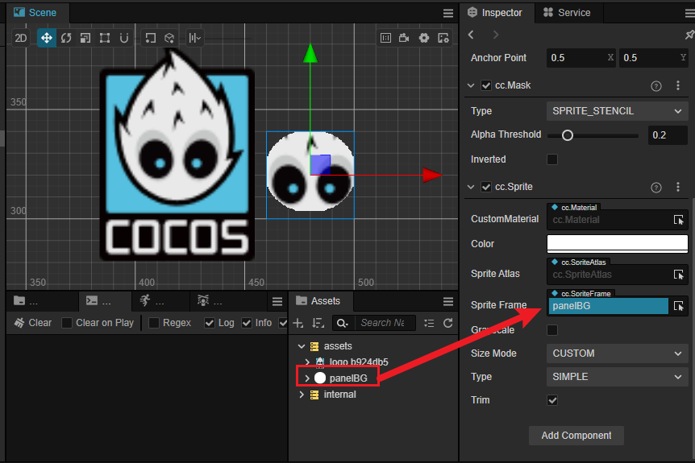

# Mask Component Reference

__Mask__ is used to specify the range which clip the render results of the children. A node with a __Mask__ component will use a bounding box (which is specified by the `contentSize` of the __UITransform__ component in the __Inspector__) to create a rectangular rendered mask. All child nodes of this node will only appear inside the mask's boundary.


Select a node in the __Hierarchy__ panel, then click the __Add Component__ button at the bottom of the __Inspector__ panel and select __Mask__ from __UI -> Render__. Then you can add the Mask component to the node.

After adding a Mask component, a [Graphics](./graphics.md) component will be automatically added on the same node. Please do not delete the graphics component. When the __Type__ property is __SPRITE_STENCIL__，the graphics component will be removed, and a new sprite component will be added. Please also do not delete the sprite component because it provides the shape information for the stencil.

> __Note__: the Mask component cannot be added to a node with other renderer components such as __Sprite__, __Label__, etc.

To use `Mask`, please refer to the [Mask API](__APIDOC__/en/class/Mask) documentation and the [Mask](https://github.com/cocos/cocos-test-projects/tree/v3.7/assets/cases/ui/08.mask) scene of the test-cases-3d project.

## Mask Properties

| Property | Function Explanation |
| :-------------- | :----------- |
| **Type**           | Mask type, including `RECT`, `ELLIPSE`, `GRAPHICS_STENCIL`, `SPRITE_STENCIL`. |
| **Segments**       | The segments for ellipse mask, which takes effect only when the Mask type is set to `ELLIPSE`.   |
| **Inverted**       | The Reverse mask. |
| **SpriteFrame**       | Image used for the type is **SPRITE_STENCIL** |

### Type

#### RECT


#### ELLIPSE



It can also be set by code at runtime. Example:

```ts
const mask = this.getComponent(Mask);
mask.type = Mask.Type.ELLIPSE;
mask.segments = 32;
```

#### GRAPHICS_STENCIL



It can also be set by code at runtime. Example:

```ts
const g = this.mask.node.getComponent(Graphics);
//const g = this.mask.graphics;
g.lineWidth = 10;
g.fillColor.fromHEX('#ff0000');
g.moveTo(-40, 0);
g.lineTo(0, -80);
g.lineTo(40, 0);
g.lineTo(0, 80);
g.close();
g.stroke();
g.fill();
```

#### SPRITE_STENCIL



It can also be set by code at runtime. Example:

```ts
const mask = this.getComponent(Mask);
mask.type = Mask.Type.SPRITE_STENCIL;
const sprite = this.getComponent(Sprite);
sprite.spriteFrame = this.stencilSprite;
mask.alphaThreshold = 0.1;
```

> __Notes__:
> 1. After adding the __Mask__ component to a node, all nodes in the sub tree of this node will be affected by __Mask__ during rendering.
> 2. The `GRAPHICS_STENCIL` simply provides the __graphics__ component, which developers can use graphics property in the __mask__ component to draw custom graphics. But the node click events are still calculated based on the size of the node.
> 3. The `SPRITE_STENCIL` type requires a picture resource by default. If it is not set, it is equivalent to no mask.
