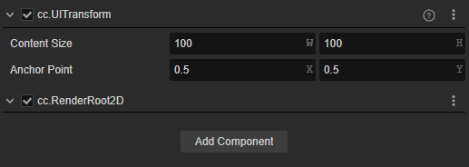
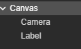
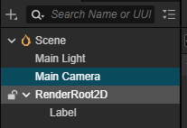
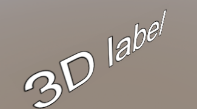

# RenderRoot2D 

The RenderRoot2D component is the parent class of [Canvas](./canvas.md), any 2D/UI elements that need to renderer should be attached under a node with the RenderRoot2D component.

The RenderRoot2D collects information from 2D/UI components in its children and submits it to the render pipeline. 3D Objects, like mesh, even if it is under the RenderRoot2D node, will not be collected by the RenderRoot2D component.

The UITransform component is required and automatically added when add a RenderRoot2D component to the node.

There are two typical usages of the RenderRoot2D component.

- Inherited by other class like [Canvas](./canvas.md) to handle the render of 2D/UI elements, and screen adaptation.
- Draw 2D/UI elements in the 3D Space.

To make A 3D Label like a player's name, you can use a RenderRoot2D component as its parent.

It can be noticed that, when creating a 2D element, Cocos Creator will automatically create a Canvas node.

So, to create a Label in the 3D space, after the creation, delete the Canvas and Camera node, and drag the Label to the RenderRoot2D as a child node to make it visible.

Normally, the scene camera(Main Camera) will not render nodes with layer UI_2D. For 2D/UI nodes to be displayed in the 3D space, please make sure they have the right visibility layer such as UI_3D.

