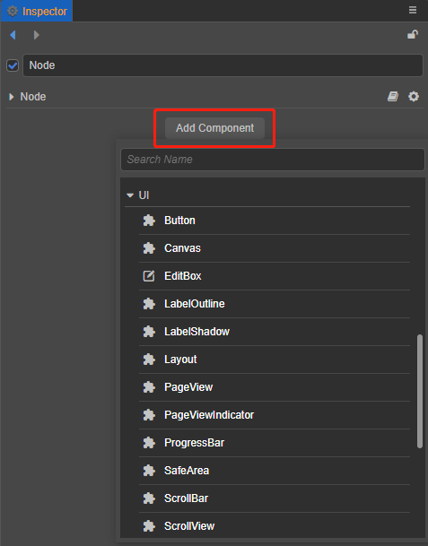

# UI System

## Getting Started with UI

The difference between defining UI and 2D rendering objects in the engine mainly lies in adaptation and interaction. All UI needs to be under a Canvas node to make adaptation behavior, and the Canvas component itself inherits from `RenderRoot2D` component, it can also be used as an entry point for data collection.

The UI is a necessary interactive part of game development. Generally, buttons, text, backgrounds, etc. on the game are made through the UI. When starting to create a UI, first it is necessary to determine the size of the display area (design resolution) of the current design content, which can be set in the **Project -> Project Settings -> Project Data** panel in the menu bar.

Once the design resolution is set, start creating UI elements, all of which are contained under the Canvas node. The Canvas node can be created by clicking the **+** button in the **Hierarchy** panel on the top left and selecting **UI Component -> Canvas**. The Canvas node has a [Canvas](../editor/canvas.md) component, which can be associated with a camera.

> **Notes**:
>
> - Multiple Canvas nodes can exist in a scene, but a Canvas node should not be nested under another Canvas node or its children.
> - Canvas components are not one-to-one with camera, their previous rendering depends on the layer of the node and the Visibility of the camera, pay extra attention to layer management to get the desired rendering effect when you have multiple Canvas.

Next, create UI nodes under the Canvas node. The editor comes with the following UI nodes:

UI components can be viewed by selecting the node and clicking **Add Component** in the **Inspector** panel.

The order in which UI components are rendered is a depth ordering scheme, which means that the ordering of the child nodes under the Canvas node already determines the entire [rendering order](priority.md).

In general game development, the necessary UI elements are not only basic 2D rendering components such as Sprite, Label (text), Mask, but also Layout, Widget (alignment), etc., which are used to quickly build the interface. Sprite and Label are used to render images and text, Mask is mainly used to limit the display content, more commonly used in chat boxes and backpacks, etc. Layout is generally used for single arrangement of buttons, neat arrangement of props in backpacks, etc.  
The last important feature is the Widget, which is mainly used for display alignment. When finishing designing the UI and publish it to different platforms, the actual device resolution of the platform is bound to be different from our design resolution, therefore some trade-offs need to be made in order to adapt it. It is necessary to add a widget component to it, and always ensure that it is aligned to the top left of our design resolution. Please review the [alignment strategy](widget-align.md) and [alignment](../editor/widget.md) documentation.

Once the interface is created, some people may notice that the iPhone 7 displays differently than the iPhone X. This is actually the same problem with the device resolution we mentioned above. When you design in design resolution and finally publish in device resolution, there is a pixel deviation because the resolution of different models of mobile devices may not be the same, so there is another conversion process that needs to be done that is screen adaptation.  
Notice in the **Projects -> Project Settings -> Project Data** page in the menu bar, there are two more options **Fit Width / Fit Height**, which can be easily adapted to different devices by following the screen adaptation rules and combining with the Widget component. The specific adaptation rules can be found in the [Multi-Resolution Adaptation Scheme](multi-resolution.md) documentation.

## UI components

UI components mostly do not have rendering capabilities themselves, but hold 2D rendering components for rendering, which themselves have more ability to quickly form user-interactive interfaces, and take on functions such as event response, typography adaptation, etc. UI component references are as follows:

- [Canvas Component Reference](../editor/canvas.md)
- [UITransform Component Reference](../editor/ui-transform.md)
- [Widget Component Reference](../editor/widget.md)
- [Button Component Reference](../editor/button.md)
- [Layout Component Reference](../editor/layout.md)
- [EditBox Component Reference](../editor/editbox.md)
- [ScrollView Component Reference](../editor/scrollview.md)
- [ScrollBar Component Reference](../editor/scrollbar.md)
- [ProgressBar Component Reference](../editor/progress.md)
- [LabelOutline Component Reference](../editor/label-outline.md)
- [Toggle Component Reference](../editor/toggle.md)
- [UIMeshRenderer Component Reference](../editor/ui-model.md)
- [ToggleGroup Component Reference](../editor/toggleContainer.md)
- [Slider Component Reference](../editor/slider.md)
- [PageView Component Reference](../editor/pageview.md)
- [PageViewIndicator Component Reference](../editor/pageviewindicator.md)
- [UIOpacity Component Reference](../editor/ui-opacity.md)
- [BlockInputEvents Component Reference](../editor/block-input-events.md)

## UI rules introduction

- [Multi-Resolution Adaptation Scheme](../engine/multi-resolution.md)
- [Alignment Strategy](../engine/widget-align.md)
- [Label Layout](../engine/label-layout.md)
- [Auto Layout Container](../engine/auto-layout.md)
- [Create a List of Dynamically Generated Content](../engine/list-with-data.md)
- [Use a Sliced Sprite to make a UI image](../engine/sliced-sprite.md)
