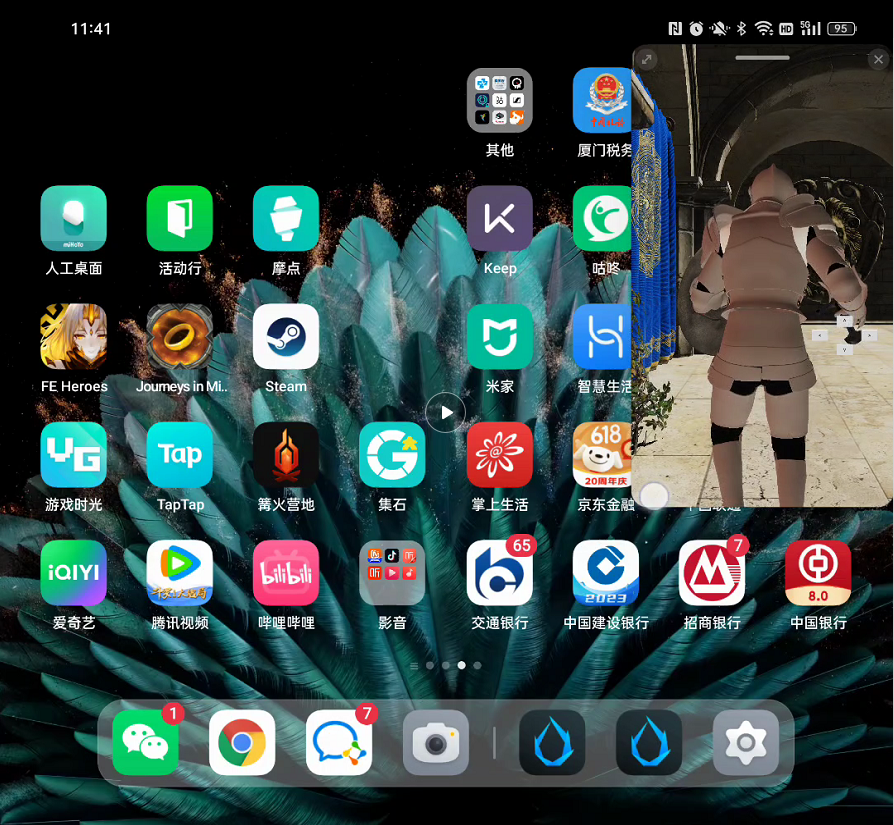

# Android Large Screen Adaptation

Cocos Creator is currently able to adapt to large screen devices as well as folding screens.

For large screen Android devices, our recommended adaptation scheme is:

- Set Wie to On_WINDOW_RESIZE or ALWAYS for the Align Mode on the 2D/UI node used to adapt the widget component.

    

- Refer to [Responsive layouts for large screen development](https://developer.android.com/large-screens).
