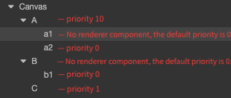

# Rendering Order

## 2D rendering node ordering

2D rendering nodes can be divided into nodes under Canvas and nodes that are not under Canvas:

- The nodes under Canvas can be found in **UI node ordering** below.

- The nodes that are not under Canvas, the user can choose to enable depth detection and occlusion display of 3D objects through [custom materials](ui-material.md), which will render the occlusion according to the Z-axis coordinates of the object when enabled (see example [2d-rendering-in-3d](https://github.com/cocos/cocos-test-projects/tree/v3.8/assets/cases/2D)).

## UI node ordering

UI nodes refer to the UI nodes under the Canvas node, the mixing of nodes is strictly sorted according to the node tree. The rendering order of the UI uses a **Breadth-First Sorting** scheme, and the node tree order is the final rendering data submission order. So the user can change the order of the nodes under their parents by setting the `siblingIndex` of the nodes and thus change the rendering order.

For example:

Therefore, the overall rendering order in the figure above is **A -> a1 -> a2 -> B -> b1 -> C**, and the rendering state on the screen is **C -> b1 -> B -> a2 -> a1 -> A**. i.e. **from top to bottom**.

`setSiblingIndex` is used to change the position of the current node in the children array of the parent node. If set at runtime by script, the changed node tree data will not be serialized. If the parameter passed in is larger than the length of the children array, it will be set to the end of the array, and if it is within the range, it will be inserted into the corresponding position. This operation is related to the state of the node tree in real time, and the user needs to know the current state of the node tree and perform the operation to get the expected result.

## Detailed Explanation

**Sorting** is a very simple function, but the final rendering is based on the rendering capabilities provided by different platforms.  
Therefore, explain here. If you encounter an error in **UI rendering**, such as flickering or unwanted artifacts or other please consider the following. The first thing to check is the **ClearFlag** of all cameras (**Camera** and **Canvas**) in the scene, and make sure that the lowest **Canvas** or **Camera**'s **ClearFlag** property is set to **SOLID_COLOR** in each scene.

To set the **ClearFlag** property, please refer to the following situations:

- If there is only one **UI Canvas** or **3D Camera** in the scene, then the **ClearFlag** property is set to `Solid_Color`.
- If the scene contains 2D background layer, 3D scene layer, 2D UI layer, then:
    - For cameras used for 3D scene rendering, make sure the first rendered camera is **SOLID_COLOR** (or set to **SKYBOX** if there is a skybox configured), and the rest of the cameras are determined by the project requirements.
    - Cameras used for UI rendering (under Canvas) should be **DEPTH ONLY**.
    - If a camera has a targetTexture set, set it to **SOLID_COLOR**.
  
