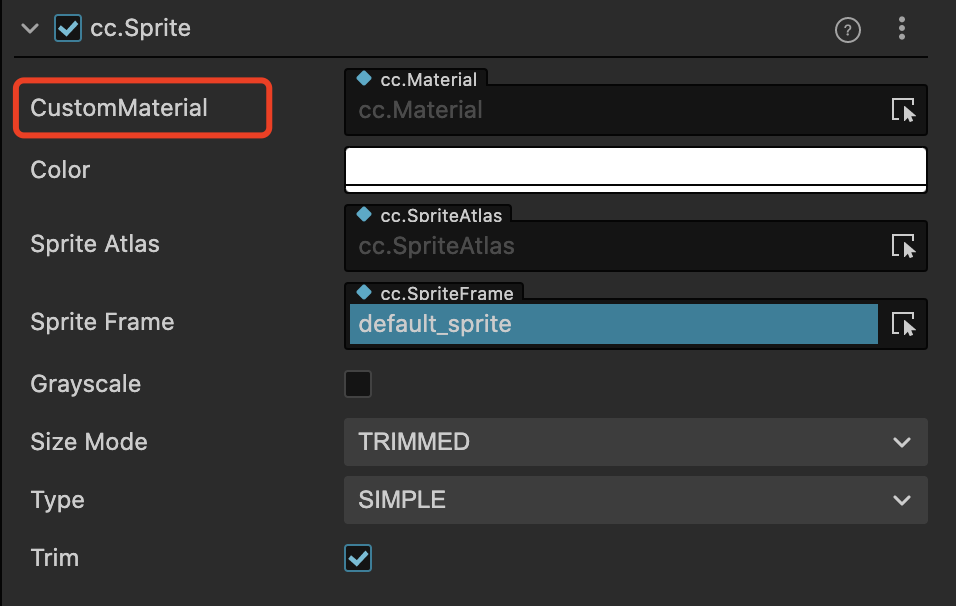

# Custom Materials for 2D Rendering Objects

Custom materials for 2D rendering objects are a best practice to extend the performance of 2D rendering objects and enhance the capabilities of 2D rendering objects themselves, allowing for cool rendering effects such as dissolve and glow.

Most of the 2D renderable components in v3.0 support the use of custom materials, with the following interface (using the Sprite component as an example).



The usage is no different from other built-in materials, just drag and drop the material to be used into the **CustomMaterial** property box, but there are some points to note as follows:

1. When no custom material is specified, the built-in material will be used for rendering, please refer to the [Sprite Component Reference](../editor/sprite.md) documentation.
2. 2D rendering objects do not support multiple materials, the maximum number of custom materials is one.
3. Please use a 2D-specific shader such as **builtin-spine** or **builtin-sprite** to customize materials, do not choose a shader used by other 3D components.
4. The **Grayscale** property on the panel is disabled when a custom material for 2D rendering objects is used, and the user can choose to implement this feature in the material itself.
5. If the BlendFactor is set in the code, when a custom material is used, the BlendFactor setting in the custom material will prevail.
6. When a custom material is used, the depth detection information of the component will be based on the material. To achieve occlusion with 3D objects, please use custom materials and turn on depth detection. See the example [2d-rendering-in-3d](https://github.com/cocos-creator/test-cases-3d/tree/v3.5/assets/cases/2d-rendering-in-3d).
7. For custom materials, getting the uploaded texture requires introducing the `cc-sprite-texture` header file in the shader, where `cc_spriteTexture` corresponds to the SpriteFrame image asset set in the 2D rendering component properties panel. For example, a fragment shader that simply uses the panel to set a SpriteFrame to sample textures should look like the following:

    ```
    CCProgram sprite-fs %{
        precision highp float;
        #include <cc-sprite-texture>
        in vec4 v_color;

        uniform ARGS{
            float time;
        };

        in vec2 uv0;
        uniform sampler2D u_normalMap;

        vec4 frag () {
            vec4 color = vec4(1, 1, 1, 1);
            color *= v_color;
            float value = 1.0;
            vec4 o = texture(u_normalMap, uv0);
            value *= o.r;
            if (value < time) {
                discard;
            }

            color *= texture(cc_spriteTexture, uv0);
            if (value < time + 0.05) {
                color = vec4(0.9, 0.6, 0.3, color.a);
            }

            return color;
        }
    }%
    ```

    

8. If the user wants to assign a `uniform` to a custom material, it can be done by getting the customMaterial on the 2D renderer component. Creator provides different interfaces for different cases, see the following example code for Sprite:

    ```ts
    let spriteComp = this.node.getComponent(Sprite);
    // The sharedMaterial method is a "shared material asset", and operations performed on the material will affect all rendering objects that use the material, this operation will not instantiate the asset and will not affect the batch
    let material = spriteComp.sharedMaterial;

    // The material method gets the "example material used by the current renderable component", and operations on the Material Instance will only affect the current component, this operation will instantiate the asset, and once instantiated, this component cannot be combined with other components
    let materialInstance = spriteComp.material;
    ```

    > **Note**: please be sure to read the annotations of the different interfaces!
