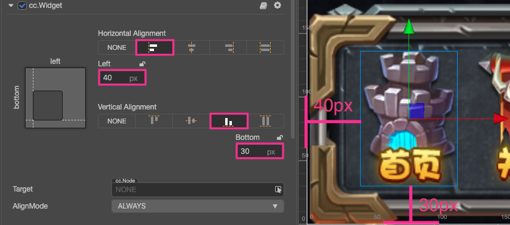
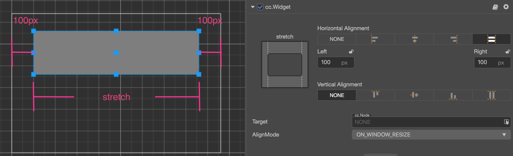
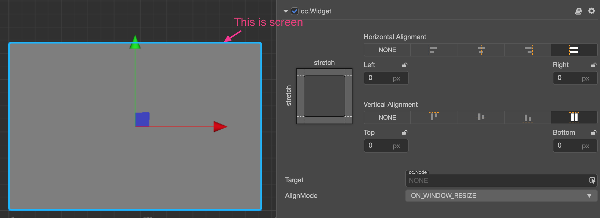
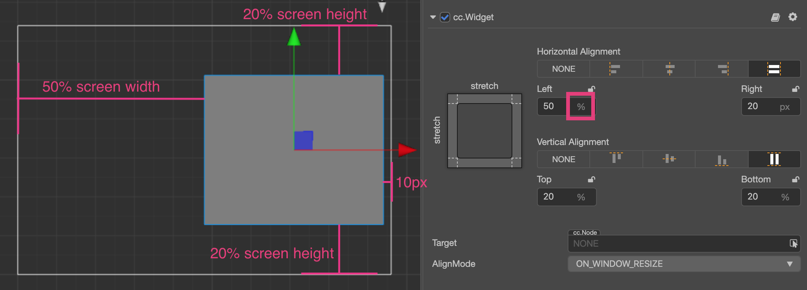
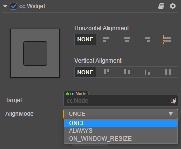

# Alignment Strategy

To achieve a perfect multi-resolution fit effect, presenting UI elements according to the positions stipulated in the design resolution is not enough. When the width and height of the screen change, UI elements must be able to intelligently sense the positions of the borders of the screen to make sure that they are presenting themselves in the visible area of the screen and being distributed in suitable positions. We can do this with the **Widget** component.

Next, we categorize different alignment workflows according to the categories of elements that need to be aligned:

## Aligning Buttons and Small Elements with the Border

For elements with relatively small areas like a pause menu, gold coins in the game, etc., normally, aligning them by the borders of the screen would be enough. Only a few simple steps are needed:

1. Creating a 2D object in the **Hierarchy** panel will automatically create a Canvas node as its parent by default, and these element nodes need to be placed under the Canvas node.
2. Add the Widget component to element nodes.
3. To align something with the bottom left corner of the screen for example, check the `Left` and `Bottom` tick boxes in the Widget component.
4. Then set up the distance between the node and the borders of the screen. In the picture below, the left margin is set as 40px, the bottom margin is set as 30px.

    

After setting up the Widget component like this, no matter what the actual screen resolution is, this node element will remain at the bottom left corner of the screen. The distance between the left side of the node's bounding box and left border of the screen remains at 40px. The distance between the bottom of the node's bounding box and the bottom of the screen remains at 30px.

> **Note**: the alignment distance provided by the Widget component refers to the border of the bounding box in the same direction as the child node and the parent node. 
> For example, `Left` is ticked on in the above example to align the element with the left border, then the distance between the left border of the child node's bounding box and the left border of the parent node's bounding box is the set value 40px, where the parent node is the Canvas node and the bounding box is constantly the same size as the screen, provided that only the **Fit Width** or **Fit Height** option is checked in the **Project -> Project Settings -> Project Data** in the top menu bar of the editor.

## Nest Alignment Elements

We just showed how to align something with the border of the screen in the example above.

Because the default alignment reference of Widget is the parent node, we can add different node hierarchies and make the nodes on every hierarchy use the auto alignment function.

Here is a simple example to explain it. Suppose we have a node hierarchy as follows:

In the example above, `parent` is a panel, and `button` is a button. We can add Widget component to both of these nodes, and respectively set their alignment distance.

For the `parent` node, the distance of aligning the top left corner of the `Canvas` node remains at 80px:

For the `button` node, the distance of aligning the top left corner of the `parent` node remains at 50px:

With a workflow like this, we can group UI elements according to their display areas or functions, and elements of a different hierarchy can be aligned according to design.

## Automatically zooming in/out the size of a node according to alignment requirements

In the above example, two borders that simultaneously align on one axis in opposite directions don't exist. If we want to make a panel that fully covers the width of the whole screen, we can simultaneously tick off the alignment switches `Left` and `Right`:

When simultaneously ticking off the alignment switches in opposite directions, Widget obtains the ability of modifying the `Size` of the node according to alignment requirements. In the picture above, we ticked off the left and right directions and set up margins, then Widget can dynamically set up the `Width` property of the node according to the width of the parent node. As a result, no matter how wide the screen is, the distance between the panel and the left & right borders of the screen remains at 100px permanently.

### Create a node whose size is in accordance with the size of screen

Making use of the features of a node that can automatically zoom in/out, we can make the size of the node the same with that of the screen by setting up the Widget component of the node.

To make such a node, we should first make sure that the size of the parent node of this node remains the same with that of the screen. The Canvas node is the best choice. Next, set up the Widget component of this node according to the following method:

Therefore the size of the node will remain constantly the same with that of the Canvas node when running, i.e., the same as the size of the screen. After being set up like this, the child node of this node can transmit the same screen size by the same settings.

> **Note**: for this to work, only the **Fit Width** or **Fit Height** option can be checked in the **Project -> Project Settings -> Project Data** in the top menu bar of the editor.

## Set up percentage alignment distance

After the alignment in a certain direction is enabled on the Widget component, in addition to specifying the margin in pixels, we can also input a percentage value (For example: by clicking the symbol circled in the box), therefore, Widget will multiply the width or height of the parent node on the corresponding axis by the input percentage to get the value of the actual margin.

Let's take a look at a real example. Take a child node that has been directly put under Canvas as an example. We hope this node panel remains on the right side of the screen and constantly covers 60% of the total height of screen. Therefore, setting up the Widget component according to the following picture will realize this effect:

When inputting the margin value when opening alignment direction, Widget can use the pixel unit together with percentage unit according to various needs. For example, input `50%` on the `Left` direction that needs to align with the center of screen and input `20px` on the `Right` direction that needs to align with the right of screen; when calculating the position and size of the child node at last, all the margins will be positioned after being converted to pixel distance according to the size of the parent node.

Making use of the percentage alignment distance, we can create UI elements that can zoom in/out infinitely according to the size of the screen. Exerting your imagination, fitting a thousand types of phones with one set of resources will be a piece of cake!

## Update alignment and optimization strategies for every frame at runtime

Widget component is generally used to locate the position of each element when the scene is initialized on the target device, but once the scene is initialized, we often do not need to use the Widget component for alignment. The `alignOnce` property is used to ensure that the Widget component only performs alignment and positioning at initialization, and no longer consumes time for alignment at runtime.

If **AlignMode** is set to **ONCE** or **ON_WINDOW_RESIZE**, and the alignment is performed once when the component is initialized, the engine will automatically set the `enabled` property of the Widget component to `false`, disabling the Widget component to disable the automatically update for subsequent every frame.

If the alignment needs to be changed at runtime, manually set the **AlignMode** mode to **ALWAYS**, or manually traverse the Widgets that need to be aligned and set their `enabled` property to `true` when the alignment needs to be updated each frame at runtime.

For a scene with many UI elements, ensuring that the **AlignMode** property of the Widget component is set to **ON_WINDOW_RESIZE**, which can significantly improve the running performance of the scene.

## Limitation on the position and size of node

When the Widget component enables one or more alignment settings, the `position`, `width` and `height` properties of the node may be restricted and cannot be freely modified through the API or __Animation__ panel. If you need to modify the position or size of the alignment node at runtime, please refer to the [Widget Component: Limitation on node position control](../editor/widget.md#limitation-on-node-position-control) for details.
