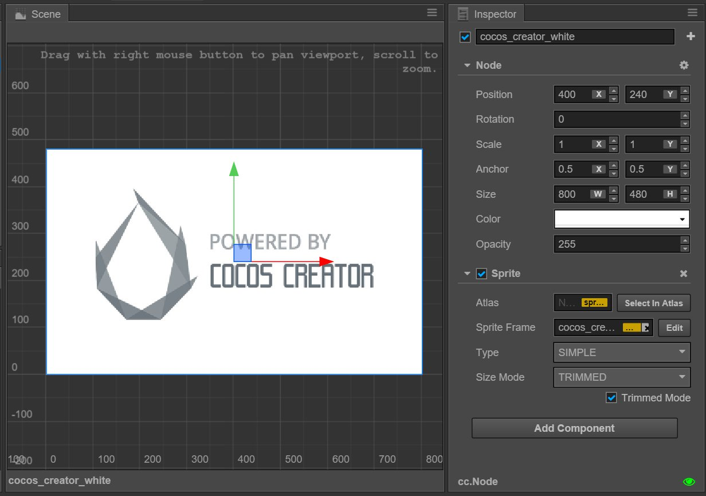

# Auto fit for multi-resolution

Cocos Creator is committed to solving the problem of adapting to screens with various resolutions with one set of resources from the beginning. Generally speaking, we realize the adaptation scheme for multi-resolution through the following technology:

- **Canvas** component immediately obtains the actual resolution of the device screen and appropriately adjusts the size of all the render elements in the scene.
- **Widget** is put on rendering elements, which can align the element with different referential positions of the parent node according to different needs.
- **Label** component has a built-in function that provides various dynamic layout modes. When the bounding box of labels change because of the alignment requirement of the Widget, labels will present the perfect layout effect according to your needs.
- **Sliced Sprite** provides images whose size can be arbitrarily designated. Simultaneously, it can meet various alignment requirements and display images with high definition on screens of any resolution.

Next, we start off by getting to know the concepts of design resolution and screen resolution, then we will go on to learn the zooming in/out function of the **Canvas** component.

## Design resolution and screen resolution

**design resolution** is the resolution sample used by content creators when creating the scene. But **screen resolution** is the actual resolution of the device that the game is running on.

Normally, design resolution will use the screen resolution of the device that is being used the most by the targeted group on the market, such as: screen resolutions of `800x480` and `1280x720` that are being used by Android devices currently, or screen resolutions of `1136x640` and `960x640` that are being used by iOS devices. Therefore, after designers or directors set up the scene by using design resolution, the game will automatically adapt to the device used by the major targeted group.

Then when the design resolution is different from the screen resolution, how could Cocos Creator adapt to the device?

Supposing the design resolution is `800x480`, designers will create a background image of the same resolution.

### When design resolution and screen resolution have the same aspect ratio

When design resolution and screen resolution have the same aspect ratio, supposing the screen resolution is `1600x960`, enlarging the background image to 1600/800 = **2 times** will perfectly fit the screen. This is the simplest situation, which will not be discussed in detail here.

### When the aspect ratio of design resolution is larger than that of screen resolution, the height should be adjusted to avoid black borders

Supposing the screen resolution is `1024x768`, a red frame is used in the following picture to indicate the visible area of the device screen. We use `Fit Height` mode provided by the Canvas component to make the height of the design resolution automatically cover the height of the screen, i.e., enlarging the scene image to 768/480 = **1.6 times**.

This is a fairly good adaptation mode when the aspect ratio of the design resolution is larger than that of the screen resolution. As illustrated above, although some parts of the background image will be cut down on the two sides of the screen, it can be ensured that no goof or black borders will appear in the visible area of the screen. Then the position of UI elements can be adjusted by the Widget, which makes sure that the UI elements will appear in the visible area of the screen. We will introduce this in detail in the next section [Widget Align](widget-align.md).

### When the aspect ratio of the design resolution is larger than that of the screen resolution, the width should be adjusted to avoid black borders

Supposing the screen resolution is `1920x960`, a red frame is also used in the following picture to indicate the visible area of the device screen. We use `Fit Width` mode provided by the Canvas component to make the width of the design resolution automatically cover the width of the screen, i.e., enlarging the scene to 1920/800 = **2.4 times**

When the aspect ratio of the design resolution is relatively small, the use of this mode will cut down some parts of the background image on the upper/lower sides of the screen.

### No matter how much the aspect ratio of the screen is, all the contents of design resolution will be completely displayed, and black borders are permitted.

In the last example, supposing the screen has a resolution of `640 x 960`. If you want to make sure the background image is completely displayed on the screen, you need to simultaneously open **Fit Height** and **Fit Width** in the Canvas component. The zooming in/out proportion of the scene image is calculated according to the smaller dimension in the screen resolution. In the example in the following picture, because the aspect ratio of the screen is less than 1, the zoom ratio will be calculated based on the width, that is, 640/800 = **0.8 times**.

Under such a displaying mode, there might be black borders on the screen or scene image that exceed the design resolution (goof). Although developers try their best to avoid black borders in general, if you want to make sure all the contents within the scale of design resolution are displayed on the screen, you can use this mode too.

### According to the aspect ratio, 'Fit Width' or 'Fit Height' will be automatically chosen

If there are no strict requirements for the content that might be cut down on the four sides of the screen, you can not check the **Fit Height** and **Fit Width** mode of the Canvas component at the same time, this is equivalent to turning on the **NO_BORDER** mode. In this case, the height and width are automatically adapted according to the aspect ratio of the screen to avoid black borders. At this point, no black border is generated regardless of the aspect ratio of the screen. In other words, when the aspect ratio of the design resolution is larger than that of the screen resolution, **Fit Height** will be automatically opened (as in the first picture above); when the aspect ratio of the design resolution is smaller than that of the screen resolution, **Fit Width** will be automatically opened(as in the second picture above).

### Canvas component doesn't provide a fit mode that can respectively zoom in/out of the x axis and the y axis, which will distort the image

In the Cocos engine, there is a fit mode called `ExactFit`, which doesn't have black borders, or cut down the image within the scale of design resolution. But the price is the zooming in/out ratio of the scene image to the direction of the x/y axis is different, which will distort the image.

## Use Canvas component in the scene

When creating a new scene, a node including the Canvas component will automatically be added to the root node of the scene. On the Canvas component, the options mentioned above can be set:

- **Design Resolution**
- **Fit Height**
- **Fit Width**

It is recommended to set the Canvas node as the root node of all the render nodes that need to adapt the **design resolution**. Because although **all nodes in the scene can automatically use the zooming in/out effect of Canvas's intelligent adaptations based on design resolution**, but the Canvas node itself also has the following features:

- **Size**
  - When editing the scene, the `Size` property of the Canvas node will be the same with design resolution, which can't be modified manually.

  - When the game is running, in the mode without black borders, the `Size` property of Canvas will remain the same as the screen resolution. In the mode with black borders, the `Size` property of Canvas will remain the same as the design resolution. 
  In other words, the size of the Canvas is equal to the visible area of the screen, **we can set sub UI elements automatically aligned to the Canvas border, making sure that UI elements can be correctly distributed in the visible area of the screen**.

- **Position**: The `Position` property will remain at `(Width / 2, Height / 2)`, which is the center of the screen whose resolution is the same with the design resolution.

- **Anchor**: The `Anchor` property defaults to `(0.5, 0.5)`. Since Canvas will remain at the position of the screen center, **the subnode of Canvas will make the screen center the origin of its coordinate system**, which is different from that in the Cocos2d-x engine. Please pay attention to that.
