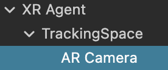
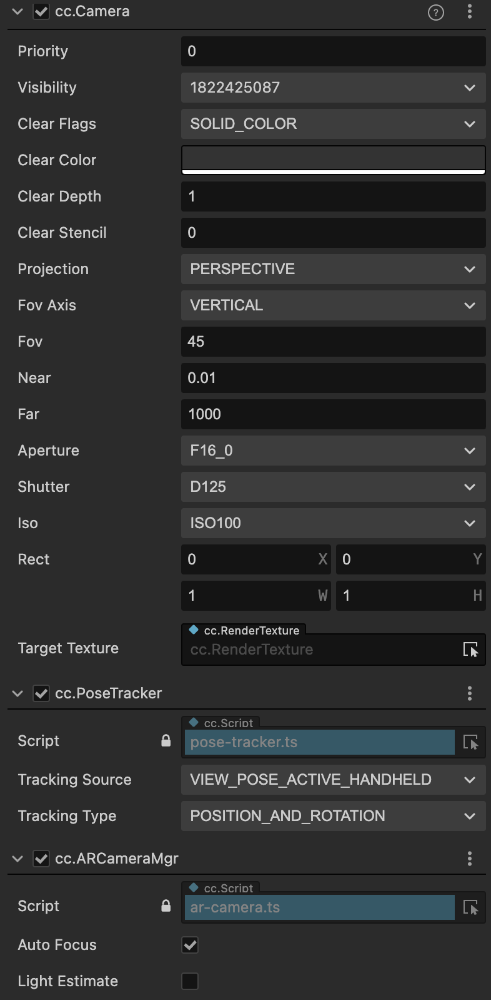

# AR Camera

Similar to head-mounted displays, to abstract the camera with AR capabilities on mobile devices in the scene, the XR plugin uses the AR Camera component to encapsulate a series of properties that map to the camera AR functionality of physical devices.

The AR Camera object consists of three essential components: `cc.Camera`, `cc.PoseTracker`, and `cc.ARCameraMgr`.

## cc.Camera

`cc.Camera` is the camera component provided by Cocos Creator. To ensure a good experience, it is recommended to set the `Clear Flags` to `SOLID_COLOR` and the `Near Plane` to `0.01`. For more information about camera parameters, please refer to the [Camera Component](../../editor/components/camera-component.md) documentation.

## `cc.PoseTracker`

`cc.PoseTracker` is used to synchronize the pose information of the physical device to the AR Camera, ensuring that the camera can render virtual content correctly and overlay it with the video stream. Unlike XR HMD, when adapting to handheld devices on mobile, the `Tracking Type` should be set to `VIEW_POSE_ACTIVE_HANDHELD`.

## cc.ARCameraMgr

`cc.ARCameraMgr` is a component used to manage the AR camera functionality. For detailed property descriptions, please refer to the **Device Mapping Component -> ARCameraMgr**.