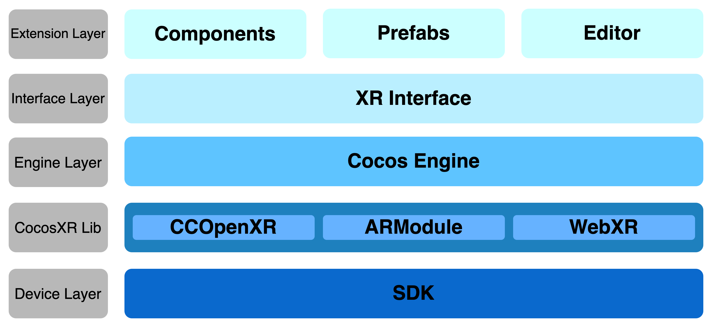

# Architecture

The extension architecture refers to the system structure of the extension. As a user of Cocos CreatorXR, you can quickly and comprehensively build XR applications by understanding the components of the extension architecture, their responsibilities, and how they are combined and interconnected.

