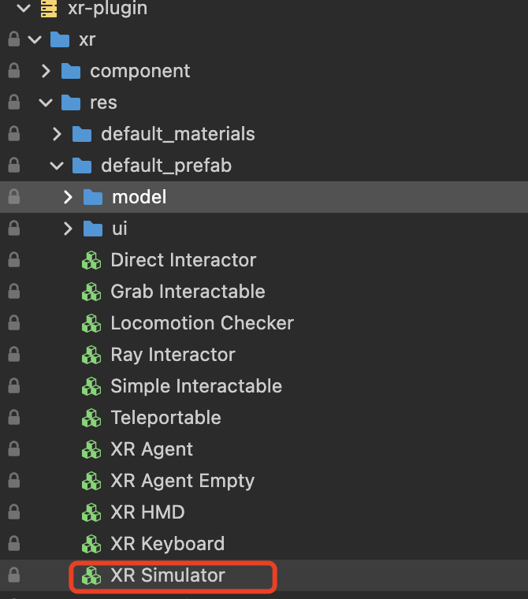
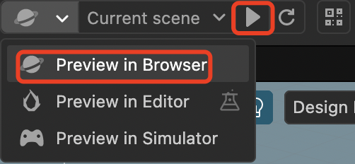
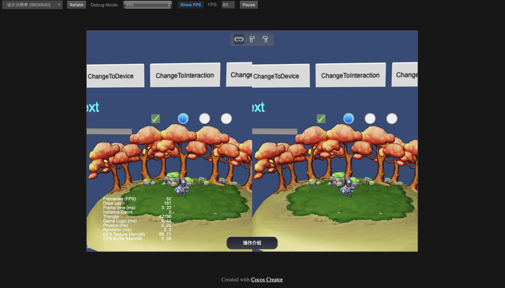
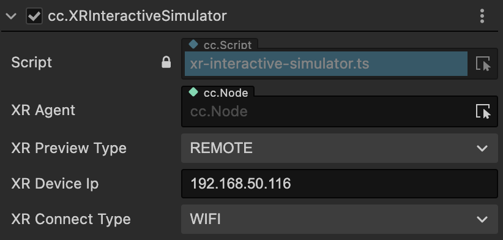
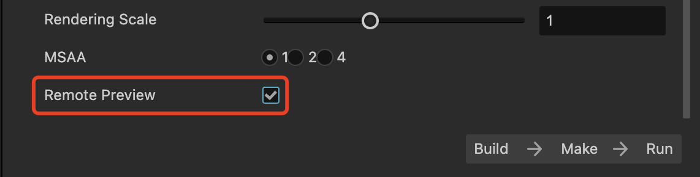

# Preview

To facilitate developers in real-time debugging and quickly verifying traditional functional logic during project development, Cocos CreatorXR offers a preview feature for XR projects based on Cocos Creator's **Preview in Browser** functionality.

## How to Use

In the xr-plugin repository, find XR Simulator and drag it into the scene.

Select the **Preview in Browser** option in the editor's preview settings and click to play.

Once running, you can simulate the preview in the browser.

Use the WASD keys to control the movement of the character as a whole (HMD + controllers) in the forward, left, backward, and right directions. Use QE to control the overall up and down.

The numeric keys 1,2,3 on the Latin part of the keyboard have the following functions: 

- **Key 1**: Switch the control target of the mouse and keyboard to the XR Agent (the character itself). In this mode, the movements of forward, backward, left, right, up, and down will affect the character as a whole. Mouse movement controls the rotation of the HMD (Camera), and the raycasting originates from the center of the HMD. Press the spacebar to trigger a click, and hold the spacebar while dragging the mouse to trigger a drag. 
- **Key 2 and 3**: Switch the control target of the mouse and keyboard to the left/right controller, respectively. In this mode, the movements of forward, backward, left, right, up, and down will affect the left/right controller individually. The raycasting originates from the position of the controller. Press the spacebar to trigger a click, and hold the spacebar while dragging the mouse to trigger a drag.

Hold down the B key to reset the controller position.

When controlling the movement of the controllers, the forward vector always aligns with the forward direction of the XR Agent.

## XR Device Wireless Streaming Debugging

The preview component in version 1.1.0 introduces wireless streaming mode. Content validation is a time-consuming process during project development. Due to the independence of XR devices and the closed nature of streaming tools, debugging and validating XR projects in the editor is more challenging compared to traditional mobile/PC projects. To address this, Cocos CreatorXR v1.1.0 introduces wireless streaming debugging. Developers can directly preview XR projects in a web browser and synchronize all signals from the XR devices, rendering real-time visuals and providing feedback on various controller signal-triggering logic. It allows for a complete and quick experience of all XR project content without the need to package the application onto the device.

Select REMOTE mode for XR Preview Type, and Wifi mode for XR Connect Type, and ensure that the computer and the device are on the same WIFI network.

Enter the XR device's IP address in the XR Device `IP` property.

Check Remote Preview in the Build panel and package the project for the XR device.

Choose **Preview in Browser** as the project preview method.

Click Run in the editor for browser preview and run the packaged APK on the device simultaneously.

> **Note**: The wireless streaming debugging feature requires extension version >= v1.1.0 and the Cocos Creator version >= 3.7.1.
