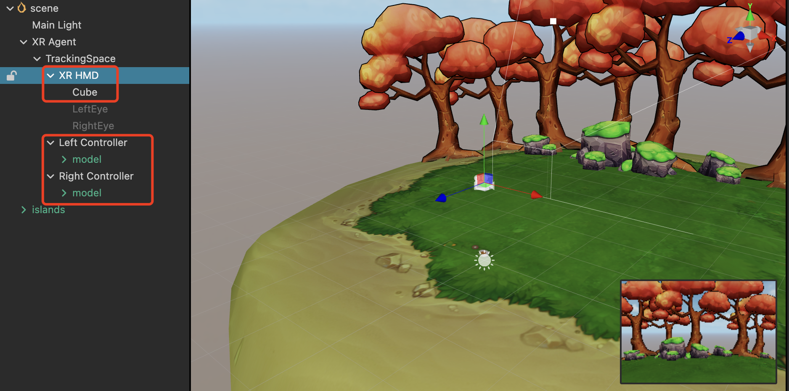
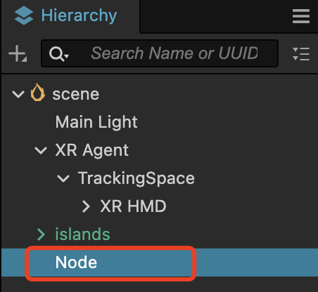
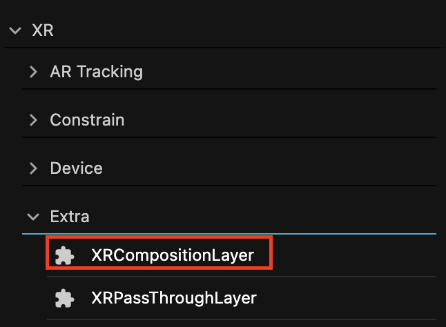
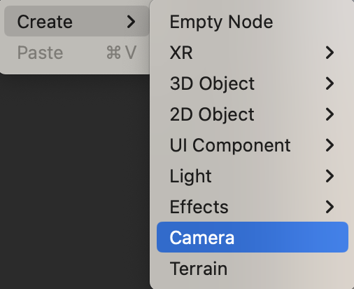
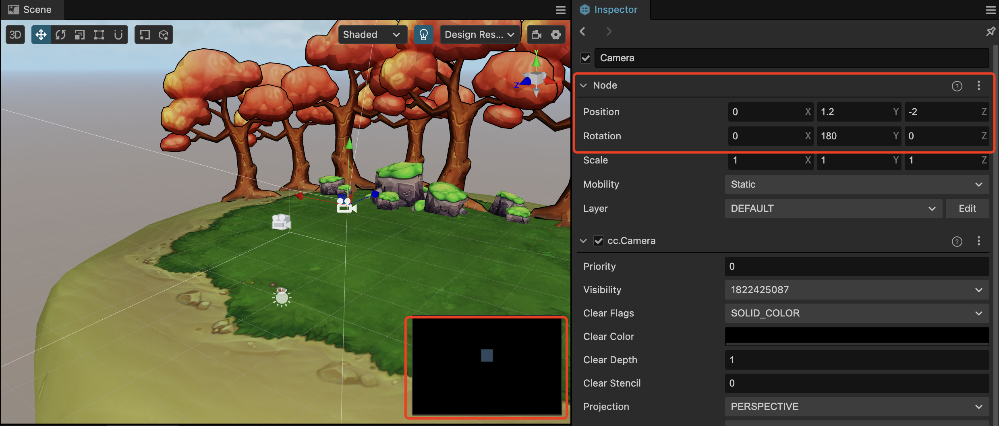
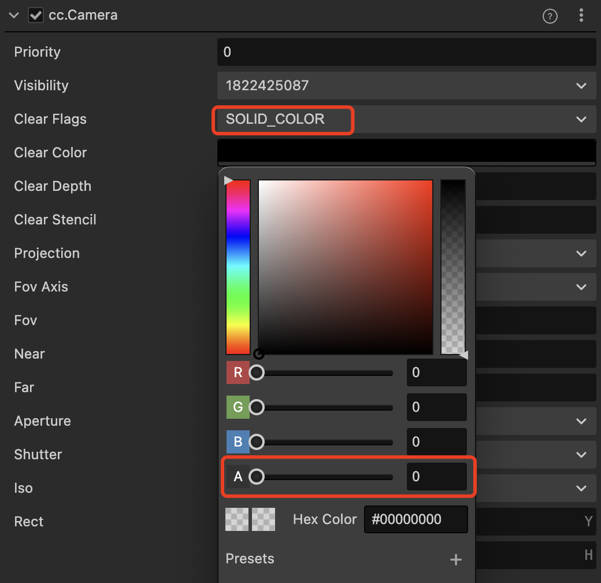
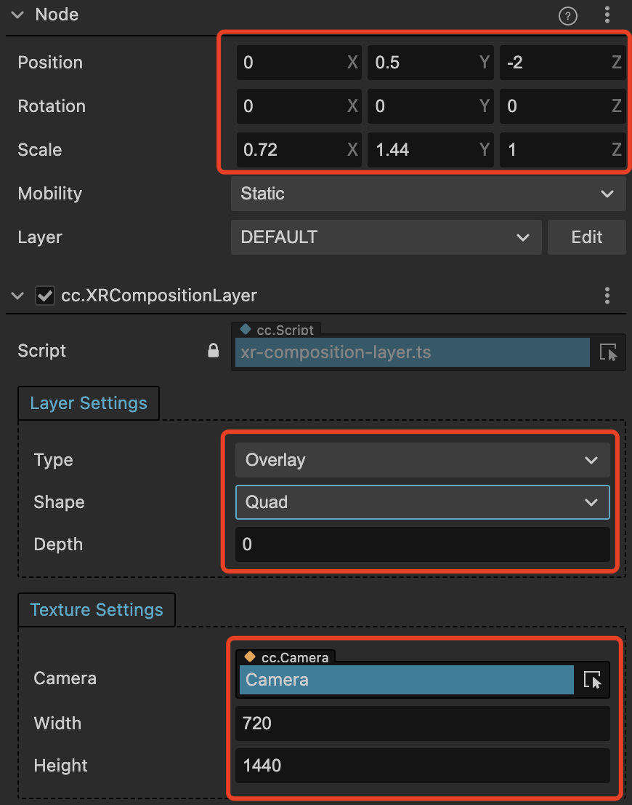

# XR Composition Layer

In XR application development, the Composition Layer is a commonly used technique, often applied in mixed-reality scenarios to blend virtual reality scenes with real-world scenes. The Composition Layer renders different layers into separate textures based on the layer depth set by the user. These layers are then composited together to form a complete XR scene. By adjusting the transparency and depth of the layers, seamless integration between virtual and real-world objects can be achieved. The Composition Layer technology enables high-quality XR rendering effects, providing significant help and support for XR application development and user experience.

## Composition Layer Features

| Property           | Description                                                         |
| -------------- | ------------------------------------------------------------ |
| Layer Setting  | Composition layer effect settings.                                            |
| --Type         | The type of the composition layer: Overlay: Renders the texture in front of the Eye Buffer. Underlay: Renders the texture behind the Eye Buffer. |
| --Shape        | Provides two types of composition layer shapes:  Quad: A flat texture with four vertices, usually used to display text or information in the scene. Cylinder: A cylindrical texture with curved radius, typically used for displaying curved UI interfaces.
 |
| --Redius       | Appears when selecting Cylinder, sets the curvature radius.      |
| --CentralAngle | Appears when selecting Cylinder, sets the central angle size.      |
| --Depth        | Defines the order of the composition layer in the scene. The smaller the value, the closer it is to the Eye Buffer.   |
| TextureSetting | Material effect settings.                   |
| --Camera       | Binds the camera that captures dynamic textures for the composition layer.        |
| --Width        | Sets the width of the camera's Render Texture.                            |
| --Height       | Sets the height of the camera's Render Texture.           |

> **Note**：
> 1. The Composition Layer feature is integrated with the core API extensions of OpenXR and is applicable to all devices that comply with the OpenXR standard.
> 2. The camera must be placed inside the inscribed sphere of the cylinder. If the camera is too close to the surface of the inscribed sphere, the composition layer will display abnormally.

## Using the Composition Layer

Currently, the Composition Layer feature can render dynamic textures and is mainly used to render the visuals captured by a camera.

The following example demonstrates the creation of a mirror object using the **Overlay** type, which reflects the actions of an XR character.

### Setup Steps

First, create a complete XR proxy node in the scene for device tracking. Bind a simple HMD/controller model to it.

Add any node to the scene, using an empty node as an example. Add the Composition Layer component to it by clicking Add Component in the Inspector panel and finding **XR > Extra > XRCompositionLayer**.

Create a Camera node in the scene and position it as desired.

Set the Camera's Clear Flags to SOLID_COLOR and set the Clear Color's alpha value to 0.

Attach this Camera node to the `cc.XRCompositionLayer` component's Camera property of the node with the added `cc.XRCompositionLayer` component. Adjust the rendering resolution, scale size, and position of the camera. Try to ensure that the aspect ratio of the scale is the same as the aspect ratio of the rendering resolution; otherwise, the image may appear stretched. Set the Type in Layer Setting to Overlay and the Shape to Quad.

The result after packaging:

> **Note**: Using the Composition Layer feature requires extension version >=1.2.0 and the Cocos Creator version >= 3.7.3.
