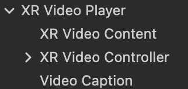

# XR Video Player

XR headsets offer a variety of ways to display videos compared to traditional monitors. With their multi-axis positional tracking and dual-screen rendering capabilities, XR devices can fulfill the need for browsing panoramic videos or dynamic materials in a 3D environment. Cocos CreatorXR v1.1.0 provides a versatile XR Video Player that optimizes video rendering pipelines for XR devices and supports switching display windows, as well as various styles of videos such as 180-degree and 360-degree. Additionally, the player offers interactive features to assist with playback control. By simply adding or replacing video resources, you can easily develop video playback functionality, simplifying the creative process and lowering the barrier to entry.

To create a video player, right-click in the Hierarchy and select **Create -> XR -> XR Video Player**.

The core components contained within the node are as follows:

## XR Video Player

### cc.XRVideoPlayer

Used to adjust various properties of the video.

| Property               | Description                                                         |
| ------------------ | ------------------------------------------------------------ |
| Source Type        | The source of the video: REMOTE for remote video URL, LOCAL for local video file path.       |
| Remote URL         | Appears when Source Type is REMOTE, for the URL of the remote video.            |
| Clip               | Appears when Source Type is LOCAL, for the local video clip.              |
| Play On Awake      | Determines whether the video automatically starts playing after loading.                  |
| Playback Rate      | The playback speed of the video, ranging from [0.0, 2.5].              |
| Volume             | The volume of the video, ranging from [0.0, 1.0].            |
| Mute               | Whether the video is muted. When muted, the volume is set to 0; when unmuted, it restores the original volume.    |
| Loop               | Whether the video should replay when it reaches the end.              |
| Keep Aspect Ratio  | Whether to maintain the original aspect ratio of the video (useful for viewing portrait videos).      |
| Shape              | The style of the video.                                 |
| Content            | Associates a VideoContent with a MeshRenderer component to render the video texture. |
| Video Player Event | A callback function triggered under specific conditions during video playback, such as during play, pause, stop, or completion. |

## XR Video Controller

### cc.XRVideoController

Used to associate UI elements with video functionality.

| Property                  | Description                                        |
| --------------------- | ------------------------------------------- |
| Player                | The associated VideoPlayer used to control its playback functionality. |
| HMD Control           | The controller object node bound to the HMD (head-mounted display).    |
| Left Hand Controller  | The controller object node bound to the left hand controller.    |
| Right Hand Controller | The controller object node bound to the right hand controller.     |
| Play Pause            | UI element for play/pause control.       |
| Progress Bar          | UI element for the progress bar.           |
| Fast Forward          | UI element for the fast forward button.        |
| Rewind                | UI element for the rewind button.     |
| Video Shape UI        | UI element for video style selection.      |
| Player Back Rate Bar  | UI element for the playback speed.      |
| Volume UI             | UI element for volume adjustment.      |

## Video Caption

### cc.XRVideoCaption

Used to parse subtitle files. Currently, only .srt subtitle files are supported.

| Property                | Description                                                         |
| ------------------- | ------------------------------------------------------------ |
| Caption Source Type | The source of the captions: REMOTE for a file specified by a URL to parse the captions, LOCAL for a local subtitle file. |
| Remote URL          | Appears when Caption Source Type is REMOTE, for the URL of the remote subtitle file.     |
| Caption File        | Appears when Caption Source Type is LOCAL, for the local subtitle file. |
| Video Player        | Associates a specified VideoPlayer to synchronize the subtitles with the video based on time. |

> **Note**: Vulkan does not currently support the video player functionality.
