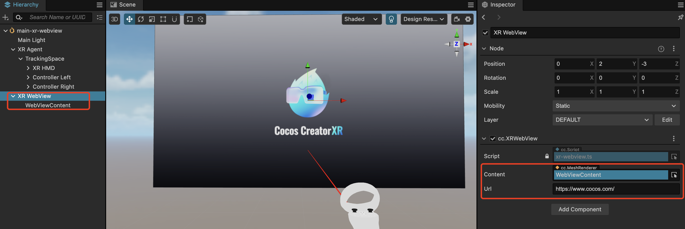
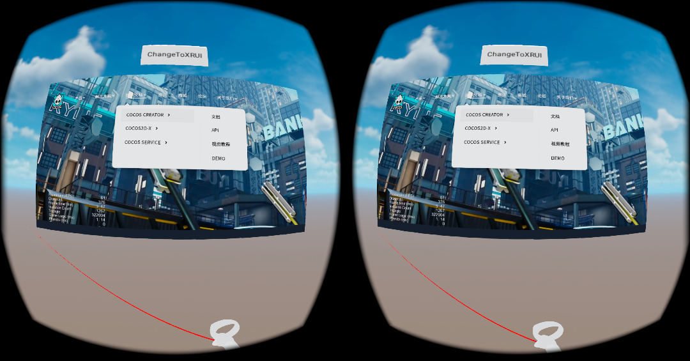

# XR Web Browser

XR Web Browser
In XR, a web browser allows users to access and browse the web within a virtual reality environment. Users can interact with web interfaces using device controllers, such as selecting links, scrolling through pages, and more, enhancing the immersion and experience for users.

## XR Web Browser Features

| Property    | Description                                     |
| ------- | ---------------------------------------- |
| Content | Specifies the `MeshRenderer` object for rendering web content. |
| Url     | The URL of the web page.                               |

## Using the XR Web Browser

Right-click in the Hierarchy panel and select **Create -> XR -> XR Webview**.

By default, it creates a node with the `cc.MeshRenderer` component as a child node of the Webview Content.

Build and publish the application to see the web page content.

Note:

- The web browser functionality requires the **XR extension version >= 1.2.0** and the **Cocos Creator version >= 3.7.3**.

- Vulkan does not currently support the video player feature.
