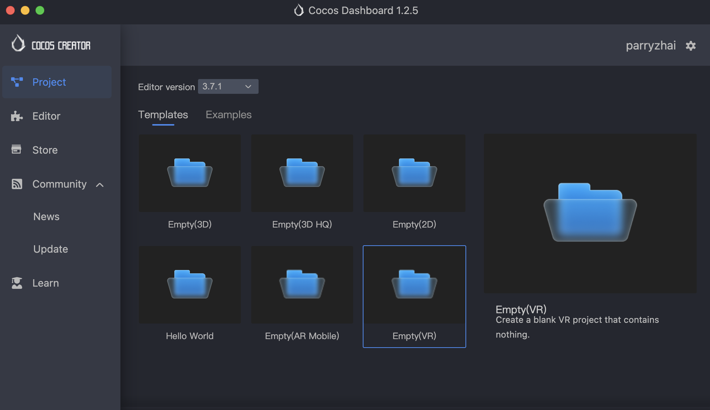
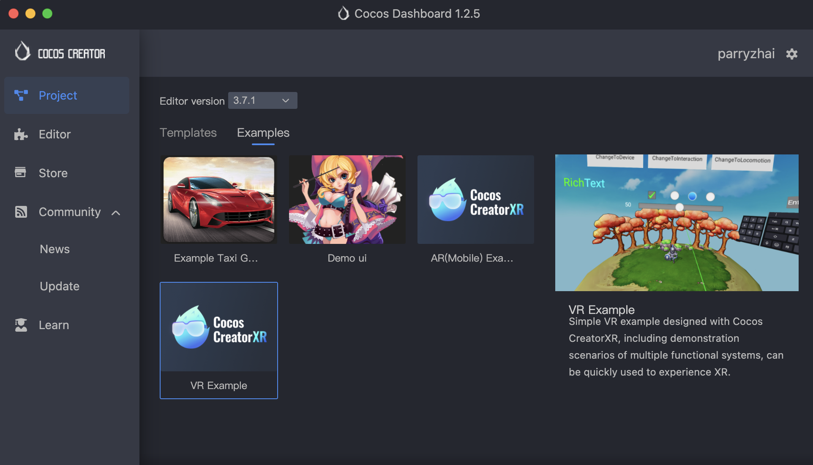

# VR Project Creation

Cocos CreatorXR supports users to quickly create VR projects using the following methods.

> **Note**: When creating XR projects, make sure that the Cocos Creator version >= 3.6.1.

## Create VR Project From Template

In the Cocos Dashboard, create a new project and choose an editor version of v3.6.1 or above (for full functionality, choose an engine version of v3.7.1 or above). Select the **Templates/Empty(VR)** template to create the project.

## Create VR Project From Example

In the Cocos Dashboard, create a new project and choose an editor version of v3.6.1 or above (for full functionality, choose an engine version of v3.7.1 or above). Select the **Examples/VR Example** to create the project.

## Apply XR Extension To An Existing Project

Add XR extension to an existing or empty project: Search for xr-plugin on the Store page in the Dashboard and download and install it for your project. Alternatively, in Cocos Creator, go to **Extensions -> Store** and download and install the extension for your project (installing it globally is not recommended). For instructions on downloading and installing extensions, please refer to the Cocos Creator Extension Installation Tutorial. [Cocos Creator Extension - Install and Share](../../editor/extension/install.md).
