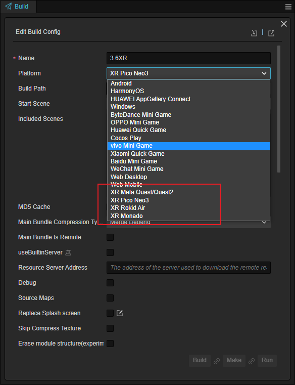
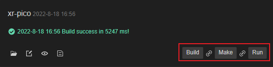

# Building and Publishing VR Project

Once the project development is completed, it needs to be published to the target platform. In the menu bar, select **Project -> Build** to open the **Build** panel. Choose the target platform from the dropdown menu.

## Options

For general build options, you can refer to the: [General Build Options](../../editor/publish/build-panel.md)。

The supported VR devices currently use the Android system, so developers need to set up the corresponding development environment. For details, please refer to the [Setting up the Native Development Environment](../../editor/publish/setup-native-development.md) documentation.

The XR-specific build options are described as follows:

- **Rendering Scale**: Adjusts the rendering resolution.

- **MSAA**:  Adjusts the level of multisample anti-aliasing.

- **Remote Preview**: Enables wireless projection preview.

- **Foveation Level**: Adjusts the foveation rendering level. A higher level reduces the GPU load but also decreases the resolution of the per-eye rendering textures at the edges. (Note: 1. Foveation rendering uses the OpenXR universal interface. If the device's FFR feature is not integrated with the OpenXR standard, this feature will not work. 2. This feature requires **extension version >= 1.2.0** and the **Cocos Creator version >= 3.7.3**).

## Build

Afterward, in the build task, choose Build, Make, and Run according to your needs.

## Publish

Once the application is generated, you can transfer the application to the target device using `adb commands` or the device's file transfer function. After that, you can run the application.
