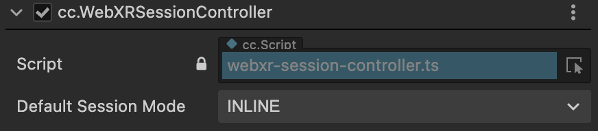
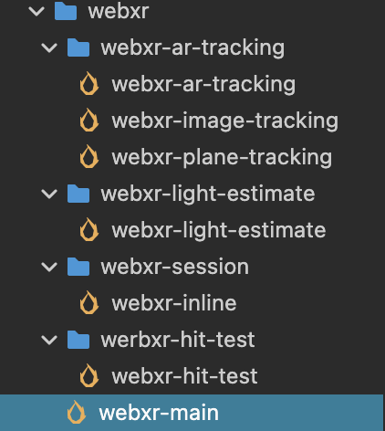

# WebXR Project Setup

The process of creating a WebXR project is the same as creating a regular XR project.

If you want to create a project for an immersive virtual reality (VR) experience, you can refer to [VR Project Creation](vr-proj-deploy.md).

If you want to create a project for an immersive augmented reality (AR) experience, you can refer to [AR Project Creation](ar-proj-deploy.md).

After completing, you need to add the `cc.WebXRSessionController` component to the **XR Agent** node. The component can be found at **XR > Device > WebXRSessionController**.

Choose the default `Session Mode` based on your needs:

- IMMERSIVE_AR: The session will have exclusive access to the immersive XR device, and the rendered content will be blended with the real-world environment.
- IMMERSIVE_VR： The session's rendering of the scene will not be overlaid or blended with the real-world environment.
- INLINE: The 3D content will be displayed inline within the element context of a standard HTML document, without occupying the entire visual space. Inline sessions can be rendered on both monoscopic and stereoscopic devices, and they do not require positional tracking. Inline sessions can be used on any [User Agent](https://developer.mozilla.org/en-US/docs/Glossary/User_agent) that supports the WebXR API.

## WebXR Examples

There are two examples in the Cocos Dashboard that are specifically designed for WebXR.

The main WebXR scene for the VR example is "webxr-main". Make sure to set this scene as the startup scene.

The main WebXR scene for the AR (mobile) example is also "webxr-main". Make sure to set this scene as the startup scene. Other scenes are shown below.

