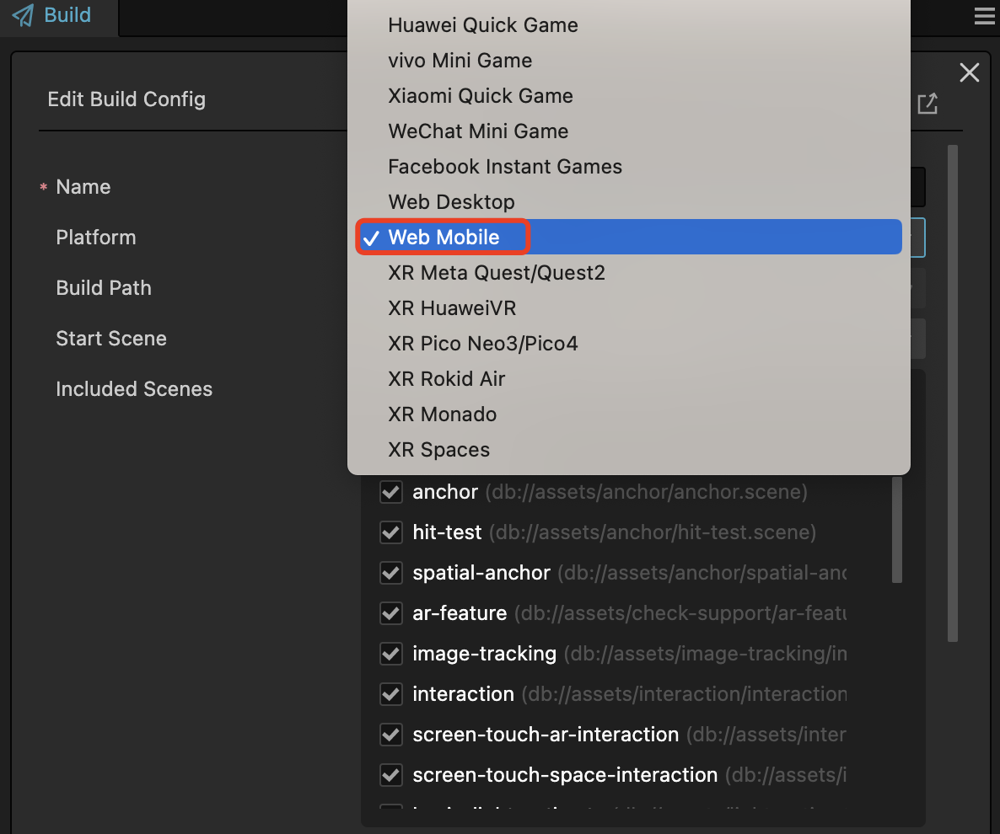
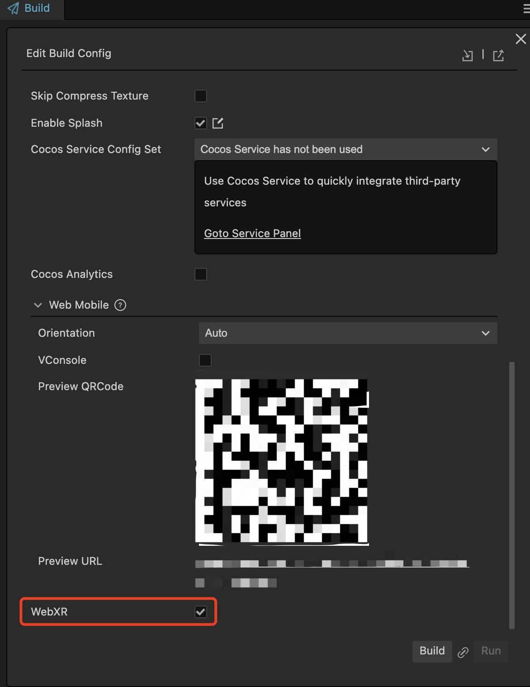
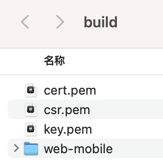
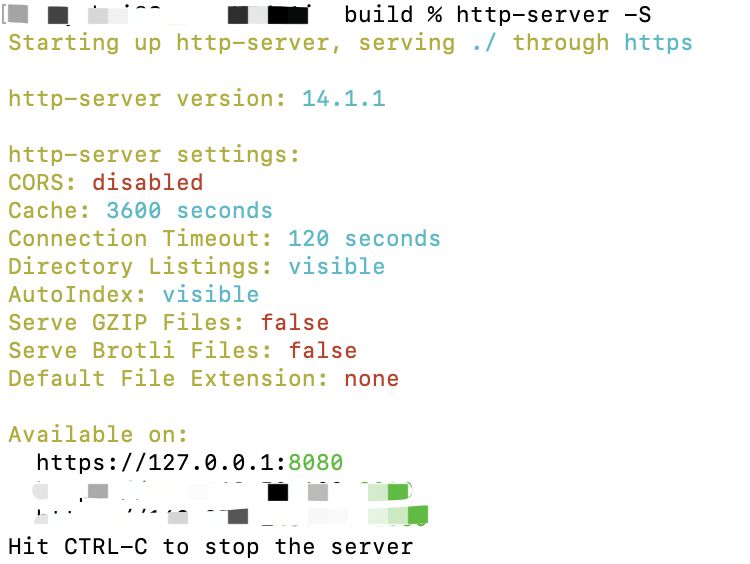

# Building and Publishing WebXR Project

After completing the [WebXR Project Setup](webxr-proj-deploy.md) and finishing the development, you can build and publish the WebXR application by clicking on **Menu Bar -> Project -> Build**.

## Setting up WebXR Build Options

Choose **Web-Mobile** as the target build platform.

Enable the `WebXR` option in the **Build** panel.

Click on **Build** to proceed.

## Configure HTTPS Environment

The server used to provide web resources for WebXR must be served in a [Secure Context](https://developer.mozilla.org/en-US/docs/Web/Security/Secure_Contexts).

To start an HTTPS server, a .pem (certificate file) needs to be configured for the domain hosting service.

Since the current version does not support starting a built-in HTTPS server, users need to start it manually.

Place the .pem file in the root directory of the build folder.

In the command terminal, navigate to this directory and enter the command: `https-server -S`. This will start the HTTPS server.

## Select Compatible Devices and Browsers

Refer to the  [ARCore official documentation](https://developers.google.com/ar/devices) for a list of devices that support ARCore.

Refer to [WEBXR browser_compatibility - mozilla.org]((https://developer.mozilla.org/en-US/docs/Web/API/WebXR_Device_API#browser_compatibility)
) for a list of browsers that support WebXR.

## Enable the WebXR Feature of the Browser

Before accessing a WebXR application using the Chrome browser, it's necessary to ensure that the WebXR feature is enabled.

Go to **[chrome://flags](chrome://flags)**  and set the `webxr incubations` to `Enable`.

