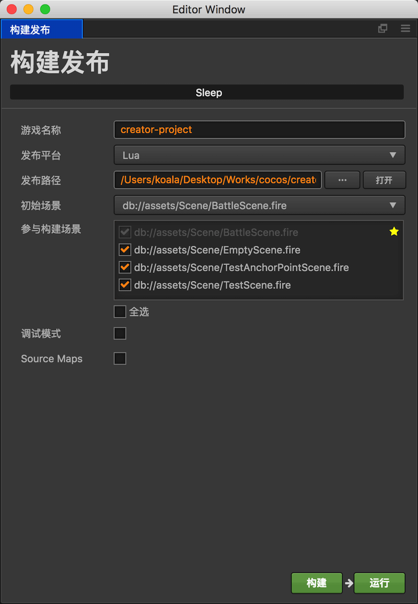

# Lua engine support

Lua developers can use Cocos Creator to build Scenes and UI's for Lua games in the normal display and operation.

The currently supported functions are as follows:

- Sprite - Sprite: Image display
- Canvas - Canvas: mainly used for automatic layout
- Widget - Widgets: You can set up automatic layouts and various alignments with Canvas
- Button - Button: Responds to player action
- EditBox - edit box: used for players to enter text
- ParticleSystem - Displays particle effects
- TileMap - Map: Displays a map edited using Tiled
- Animation - Animation only supports frame animation
- Label (System Font) - Text label: only supports system fonts
- Component with Lifetime events - components and their life cycle management

Some controls that are temporarily not supported:

- ProgressBar
- Layout
- ScrollView

## Using Lua

Starting with __Cocos Creator v1.3__, Lua Engineering support will be added as a plugin to Creator. First, you will 
need to download the __Creator-for-Lua plug-in__ and execute the installer:

- [Creator For Lua v1.1.3 for Windows download](http://cocos2d-x.org/filedown/Creator-Lua-Support-1.1.3-win)
- [Creator For Lua v1.1.3 Mac version download](http://cocos2d-x.org/filedown/Creator-Lua-Support-1.1.3-mac)

### Build the project for the first time

1. Create a new Lua project

    Create a Lua project using the command `cocos new -l lua GAME-NAME`.

2. Set up your scene in the Creator. Next, from the main menu, select __Project -> Lua Support -> Setup Target Project__, 
open the Lua project settings interface

3. Click the __...__ button next to Project Path to select your Lua project directory
4. Click the __Copy Support Library__ button. (this step only needs to be done once for each new Lua project)
5. Click the __Build__ button

### Automatically build
By default, the automatic build feature is not enabled. To update the Lua code after modifying the scene, you 
need to click the __Build__ button again, or select the __project -> Lua Support -> Build Now__.

The easiest way to do this is to select the __Auto Build__ option in the dialog box. So every time you save the 
scene, it will automatically update the Lua code friends.

### Run
After the initial build, or after each rebuild, use the `cocos run` command in your Lua project path to see 
the scene effect:

