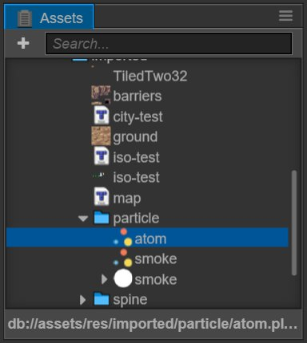
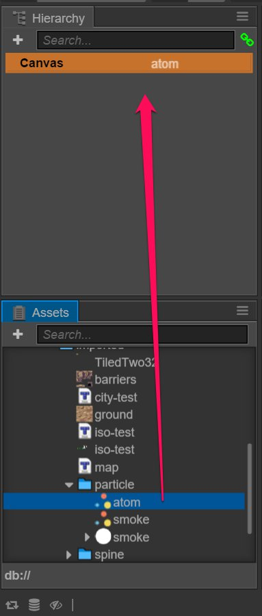
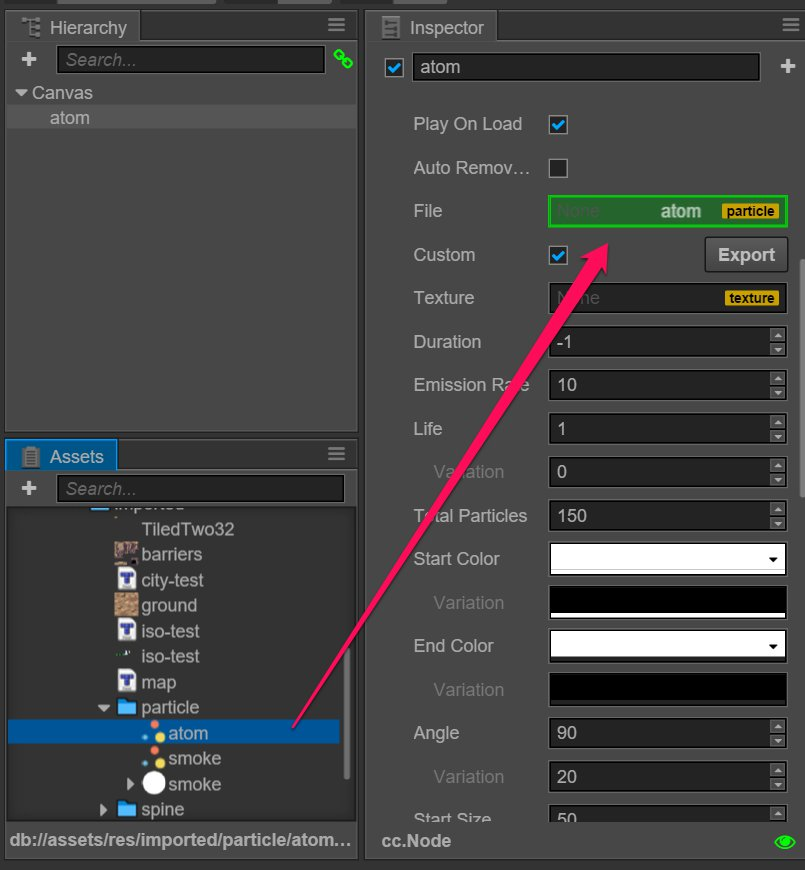

# Particle System

## Importing a particle asset
Put the Cocos2d-s supported particle `.plist` directly under the project catalogue.

## Adding a particle system to the scene
Method one: drag particle assets directly from **assets** to **Node Tree**:

Method two: drag particle assets directly from **assets** to **scene editor**:

Method three: add a **ParticleSystem** component to the existing node and give particle assets to the component `File` attribute in **assets**:

Continue on to read about [Audio assets](audio-asset.md).
