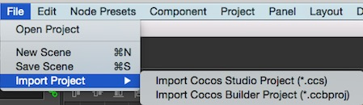

# Import Projects of Other Editors

## Brief

You can import projects of other editors by the Main Menu `File->Import Project`. Now supportted:

* Cocos Studio Projects (*.ccs)
* Cocos Builder Projects (*.ccbproj)

The menu looks like:

## Steps

1. Click the right menu item, there will be a Open File dialog.
2. Select a file with the specified extension like this:

	

3. When the Cocos Creator is processing the import, logs will be output in **Console**. The log looks like this:

	
	
	Details:
	* The full path of the imported project.
	* Log the file now importing.
	* When the importing finished, you will see a line like this: `Import XXX project finished.`. (XXX should be the project type.)
	* At last, the url of imported resources will be shown.

**PS:**
The time of importing depends on the size of the project. When it's importing, please don't operate the Cocos Creator. You should wait for the importing finished.

## Details of Importing Cocos Studio Projects

### The solution

* There are 3 kinds of csd files in Cocos Studio project：
	* Scene ---- Imported as a scene (.fire)
	* Layer ---- Imported as a prefab
	* Node ---- Imported as a prefab
* The animation data in csd files will be imported as .anim files.
* The File Structure after the project imported:
	* The resources will be stored in a separate folder in assets. The folder name will be same with the Cocos Studio project name.
	* The File Structure will be same with the Cocos Studio project.
	* The animation files will be stored in a child folder. The folder name will be `[csd file name]_action`
* Now some widgets in Cocos Studio are not supported in Cocos Creator. The importing process will add a StudioComponent for the node with unsupported widgets. And the data of the widgets will be stored in the StudioComponent. Unsupported widgets:
	* CheckBox
	* LabelAtlas
	* SliderBar
	* ListView
	* PageView
* The data of StudioComponent will be looks like this:

	

	1. The type of the widget.
	2. The data of the widget.

### Unsupported

* Unsupport importing skeletal animation.
* Unsupport importing csi files. (small images will be imported)
* Unsupport importing property SkewX & SkewY of the node.
* Particle is not support property Blend Function. Also not support the action of Blend Function.

### Special Instructions

The feature of importing Cocos Studio project is developed & tested on Cocos Studio 3.10. If you want to import an old version project, please import it to Cocos Studio 3.10 first. Then import the Cocos Studio 3.10 project to Cocos Creator.

## Details of Importing Cocos Builder Projects

### The Solution

* All ccb files will be imported as a prefab.
* The animation data in ccb files will be imported as .anim file.
* The File Structure after imported please refer to the solution of importing Cocos Studio project.

### Unsupported

* CCControlButton in Cocos Builder can set different color for different states, but Cocos Creator is not support this.
* Not support LayerGradient.
* Not support skew property & action.

Back to [Asset Workflow](index.md) 
Continue on to read about [Script Assets](script.md)
