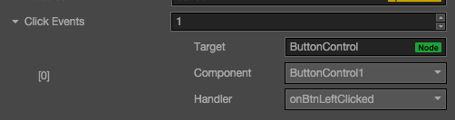

# Button component reference

The button component responds to a click from the user. When the user clicks a Button, its status will change. In addition, users can assign a custom behavior to buttons' click event.


Click the `Add component` button at the bottom of the **Properties** panel and select `Button` from `add UI component`. You can then add the Button component to the node.

## Button property

| Property |   Function explanation
| -------------- | ----------- |
|Interactable| Boolean type, if set to false then the Button component enters the forbidden state.
|enableAutoGrayEffect| Boolean type, if set to true, the Button's target sprite will turn gray when interactable is false. Don't  take effect when Transition type is SPRITE and the disabledSprite property is exists.
|Transition| Enumeration type, including NONE, COLOR and SPRITE. Each type corresponds to a different Transition setting. Please check more detailed information in the chapter `Button Transition`.
|Click Event| Default list type is null. Each event added by the user is composed of the node reference, component name and a response function. Please check more detailed information in the chapter `Button Event`.


### Button Transition
Button Transition is used to indicate the status of the Button when clicked by the user. Currently the types available are NONE, COLOR, SPRITE and SCALE.


### Color Transition


| Property |   Function Explanation
| -------------- | ----------- |
|Normal| Color of Button under Normal status.
|Pressed| Color of Button under Pressed status.
|Hover| Color of Button under Hover status.
|Disabled| Color of Button under Disabled status.
|Duration| Time interval needed for Button status switching.

### Sprite Transition


| Property |   Function Explanation
| -------------- | ----------- |
|Normal| SpriteFrame of Button under Normal status.
|Pressed| SpriteFrame of Button under Pressed status.
|Hover| SpriteFrame of Button under Hover status.
|Disabled| SpriteFrame of Button under Disabled status.

### Scale Transition


| Property |   Function Explanation
| -------------- | ----------- |
|Duration| Time interval needed for Button status switching.
|ZoomScale| When user press the button, the button will zoom to a scale.The final scale of the button  equals (button original scale * zoomScale), zoomScale could be negative value.

### Button event




| Property       | Function Explanation                                                                             |
| --------------  | -----------                                                                                      |
| Target          | Node with the script component.                                                                  |
| Component       | Script component name.                                                                           |
| Handler         | Assign a callback function which will be triggered when the user clicks and releases the Button. |
| customEventData | A user-defined string value passed as the last event argument of the event callback.             |
  

#### Detailed explanation

Button currently only supports the On Click event. This means only when users click and release the Button will the corresponding call-back function be triggered.

#### Add a callback through the script code

##### Method one

This method adds the same event callback as the event callback that is added using the editor，By adding code, you need to first construct a `cc.Component.EventHandler` object, and then set the corresponding target, component, handler and customEventData parameters.

```js
//here is your component file, file name = MyComponent.js 
cc.Class({
    extends: cc.Component,
    properties: {},
    
    onLoad: function () {
        var clickEventHandler = new cc.Component.EventHandler();
        clickEventHandler.target = this.node; //This node is the node to which your event handler code component belongs
        clickEventHandler.component = "MyComponent";//This is the code file name
        clickEventHandler.handler = "callback";
        clickEventHandler.customEventData = "foobar";

        var button = node.getComponent(cc.Button);
        button.clickEvents.push(clickEventHandler);
    },

    callback: function (event, customEventData) {
        //here event is a Touch Event object, you can get events sent to the event node node
        var node = event.target;
        var button = node.getComponent(cc.Button);
        //here the customEventData parameter is equal to you set before the "foobar"
    }
});
```

##### Method two

By `button.node.on ('click', ...)` way to add, this is a very simple way, but the way there are some limitations in the event callback which can not
Gets the screen coordinate point of the current click button.

```js
//Suppose we add an event handler callback to the onLoad method of a component and handle the event in the callback function:

cc.Class({
    extends: cc.Component,
	
    properties: {
       button: cc.Button
    },
    
    onLoad: function () {
       this.button.node.on('click', this.callback, this);
    },
    
    callback: function (event) {
       //here the event is an EventCustom object, you can get through the event.detail Button component
       var button = event.detail;
       //do whatever you want with button
       //In addition, attention to this way registered events, can not pass customEventData
    }
});
```

---

Continue on to read about [ProgressBar Component reference](progress.md).
