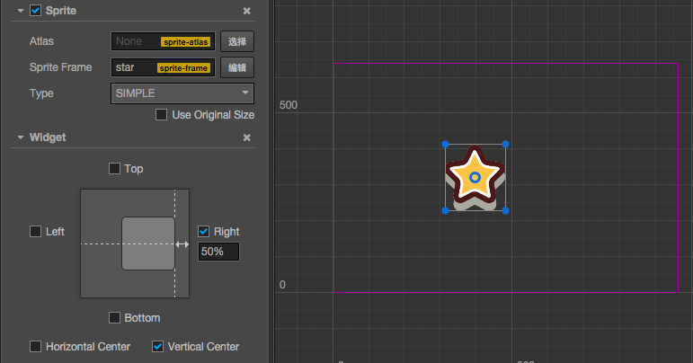
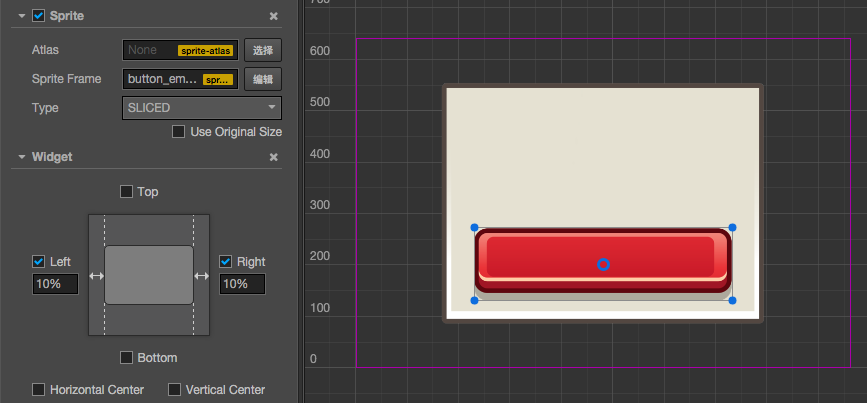

# Widget component reference

Widget is a frequently used UI layout component. It can make the current node automatically align to an optional position of the parent object or restrict dimensions to make your game adaptive to different resolution ratios.

For API reference please read [Widget API](../api/classes/Widget.html)

## Property

Property           | Explanation                 | Note
--                 | --                          | --
Top                | Upper border alignment      | Once selected, an input field will appear to set the distance between the upper border of the current node and the upper border of the parent object.
Bottom             | Lower border alignment      | Once selected, an input field will appear to set the distance between the lower border of the current node and the lower border of the parent object.
Left               | Left border alignment       | Once selected, an input field will appear to set the distance between the left border of the current node and the left border of the parent object.
Right              | Right border alignment      | Once selected, an input field will appear to set the distance between the right border of the current node and the right border of the parent object.
HorizontalCenter   | Horizontal center alignment |
VerticalCenter     | Vertical center alignment   |
AlignOnce          | default to `true`, will only make alignment when the component is enabled. If set to `false`, will update Widget's alignment every frame. (Will kill your performance!) |

## Border alignment

We can place a Widget below Canvas, and perform the following tests:

#### Left alignment, left border distance 100 px：

#### Bottom alignment, left border distance 50%：

The percentage will take the width or height of the parent object as a benchmark

#### Bottom right alignment, border distance 0 px：

## Center alignment

#### Horizontal center alignment:

#### Vertical center alignment and right border distance 50%:

## Limit size

If you align the left and right side at the same time, or align the top and bottom at the same time, then the size will be stretched in the corresponding direction.
Let us look at a demonstration. Place two rectangular Sprites in the scene and take the bigger one as the dialog box background and the smaller one as the button on the dialog box. Take the button node as the child node of the dialog box and set the button into Sliced mode so that you can observe the stretch effect.

#### Horizontal stretch, left and right margin 10%：

#### Vertical stretch, no margins on each end and horizontal center alignment:

#### Stretch in the horizontal and vertical directions, margin 50 px：

## Limitation on node position control

If `alignOnce` property is set to `false`, Widget will set alignment for current node every frame, overriding node's position and width/height setting. Thus user may not effectively change position or size of the node.

To make sure you can update node's position or size during runtime:

1. set `alignOnce` to `true`, so it will only align during onEnable process.
2. Use Widget's API to update node's position and size, for example updating Widget's `top`, `bottom`, `left`, `right` instead of node's `x`, `y`, `width`, `height`.

---

Continue on to read about [Button component preference](button.md).
